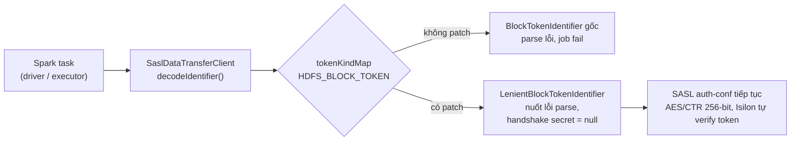

# sample-spark-application-privacy

Spark 3.5.1 (Scala 2.12) application mẫu **đọc/ghi HDFS trên Dell PowerScale/Isilon
OneFS** khi cụm bật **wire encryption bắt buộc** (`dfs.data.transfer.protection = privacy`)
và xác thực **Kerberos**, chạy trên Kubernetes qua **Spark Operator**.

Đi kèm là một **thư viện patch nhỏ** (`vai.lakehouse.hdfs`) giúp Hadoop client ≥ 3.2.1
làm việc được với block token của Isilon — mà **không phải hạ mức mã hoá**.

---

## 1. Bài toán

| Thành phần                   | Giá trị                                                         |
| ---------------------------- | --------------------------------------------------------------- |
| Spark / Scala                | 3.5.1 / 2.12                                                    |
| Hadoop client (đi kèm Spark) | 3.3.4                                                           |
| HDFS backend                 | Dell PowerScale / Isilon OneFS 9.5.0.6 (không phải Apache HDFS) |
| Namenode                     | `hdfs://vailakehouse.datalakehkh.viettel.com.vn:8020`           |
| Xác thực                     | Kerberos, realm `VAILAKEHOUSE.VIETTEL.COM`, principal `k8s`     |
| Chạy trên                    | Kubernetes + Spark Operator (`SparkApplication` CRD)            |

Isilon **ép** mã hoá đường truyền (`AES/CTR/NoPadding` 256-bit). Từ Hadoop client 3.2.1
(HDFS-13617 / HDFS-13699), client tự parse block token trong SASL handshake; token của
Isilon dùng định dạng nội bộ nên parse ném `NegativeArraySizeException` và **mọi thao tác
đọc/ghi block đều fail**. Không có config Spark/Hadoop nào tắt được bước này — phải can
thiệp ở tầng class.

> **Ràng buộc cứng:** KHÔNG được hạ `dfs.data.transfer.protection` xuống
> `authentication`/`integrity`. Patch giữ nguyên mã hoá, Kerberos và việc Isilon verify token.

## 2. Giải pháp tổng quan



Patch đăng ký `LenientBlockTokenIdentifier` (subclass của `BlockTokenIdentifier`) đè lên
entry `HDFS_BLOCK_TOKEN` trong `Token.tokenKindMap` (cơ chế `ServiceLoader`, last-write-wins),
khôi phục hành vi của Hadoop client ≤ 3.2.0: coi block token là chuỗi byte đục, chỉ chuyển
tiếp. Mã hoá, Kerberos, RPC encryption **không đổi**.

Phân tích chi tiết, diagram luồng lỗi/luồng đã vá và ảnh hưởng hiệu năng: xem
[`docs/HDFS_BLOCK_TOKEN_PATCH_FLOW.md`](./docs/HDFS_BLOCK_TOKEN_PATCH_FLOW.md).

Đây là **workaround**, không phải fix gốc — fix thật là Dell phát hành OneFS sinh block
token đúng chuẩn Apache. Khi đó chỉ cần gỡ package `vai.lakehouse.hdfs` và file
`META-INF/services`, phần app code không phải đụng tới.

## 3. Project gồm những gì

| Thành phần                                                              | Vai trò                                                                                                                                                                                                                                                       |
| ----------------------------------------------------------------------- | ------------------------------------------------------------------------------------------------------------------------------------------------------------------------------------------------------------------------------------------------------------- |
| **App mẫu** `org.example.SparkApp`                                      | Job Spark: tạo DB nếu chưa có → tạo bảng nếu chưa có → insert dữ liệu mẫu → query lại (giống `vlp-spark-sample/MainApp.scala`, cộng thêm Kerberos + diagnostics wire encryption cho Isilon)                                                                   |
| **Lib mã hoá cột** `column-crypto-lib` (`vai.lakehouse.columncrypto.*`) | Mã hoá/giải mã cột AES-256-GCM dùng được qua **DataFrame API** lẫn **SQL function** (`column_encrypt`/`column_decrypt`), lấy `keyPrefix` từ K8s Secret mount và/hoặc Vault. Jar riêng, nạp được vào sql-engine (xem `docs/COLUMN_CRYPTO_SQL_ENGINE_GUIDE.md`) |
| **Patch lib** `vai.lakehouse.hdfs.*`                                    | Vá tương thích block token Isilon (xem mục 2)                                                                                                                                                                                                                 |
| **Log4j2 config**                                                       | Chỉ log phần quan trọng của app (logger `VLP`), chặn chatter Spark/Hadoop                                                                                                                                                                                     |
| **Dockerfile**                                                          | Đóng gói app lên base `apache/spark:3.5.1-scala2.12-java11-ubuntu`                                                                                                                                                                                            |
| **k8s/spark-application.yaml**                                          | Manifest `SparkApplication` chạy app trên cluster                                                                                                                                                                                                             |
| **docs/**                                                               | Tài liệu kỹ thuật chi tiết (mục 10)                                                                                                                                                                                                                           |

`mvn package` (multi-module: `column-crypto-lib` + `spark-app`) sinh ra **3 artifact**:

| Artifact                                                                               | Nội dung                                                            | Dùng cho                                                                 |
| -------------------------------------------------------------------------------------- | ------------------------------------------------------------------- | ------------------------------------------------------------------------ |
| `column-crypto-lib/target/column-crypto-lib-1.0-SNAPSHOT.jar`                          | Jar thuần (~66 KB, không shade): chỉ `vai.lakehouse.columncrypto.*` | sql-engine (`spark.jars` + `spark.sql.extensions`) hoặc app Spark bất kỳ |
| `spark-app/target/sample-spark-application-privacy-1.0-SNAPSHOT.jar`                   | Fat jar: app + lib mã hoá + patch + `META-INF/services`             | Chạy SparkApplication (`mainApplicationFile`)                            |
| `spark-app/target/sample-spark-application-privacy-1.0-SNAPSHOT-block-token-patch.jar` | Jar "thin" chỉ chứa `vai.lakehouse.hdfs.*` + `META-INF/services`    | Nhét vào `/opt/spark/jars/` của image khác (ví dụ Spark History Server)  |

## 4. Cấu trúc thư mục

```
.
├── pom.xml                         # parent (properties + pluginManagement), 2 module bên dưới
├── Dockerfile
├── k8s/
│   └── spark-application.yaml
├── docs/
│   ├── COLUMN_CRYPTO_SQL_ENGINE_GUIDE.md        # dùng lib trong sql-engine: config UI + query console
│   ├── SPARK_HDFS_WIRE_ENCRYPTION_TASK.md       # root cause + thiết kế patch
│   ├── HDFS_BLOCK_TOKEN_PATCH_FLOW.md           # diagram + ảnh hưởng hiệu năng
│   ├── HDFS_PATCH_AT_SCALE.md                   # phân phối patch cho nhiều app
│   └── spark-history-server-hdfs-hkh-kerberos.md
├── column-crypto-lib/              # THƯ VIỆN mã hoá cột (jar thuần, Spark provided)
│   └── src/
│       ├── main/scala/vai/lakehouse/columncrypto/
│       │   ├── CryptoExpressions.scala       # NGUỒN DUY NHẤT của công thức mã hoá (Catalyst Expression)
│       │   ├── ColumnCrypto.scala            # DataFrame API: encryptColumns/decryptColumns (bọc CryptoExpressions)
│       │   ├── ColumnCryptoConfig.scala      # settings YAML: keyField/encryptedColumns (chỉ DataFrame API dùng)
│       │   ├── prefix/
│       │   │   ├── PrefixSource.scala        # trait + FilePrefixSource (Secret mount) + ChainedPrefixSource (fallback) + CachedPrefixSource (TTL)
│       │   │   ├── VaultPrefixSource.scala   # Vault KV v2 qua Kubernetes auth
│       │   │   └── PrefixSourceFactory.scala # dựng nguồn từ ConfigSource (env hoặc spark.columncrypto.*)
│       │   └── sql/ColumnCryptoExtension.scala # đăng ký SQL function column_encrypt / column_decrypt
│       └── test/                             # unit test + test SQL bằng SparkSession local
└── spark-app/                      # APP mẫu + patch block token, phụ thuộc column-crypto-lib
    └── src/
        ├── main/
        │   ├── resources/
        │   │   ├── META-INF/services/org.apache.hadoop.security.token.TokenIdentifier
        │   │   ├── conf/column-crypto.yaml               # keyField/encryptedColumns — không nhạy cảm, xem mục "Mã hoá cột"
        │   │   ├── conf/key-prefix/sample_table          # keyPrefix của bảng (1 file/bảng) — MẪU DEV, production dùng K8s Secret k8s/key-prefix-secret.yaml
        │   │   └── log4j2.properties
        │   └── scala/
        │       ├── org/example/
        │       │   ├── SparkApp.scala                   # entry point, điều phối create DB/table/insert
        │       │   ├── EnvConfigSource.scala            # đọc cấu hình nguồn keyPrefix từ env (giữ nguyên tên biến cũ)
        │       │   ├── BusinessLogic.scala              # schema + DDL + sample data (thuần, test được)
        │       │   └── Log.scala                        # banner/section/kv cho log dễ đọc
        │       └── vai/lakehouse/hdfs/
        │           ├── LenientBlockTokenIdentifier.scala   # patch chính
        │           ├── BlockTokenDiagnostics.scala         # chỉ đọc, xác nhận patch đang thắng
        │           └── BlockTokenFixPlugin.scala           # fallback qua spark.plugins
        └── test/scala/org/example/
            ├── BusinessLogicSpec.scala
            └── EnvConfigSourceSpec.scala
```

## 5. Ứng dụng mẫu

App không nhận tham số dòng lệnh — toàn bộ cấu hình đọc qua biến môi trường (tất cả optional,
có default; validate lúc khởi động, sai giá trị sẽ `exit(2)` — cùng logic với
`vlp-spark-sample/MainApp.scala`):

| Biến                                                                      | Mặc định                                                                               | Giá trị hợp lệ               | Mô tả                                                                                                                        |
| ------------------------------------------------------------------------- | -------------------------------------------------------------------------------------- | ---------------------------- | ---------------------------------------------------------------------------------------------------------------------------- |
| `APP_NAME`                                                                | `SampleSparkApplicationPrivacy`                                                        | chuỗi bất kỳ                 | Tên hiển thị trên Spark UI                                                                                                   |
| `DB_NAME`                                                                 | `demo_db`                                                                              | chuỗi bất kỳ                 | Database/schema sẽ được tạo                                                                                                  |
| `TABLE_NAME`                                                              | `sample_table`                                                                         | chuỗi bất kỳ                 | Bảng sẽ được tạo                                                                                                             |
| `TABLE_TYPE`                                                              | `delta`                                                                                | `delta` / `iceberg` / `hive` | `hive` → `STORED AS PARQUET`; còn lại → `USING <type>`                                                                       |
| `INSERT_MODE`                                                             | `append`                                                                               | `append` / `overwrite`       | Chế độ ghi dữ liệu mẫu                                                                                                       |
| `ENABLE_HIVE_SUPPORT`                                                     | `true`                                                                                 | `true` / `false`             | Bật `enableHiveSupport()` cho SparkSession                                                                                   |
| `CRYPTO_CONFIG_PATH`                                                      | `conf/column-crypto.yaml` (mẫu dev, đóng sẵn trong jar)                                | đường dẫn file YAML          | keyField/encryptedColumns (không nhạy cảm, mount ConfigMap) — xem mục "Mã hoá cột"                                           |
| `CRYPTO_PREFIX_SOURCE`                                                    | `file`                                                                                 | `file` / `vault`             | Nguồn keyPrefix: thư mục file (K8s Secret) hoặc HashiCorp Vault — xem mục "Mã hoá cột"                                       |
| `CRYPTO_KEY_PREFIX_DIR`                                                   | `conf/key-prefix` (mẫu dev, đóng sẵn trong jar)                                        | đường dẫn thư mục            | Chỉ khi `file`: thư mục chứa keyPrefix, mỗi bảng 1 file `<tên bảng>` (nhạy cảm, mount K8s Secret `key-prefix`)               |
| `VAULT_ADDR`, `VAULT_ROLE`, `VAULT_KV_PATH`                               | (bắt buộc khi `vault`)                                                                 | chuỗi                        | Địa chỉ Vault, tên role Kubernetes auth, đường dẫn KV chứa prefix (không gồm tên bảng)                                       |
| `VAULT_KV_MOUNT`, `VAULT_AUTH_MOUNT`, `VAULT_KEY_FIELD`, `VAULT_JWT_PATH` | `kv`, `kubernetes`, `keyPrefix`, `/var/run/secrets/kubernetes.io/serviceaccount/token` | chuỗi                        | Mount KV v2, mount auth, tên field chứa prefix trong secret, file JWT của service account                                    |
| `HDFS_SASL_DEBUG`                                                         | `false`                                                                                | `true` / `false`             | Bật DEBUG cho 2 logger SASL/Token của Hadoop — in ra hex dump wrap/unwrap rất dài, chỉ bật khi cần trace lỗi wire encryption |

Flow nghiệp vụ (`SparkApp.runCreateTableAndInsert`):

1. `CREATE DATABASE IF NOT EXISTS ${DB_NAME}`
2. `CREATE TABLE IF NOT EXISTS ${DB_NAME}.${TABLE_NAME} (id BIGINT, name STRING, city STRING, created_at STRING) USING delta` (hoặc `STORED AS PARQUET` nếu `TABLE_TYPE=hive`)
3. Mã hoá các cột cấu hình trong `CRYPTO_CONFIG_PATH` (kèm `keyPrefix` từ nguồn `CRYPTO_PREFIX_SOURCE`, lấy TRƯỚC mọi thao tác ghi và được che khỏi plan/Spark UI; mặc định `name`, `city`), insert 5 dòng dữ liệu mẫu bằng `insertInto` (mode = `INSERT_MODE`)
4. `SELECT * FROM ${DB_NAME}.${TABLE_NAME} ORDER BY id`, giải mã lại các cột đó, in kết quả plaintext

- Trước khi chạy nghiệp vụ, app in mục **HDFS SECURITY DIAGNOSTICS**: các config bảo mật,
  `encryptDataTransfer` của server, và **class đang xử lý `HDFS_BLOCK_TOKEN`**
  (patch có đang hoạt động không).
- Sau mỗi bước (CREATE DATABASE / CREATE TABLE / INSERT), app log permission/owner của
  thư mục HDFS tương ứng (`DB_DIR`, `TABLE_DIR`) — hữu ích để trace lỗi quyền trên Isilon.
- Khi job fail vì block token, app tự nhận diện và chỉ thẳng tới nguyên nhân/patch chưa nạp.

### Mã hoá cột (`vai.lakehouse.columncrypto`, module `column-crypto-lib`)

Mã hoá/giải mã theo cột bằng AES-256-GCM qua hàm built-in `aes_encrypt`/`aes_decrypt` của
Spark SQL (có từ Spark 3.3) — không tự viết crypto tay. Key sinh **riêng cho từng dòng**:

```
key = SHA-256(keyPrefix || giá trị cột keyField của chính dòng đó)
```

`encryptColumns` (trước khi ghi) và `decryptColumns` (sau khi đọc) dùng chung 1 công thức
sinh key nên luôn đồng nhất giữa 2 chiều. Công thức nằm ở `CryptoExpressions` và được dùng chung
cho cả **DataFrame API** lẫn **SQL function** `column_encrypt`/`column_decrypt` (dùng trên query
console của sql-engine, xem `docs/COLUMN_CRYPTO_SQL_ENGINE_GUIDE.md`), nên dữ liệu ghi bằng đường
này giải mã được bằng đường kia. `ColumnCryptoConfig` ghép cấu hình từ **2 nguồn**
(đọc đĩa trước, fallback classpath resource), tách theo mức độ nhạy cảm:

```yaml
# CRYPTO_CONFIG_PATH — conf/column-crypto.yaml (KHÔNG nhạy cảm, mount ConfigMap, commit được vào Git)
datasets:
  sample_table:
    keyField: "created_at" # cột KHÔNG bị mã hoá, dùng làm nguyên liệu key
    encryptedColumns:
      - "name"
      - "city"
```

```yaml
# CRYPTO_KEY_PREFIX_DIR — K8s Secret "key-prefix" (NHẠY CẢM, KHÔNG commit giá trị thật).
# data của Secret là <tên bảng>: <keyPrefix của bảng đó>; mount thành thư mục, mỗi key 1 file.
apiVersion: v1
kind: Secret
metadata:
  name: key-prefix
stringData:
  sample_table: "sample_table_dev_prefix" # -> file /etc/key-prefix/sample_table
```

Bản dev mặc định trong jar là `conf/key-prefix/sample_table` (nội dung file = giá trị prefix).
Ký tự xuống dòng ở cuối file được bỏ khi đọc. Tên bảng chỉ được gồm `[A-Za-z0-9_.-]` và không
bắt đầu bằng `.` (chặn path traversal vì tên bảng đi vào đường dẫn file).

Mỗi dataset phải có mặt ở **cả hai** nguồn, thiếu bên nào app fail ngay (thông báo lỗi không
bao giờ in giá trị `keyPrefix`; `ColumnCryptoConfig.toString` cũng che nó).

- `keyPrefix` là bí mật thật sự (gần tương đương credential) — `keyField` chỉ là tên cột
  (config), nhưng giá trị của nó vốn công khai với bất kỳ ai đọc được bảng, nên toàn bộ độ an
  toàn của cơ chế này quy về việc giữ kín `keyPrefix`. Các file mặc định đóng trong jar
  (`conf/column-crypto.yaml`, `conf/key-prefix/`) chỉ dùng cho dev/local.
  **Production phải override** `CRYPTO_KEY_PREFIX_DIR` trỏ tới thư mục mount từ K8s Secret (và nên
  override `CRYPTO_CONFIG_PATH` bằng ConfigMap để đổi cột mã hoá theo môi trường mà không cần
  build lại image), không commit giá trị thật của `keyPrefix` vào git.

  `k8s/spark-application.yaml` mount ConfigMap `column-crypto-settings` →
  `/etc/app-config/column-crypto.yaml` cho cả driver lẫn executor, và lấy `keyPrefix` từ Vault
  (`CRYPTO_PREFIX_SOURCE=vault`, chỉ driver cần vì executor nhận prefix qua plan). ConfigMap phải có
  trước khi apply manifest:

  ```bash
  kubectl create configmap column-crypto-settings \
    --from-file=column-crypto.yaml=./column-crypto.yaml \
    -n vlp-tenantw1xjixm-wsytjjtr0-ingestion
  ```

  **Nguồn `file` (K8s Secret)** — dùng khi không có Vault: đặt `CRYPTO_PREFIX_SOURCE=file`,
  `CRYPTO_KEY_PREFIX_DIR=/etc/key-prefix` và mount Secret `key-prefix` (`k8s/key-prefix-secret.yaml`,
  mỗi key = tên bảng, giá trị mẫu — thay bằng giá trị thật, không commit) vào thư mục đó cho driver.
  Lưu ý K8s Secret **chỉ base64-encode chứ không tự mã hoá** trong `etcd` (trừ khi cluster đã bật
  riêng encryption-at-rest cho Secret), và không chặn được ai đã `kubectl exec` vào pod đang chạy —
  nó chỉ tách quyền đọc `keyPrefix` khỏi code/image, không phải kiểm soát truy cập theo từng lần
  decrypt như Ranger KMS.

  **Che khỏi plan:** `keyPrefix` là literal trong biểu thức SQL nên mặc định sẽ hiện trong
  `explain`/`queryExecution.toString` (tab SQL của Spark UI, event log). App gọi
  `ColumnCrypto.redactKeyPrefixInPlans` ngay sau khi lấy prefix để đặt
  `spark.sql.redaction.string.regex`, nên các chỗ đó chỉ hiện `*********(redacted)`.

### Chọn nguồn keyPrefix (`CRYPTO_PREFIX_SOURCE`)

| Giá trị      | Hành vi                                                                                  |
| ------------ | ---------------------------------------------------------------------------------------- |
| `file`       | (mặc định) đọc `<CRYPTO_KEY_PREFIX_DIR>/<tên bảng>` — K8s Secret mount                   |
| `vault`      | gọi Vault KV v2 bằng Kubernetes auth (`VAULT_*`)                                         |
| `file,vault` | thử `file` trước, không có/lỗi thì fallback sang `vault`; lỗi gộp lý do của cả hai nguồn |

Kết quả được cache trong bộ nhớ theo bảng, `CRYPTO_CACHE_TTL_SECONDS` (mặc định 300, `0` = tắt cache).
Cùng các key logic này, sql-engine cấu hình qua Spark conf `spark.columncrypto.<key>` thay vì env
(`source`, `file.dir`, `vault.addr`, `vault.role`, `vault.kvBasePath`, `vault.authMount`,
`vault.kvMount`, `vault.keyField`, `vault.jwtPath`, `vault.authMethod`, `vault.token`, `cacheTtlSeconds`).

### Lấy keyPrefix từ HashiCorp Vault (`CRYPTO_PREFIX_SOURCE=vault`)

`VaultPrefixSource` (module `column-crypto-lib`, chỉ dùng JDK `HttpClient` + Jackson có sẵn của Spark) làm 3 bước trên driver:
đăng nhập Kubernetes auth bằng JWT của service account (`POST /v1/auth/<auth-mount>/login`),
đọc KV v2 (`GET /v1/<kv-mount>/data/<VAULT_KV_PATH>/<tên bảng>`, lấy field `VAULT_KEY_FIELD`), rồi thu
hồi token (`POST /v1/auth/token/revoke-self`). Lỗi không bao giờ in JWT, token hay giá trị prefix.

Với path hiện tại `kv/hla-datalake/datalake/spark-application/<tên bảng>` (KV v2 — không có đoạn
`key-prefix` trong path), mỗi secret phải có field `keyPrefix` (đổi bằng `VAULT_KEY_FIELD`).
Cấu hình phía Vault (làm 1 lần, chỉ cần khi dùng Kubernetes auth — xem "Xác thực bằng token Vault
tĩnh" bên dưới nếu Vault dùng token tĩnh như hạ tầng hiện tại):

```bash
vault auth enable kubernetes
vault write auth/kubernetes/config kubernetes_host="https://<K8S_API_SERVER>:443"   # + token_reviewer_jwt / kubernetes_ca_cert nếu Vault chạy ngoài cluster
vault policy write spark-key-prefix - <<'EOF'
path "kv/data/hla-datalake/datalake/spark-application/*" { capabilities = ["read"] }
EOF
vault write auth/kubernetes/role/spark-application \
  bound_service_account_names=spark-application-sa \
  bound_service_account_namespaces=vlp-tenantw1xjixm-wsytjjtr0-ingestion \
  policies=spark-key-prefix ttl=5m
vault kv put kv/hla-datalake/datalake/spark-application/sample_table keyPrefix='<giá trị thật>'
```

#### Xác thực bằng token Vault tĩnh (`VAULT_AUTH_METHOD=token`)

Mặc định `VaultPrefixSource` dùng Kubernetes auth (ở trên). Khi Vault không bật Kubernetes auth cho
app — ví dụ ExternalSecrets `ClusterSecretStore` đang dùng `tokenSecretRef` — có thể dùng thẳng một
**token Vault tĩnh**:

| Env (SparkApplication)    | Spark conf (sql-engine)               | Ý nghĩa                                                   |
| ------------------------- | ------------------------------------- | --------------------------------------------------------- |
| `VAULT_AUTH_METHOD=token` | `spark.columncrypto.vault.authMethod` | `kubernetes` (mặc định) hoặc `token`                      |
| `VAULT_TOKEN`             | `spark.columncrypto.vault.token`      | Token Vault; bắt buộc khi `token`. Không cần `VAULT_ROLE` |

Ở chế độ này lib **không login và không `revoke-self`** (revoke một token dùng chung sẽ làm hỏng mọi
dịch vụ đang dùng nó, kể cả ExternalSecrets). Token không bao giờ xuất hiện trong thông báo lỗi và
`VaultConfig.toString` che nó. Spark tự che conf có chứa `token` trong tab Environment và log
(`spark.redaction.regex`), nhưng giá trị vẫn nằm plaintext trong cấu hình engine/manifest — nên đưa
vào `SparkApplication` bằng `env.valueFrom.secretKeyRef` thay vì ghi thẳng.

**Không nên dùng lại token của ExternalSecrets** (`datalake-vault-token`): store báo `ReadWrite` nên
token đó có quyền ghi, rộng hơn nhiều so với việc chỉ đọc `keyPrefix`. Tạo token riêng, chỉ đọc:

```bash
vault policy write spark-key-prefix - <<'POLICY'
path "kv/data/hla-datalake/datalake/spark-application/*" { capabilities = ["read"] }
POLICY
# Token định kỳ: sống thêm mỗi lần renew; lib KHÔNG tự renew nên phải renew định kỳ hoặc đặt period đủ dài rồi rotate
vault token create -policy=spark-key-prefix -period=768h -orphan -display-name=spark-column-crypto
```

Token có TTL sẽ hết hạn → mọi query mã hoá/giải mã lỗi `HTTP 403` sau TTL cache; cần quy trình
rotate (hoặc chuyển sang Kubernetes auth/AppRole để không phải giữ credential dài hạn).

`VAULT_ADDR` hiện là HTTP nên token và prefix đi trên mạng không mã hoá — app log cảnh báo; nên
chuyển sang HTTPS (JDK dùng truststore mặc định, nếu Vault dùng CA riêng thì cần bổ sung truststore).

- `keyField` bắt buộc không nằm trong `encryptedColumns` (validate lúc chạy, fail-fast) —
  nó phải giữ plaintext để dùng lại làm nguyên liệu sinh key lúc giải mã.
- Cột đã mã hoá lưu dạng `STRING` (Base64 của ciphertext, IV do `aes_encrypt` tự sinh và gắn
  kèm) — DDL hiện tại (`name`/`city`) đã sẵn `STRING` nên không cần đổi; nếu sau này mã hoá
  cột kiểu khác (số, ngày...), DDL phải khai `STRING` cho cột đó.

### Logging

`log4j2.properties`: root logger `warn`; chỉ logger nghiệp vụ `VLP` (dùng bởi `Log.scala`)
ở `info`; toàn bộ nhánh `org.apache.spark`/`org.apache.hadoop`/`io.delta` hạ xuống `warn`,
scheduler K8s + fabric8 client xuống `error`. Hai logger
`org.apache.hadoop.hdfs.protocol.datatransfer.sasl` và
`org.apache.hadoop.security.token.Token` giữ `warn` làm baseline — chỉ được app nâng lên
`DEBUG` khi set `HDFS_SASL_DEBUG=true`.

#### Trên Kubernetes: BẮT BUỘC trỏ bằng `-Dlog4j.configurationFile`

Đây là điểm dễ sai nhất. Khi chạy trên K8s, Spark tự tạo ConfigMap
(`spark-conf-volume-driver`/`spark-conf-volume-exec`) và **mount đè lên `/opt/spark/conf`**
của pod (hằng số `SPARK_CONF_DIR_INTERNAL` trong `spark-kubernetes` jar). Volume mount của
K8s thay thế **toàn bộ** nội dung thư mục → `log4j2.properties` bake trong image tại đó **bị
che hoàn toàn**. Log4j2 không thấy config nào nên rơi về bản mặc định nhúng trong `spark-core`
(`org/apache/spark/log4j2-defaults.properties`, `rootLogger.level = info`) → log INFO của
`TaskSetManager`/`DAGScheduler`/`MemoryStore`... tràn ra dù `log4j2.properties` của project đã
cấu hình đúng.

Vì vậy `Dockerfile` copy file vào **2 chỗ**, và `k8s/spark-application.yaml` trỏ tường minh
tới bản không bị che:

| Path trong image                    | Dùng khi                                                                                                                                                           |
| ----------------------------------- | ------------------------------------------------------------------------------------------------------------------------------------------------------------------ |
| `/opt/app/log4j2.properties`        | Chạy trên K8s — trỏ tới qua `-Dlog4j.configurationFile=file:/opt/app/log4j2.properties` ở cả `spark.driver.extraJavaOptions` lẫn `spark.executor.extraJavaOptions` |
| `/opt/spark/conf/log4j2.properties` | Chạy KHÔNG qua K8s (`docker run`, spark-submit local trong container) — lúc đó không có ConfigMap mount đè                                                         |

Kiểm chứng nhanh trên cluster: `kubectl exec <driver-pod> -- ls -la /opt/spark/conf` sẽ **không**
thấy `log4j2.properties` (chỉ có `spark.properties` của ConfigMap) — đúng như mô tả ở trên.

## 6. Build & test

Yêu cầu: JDK 11+, Maven 3.8+ (lần build đầu cần mạng để tải dependency). Scala/Spark/Hadoop được khai
`provided` — không đóng gói vào jar (riêng `delta-spark` đóng gói vào fat jar, xem mục 1).

Project là Maven **multi-module** — chạy lệnh ở thư mục gốc:

| Module              | Artifact                                                                                          | Dùng cho                                     |
| ------------------- | ------------------------------------------------------------------------------------------------- | -------------------------------------------- |
| `column-crypto-lib` | `column-crypto-lib/target/column-crypto-lib-1.0-SNAPSHOT.jar`                                     | Nạp vào sql-engine hoặc app Spark bất kỳ     |
| `spark-app`         | `spark-app/target/sample-spark-application-privacy-1.0-SNAPSHOT.jar` (+ `-block-token-patch.jar`) | Chạy SparkApplication; đã gộp sẵn lib mã hoá |

### 6.1. Build cả project

```bash
mvn -B clean package        # build + chạy test cả 2 module, ra đủ 3 jar ở bảng trên
```

### 6.2. Build riêng lib mã hoá (`column-crypto-lib`)

Dùng khi chỉ cần jar để nạp vào sql-engine (xem `docs/COLUMN_CRYPTO_SQL_ENGINE_GUIDE.md`):

```bash
mvn -B clean package -pl column-crypto-lib             # build + test lib
mvn -B clean package -pl column-crypto-lib -DskipTests # bỏ qua test
# -> column-crypto-lib/target/column-crypto-lib-1.0-SNAPSHOT.jar
```

Jar này là jar **thuần** (~66 KB, không shade): chỉ chứa `vai.lakehouse.columncrypto.*`, không kèm
Spark/Jackson/snakeyaml nên không gây xung đột classpath khi nạp vào engine.

### 6.3. Build riêng app chính (`spark-app`)

```bash
mvn -B clean package -pl spark-app -am                 # -am: tự build lib trước (app phụ thuộc lib)
mvn -B clean package -pl spark-app -am -DskipTests
# -> spark-app/target/sample-spark-application-privacy-1.0-SNAPSHOT.jar               (fat jar: app + lib + patch)
# -> spark-app/target/sample-spark-application-privacy-1.0-SNAPSHOT-block-token-patch.jar (thin, chỉ patch block token)
```

Phải có `-am`: nếu chỉ `-pl spark-app` thì Maven đi tìm `column-crypto-lib` trong `~/.m2` và fail
khi chưa `mvn install` lib. Fat jar của app đã đóng gói sẵn lib nên **không cần** nạp thêm jar lib
riêng cho SparkApplication.

### 6.4. Chạy test

```bash
mvn -B test                                                   # test cả 2 module
mvn -B test -pl column-crypto-lib                             # chỉ test lib
mvn -B test -pl spark-app -am                                 # test app (kèm test lib)
mvn -B test -pl column-crypto-lib \
    -DwildcardSuites=vai.lakehouse.columncrypto.sql           # chỉ 1 suite/package (tên đầy đủ)
```

| Module              | Test                                                                                                                                                                                                                                                                                                                                                                                                           |
| ------------------- | -------------------------------------------------------------------------------------------------------------------------------------------------------------------------------------------------------------------------------------------------------------------------------------------------------------------------------------------------------------------------------------------------------------- |
| `column-crypto-lib` | `ColumnCryptoSpec` (DataFrame API), `ColumnCryptoConfigSpec` (settings/file prefix), `VaultPrefixSourceSpec` (Vault giả bằng HTTP server cục bộ), `PrefixSourceSpec` (chain/cache), `PrefixSourceFactorySpec` (cấu hình), `ColumnCryptoExtensionSpec` (SQL function trên SparkSession local: roundtrip, tương thích 2 chiều với DataFrame API, INSERT/SELECT bảng parquet thật, view, che prefix khỏi explain) |
| `spark-app`         | `BusinessLogicSpec` (schema/DDL/sample-data thuần), `EnvConfigSourceSpec` (ánh xạ env → cấu hình nguồn keyPrefix)                                                                                                                                                                                                                                                                                              |

Test chạy trên `local[*]`, không cần cluster, Vault hay HDFS thật. Log có các dòng
`AES_CRYPTO_ERROR ... Tag mismatch` là **bình thường**: đó là test cố ý giải mã sai key để kiểm tra
lỗi được báo đúng. Phần I/O thật với Isilon (wire encryption, block token, CREATE DATABASE/TABLE
thật) và việc nạp jar vào sql-engine **không thể** unit test cục bộ — phải verify trên cluster
(mục 8 và `docs/COLUMN_CRYPTO_SQL_ENGINE_GUIDE.md`). Trên JDK 17+, `pom.xml` gốc đã cấu hình sẵn
`--add-opens` cho test JVM.

Kiểm tra jar trước khi dùng — thiếu bước này patch có thể **âm thầm** không hoạt động:

```bash
JAR=spark-app/target/sample-spark-application-privacy-1.0-SNAPSHOT.jar

unzip -p $JAR META-INF/services/org.apache.hadoop.security.token.TokenIdentifier
# Phải in ra: vai.lakehouse.hdfs.LenientBlockTokenIdentifier

unzip -l $JAR | grep LenientBlockToken
# Phải thấy: vai/lakehouse/hdfs/LenientBlockTokenIdentifier.class
```

Lưu ý build: `maven-shade-plugin` **bắt buộc** có `ServicesResourceTransformer` (giữ file đăng
ký ServiceLoader) và **không được relocate** `org.apache.hadoop.*` (class con sẽ kế thừa sai
class thật của runtime).

## 7. Build & push image

`Dockerfile` (root project) build trên `apache/spark:3.5.1-scala2.12-java11-ubuntu`
(tag **phải** có hậu tố `-ubuntu`), thêm jar vào `/opt/app/` và log4j2 vào `/opt/spark/conf/`.

```bash
mvn -B clean package
docker build -t hub.vtcc.vn:8989/sample-spark-application-privacy:v1 .
docker push hub.vtcc.vn:8989/sample-spark-application-privacy:v1
```

Tên/tag trên là giả định theo convention `hub.vtcc.vn:8989/<tên>:<tag>` — đổi cho khớp
registry thực tế và sửa `image:` trong `k8s/spark-application.yaml` theo.

- **Jar path phải khớp CRD**: `mainApplicationFile` dùng scheme `local://` nên Spark Operator
  không upload jar — jar phải nằm đúng `/opt/app/sample-spark-application-privacy-1.0-SNAPSHOT.jar`
  trong image.
- **Không bake bí mật vào image**: `krb5.conf` (`/etc/krb5.conf`) và keytab
  (`/etc/security/keytabs/k8s.keytab`) phải được mount vào pod lúc chạy (Secret/ConfigMap qua
  `volumes`/`volumeMounts` trong CRD). Thiếu mount thì job fail ngay ở bước Kerberos login,
  trước cả khi chạm tới HDFS.
- **Permission**: Dockerfile `chmod -R 777` lên `/opt/app`, `/opt/spark`, `/tmp` nhưng giữ
  `USER 185` (không set root) — để dù `securityContext` của cluster ép UID/GID khác thì
  Spark vẫn đọc/ghi được, mà không vi phạm `runAsNonRoot` của OpenShift / Pod Security
  Admission "restricted".

## 8. Deploy & verify trên Kubernetes

```bash
kubectl apply -f k8s/spark-application.yaml
kubectl logs <driver-pod> -n vlp-tenantw1xjixm-wsytjjtr0-ingestion
```

Các config quan trọng trong `k8s/spark-application.yaml`:

| Config                                                                              | Lý do                                                                                                                      |
| ----------------------------------------------------------------------------------- | -------------------------------------------------------------------------------------------------------------------------- |
| `mainClass: org.example.SparkApp` + `driver/executor.env`                           | Entry point; app đọc config qua env (`DB_NAME`, `TABLE_NAME`, `TABLE_TYPE`, `INSERT_MODE`, ... — sai giá trị sẽ `exit(2)`) |
| `spark.sql.extensions` / `spark.sql.catalog.spark_catalog`                          | Bắt buộc khi `TABLE_TYPE=delta` (mặc định) để Delta catalog hoạt động đúng                                                 |
| `hadoopConfigMap: hdfs-hadoop-hkh`                                                  | Cấp `core-site.xml`/`hdfs-site.xml` của cụm HKH                                                                            |
| `spark.kerberos.principal / keytab / access.hadoopFileSystems`                      | Kerberos login và lấy delegation token cho HDFS                                                                            |
| `spark.hadoop.hadoop.security.authentication / authorization`                       | Tiền tố `hadoop.` lặp lại là **đúng**: Spark strip `spark.hadoop.` rồi set phần còn lại vào Hadoop Configuration           |
| `spark.driver.userClassPathFirst` / `spark.executor.userClassPathFirst` = `"false"` | **Bắt buộc** — bật `true` đảo thứ tự classpath và patch mất tác dụng                                                       |
| `-Dsun.security.krb5.debug=true` (driver/executor)                                  | Debug Kerberos khi verify                                                                                                  |

### Checklist verify

1. Mục `HDFS SECURITY DIAGNOSTICS` trong log driver phải có:
   - `server encryptDataTransfer : true`
   - `HDFS_BLOCK_TOKEN handler : vai.lakehouse.hdfs.LenientBlockTokenIdentifier`
   - `[ OK ] Patch ĐANG hoạt động`
2. Các mục `CREATE DATABASE`, `CREATE TABLE`, `INSERT SAMPLE DATA`, `QUERY KẾT QUẢ` xuất hiện
   tuần tự; `row count` ở bước cuối khớp số dòng vừa insert (5 dòng, hoặc bội số của 5 nếu
   `INSERT_MODE=append` và chạy job nhiều lần).
3. Log executor (DEBUG) có `SASL client doing encrypted handshake` và
   `Handshake secret is null, sending without handshake secret`. Nếu thấy
   `SASL client skipping handshake` → mã hoá **đã bị tắt**, sai yêu cầu, phải điều tra lại.
4. Kiểm tra dữ liệu qua Spark SQL hoặc trực tiếp trên HDFS:
   ```bash
   hdfs dfs -ls /user/hive/warehouse/demo_db.db/sample_table
   ```

Nếu mục 1 báo `Patch KHÔNG hoạt động`: kiểm tra jar có trong `spark.jars`/`mainApplicationFile`
chưa, `userClassPathFirst` có bị bật không — xem
[`docs/SPARK_HDFS_WIRE_ENCRYPTION_TASK.md`](./docs/SPARK_HDFS_WIRE_ENCRYPTION_TASK.md) mục 15
(fallback bằng `spark.plugins: vai.lakehouse.hdfs.BlockTokenFixPlugin`).

## 9. Tuyệt đối không làm

| Không làm                                               | Lý do                                                                        |
| ------------------------------------------------------- | ---------------------------------------------------------------------------- |
| Hạ `dfs.data.transfer.protection`                       | Vi phạm yêu cầu bắt buộc; ở nhánh encrypted, config này còn bị Hadoop bỏ qua |
| Dùng `spark.*.extraClassPath` cho jar này               | Prepend → nạp trước Hadoop → patch thua last-write-wins                      |
| Bật `spark.*.userClassPathFirst = true`                 | Đảo thứ tự classpath → patch mất tác dụng                                    |
| Relocate `org.apache.hadoop.*` trong shade              | Class con kế thừa sai class → `instanceof` fail                              |
| Đóng gói Spark/Hadoop vào fat jar (scope `compile`)     | Xung đột runtime, phình jar, có thể vỡ `META-INF/services`                   |
| Bỏ `ServicesResourceTransformer`                        | File đăng ký ServiceLoader biến mất → giải pháp vô hiệu                      |
| Sửa trực tiếp `hadoop-client-api-3.3.4.jar` trong image | Jar mang version 3.3.4 nhưng checksum lạ → cờ đỏ supply-chain                |
| Hạ Hadoop client xuống 3.2.0                            | Spark 3.5 compile trên API Hadoop 3.3.x, sẽ vỡ ở chỗ khác                    |

## 10. Tài liệu chi tiết

| Tài liệu                                                                                             | Nội dung                                                                                         |
| ---------------------------------------------------------------------------------------------------- | ------------------------------------------------------------------------------------------------ |
| [`docs/COLUMN_CRYPTO_SQL_ENGINE_GUIDE.md`](./docs/COLUMN_CRYPTO_SQL_ENGINE_GUIDE.md)                 | Nạp `column-crypto-lib` vào sql-engine, cấu hình Vault (kể cả token tĩnh), cú pháp query console |
| [`docs/COLUMN_CRYPTO_ARCHITECTURE.md`](./docs/COLUMN_CRYPTO_ARCHITECTURE.md)                         | Kiến trúc biểu thức built-in hiện tại so với phương án UDF, bảng so sánh chi tiết                |
| [`docs/SPARK_HDFS_WIRE_ENCRYPTION_TASK.md`](./docs/SPARK_HDFS_WIRE_ENCRYPTION_TASK.md)               | Bối cảnh, stack trace, root cause, thiết kế patch, verify, fallback Plugin                       |
| [`docs/HDFS_BLOCK_TOKEN_PATCH_FLOW.md`](./docs/HDFS_BLOCK_TOKEN_PATCH_FLOW.md)                       | Diagram Mermaid: luồng lỗi, luồng đã vá, class thuộc lib nào, ảnh hưởng khi chạy dữ liệu lớn     |
| [`docs/HDFS_PATCH_AT_SCALE.md`](./docs/HDFS_PATCH_AT_SCALE.md)                                       | Cách dùng patch cho nhiều SparkApplication (~100 app, monorepo)                                  |
| [`docs/spark-history-server-hdfs-hkh-kerberos.md`](./docs/spark-history-server-hdfs-hkh-kerberos.md) | Cấu hình Spark History Server đọc event log từ HDFS HKH (Kerberos), dùng jar `block-token-patch` |
