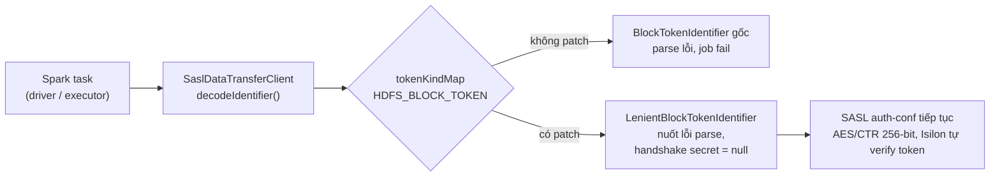

# sample-spark-application-privacy

Project giải quyết **3 bài toán bảo mật dữ liệu** cho Spark 3.5.1 (Scala 2.12) chạy trên
Kubernetes qua **Spark Operator**, đọc/ghi HDFS trên Dell PowerScale/Isilon OneFS:

| #   | Bài toán                                                                                                                                                                                                           | Giải pháp                                                                                                                                | Module                               |
| --- | ------------------------------------------------------------------------------------------------------------------------------------------------------------------------------------------------------------------ | ---------------------------------------------------------------------------------------------------------------------------------------- | ------------------------------------ |
| 1   | Isilon **ép wire encryption bắt buộc** (`dfs.data.transfer.protection = privacy`), nhưng block token của Isilon không đúng chuẩn Apache khiến Hadoop client ≥ 3.2.1 parse lỗi — **mọi thao tác đọc/ghi HDFS fail** | Patch tương thích `LenientBlockTokenIdentifier`, giữ nguyên mã hoá và Kerberos (không hạ mức bảo mật)                                    | `spark-app` (`vai.lakehouse.hdfs.*`) |
| 2   | Mã hoá **cột dữ liệu nhạy cảm** trước khi ghi lên Data Lake, phải dùng được cả trong Spark job (DataFrame API) lẫn trên query console SQL của sql-engine, và 2 đường phải cho cùng kết quả                         | Biểu thức Catalyst **built-in** của Spark (`aes_encrypt`/`aes_decrypt`, AES-256-GCM), `keyPrefix` lấy từ K8s Secret hoặc HashiCorp Vault | `column-crypto-lib`                  |
| 3   | Đọc/ghi CDR đã mã hoá theo **thuật toán riêng của đối tác** (không tự chọn được thuật toán; đối tác chỉ cấp thư viện Java **chỉ có decrypt**)                                                                      | **UDF** bọc thư viện đối tác + tự viết phần encrypt tương ứng (thuật toán không tái tạo được bằng hàm built-in)                          | `cdr-crypto-udf`                     |

Ba module dùng chung 1 project Maven multi-module và chung hạ tầng lấy `keyPrefix` từ Vault
(`PrefixSourceFactory`, tái dùng giữa module 2 và 3 qua namespace conf riêng). Chi tiết từng
bài toán ở mục 1 bên dưới; ứng dụng mẫu minh hoạ bài toán 1 từ mục 5.

---

## 1. Bài toán

### 1.1. Wire encryption + block token không tương thích trên Isilon

| Thành phần                   | Giá trị                                                         |
| ---------------------------- | --------------------------------------------------------------- |
| Spark / Scala                | 3.5.1 / 2.12                                                    |
| Hadoop client (đi kèm Spark) | 3.3.4                                                           |
| HDFS backend                 | Dell PowerScale / Isilon OneFS 9.5.0.6 (không phải Apache HDFS) |
| Namenode                     | `hdfs://vailakehouse.datalakehkh.viettel.com.vn:8020`           |
| Xác thực                     | Kerberos, realm `VAILAKEHOUSE.VIETTEL.COM`, principal `k8s`     |
| Chạy trên                    | Kubernetes + Spark Operator (`SparkApplication` CRD)            |

Isilon **ép** mã hoá đường truyền (`AES/CTR/NoPadding` 256-bit). Từ Hadoop client 3.2.1
(HDFS-13617 / HDFS-13699), client tự parse block token trong SASL handshake; token của
Isilon dùng định dạng nội bộ nên parse ném `NegativeArraySizeException` và **mọi thao tác
đọc/ghi block đều fail**. Không có config Spark/Hadoop nào tắt được bước này — phải can
thiệp ở tầng class.

> **Ràng buộc cứng:** KHÔNG được hạ `dfs.data.transfer.protection` xuống
> `authentication`/`integrity`. Patch giữ nguyên mã hoá, Kerberos và việc Isilon verify token.

Giải pháp chi tiết ở mục 2. Ứng dụng mẫu minh hoạ (`spark-app`) từ mục 5.

### 1.2. Mã hoá cột dữ liệu nhạy cảm — dùng chung từ Spark job lẫn SQL console

Dữ liệu ghi lên Data Lake cần mã hoá một số cột (PII, số điện thoại, ISDN...) trước khi lưu,
với các ràng buộc:

- Giải mã lại đúng dữ liệu gốc bất kể ghi bằng Spark job (DataFrame API) hay đọc bằng câu SQL
  trên sql-engine (Spark Thrift Server) — 2 đường phải luôn khớp nhau.
- Key mã hoá sinh **riêng cho từng dòng**, từ 1 cột plaintext sẵn có trên dòng đó (`keyField`)
  cộng với 1 `keyPrefix` bí mật lấy từ Vault/K8s Secret — không dùng chung 1 key cho cả bảng.
- Không tự viết thuật toán mã hoá tay — dùng hàm đã được Spark kiểm chứng sẵn.

Giải pháp: `column-crypto-lib`, biểu thức Catalyst **built-in** (`aes_encrypt`/`aes_decrypt`,
AES-256-GCM) — chi tiết cách dùng ở mục "Mã hoá cột" trong mục 5, kiến trúc built-in so với
UDF tại [`docs/COLUMN_CRYPTO_ARCHITECTURE.md`](./docs/COLUMN_CRYPTO_ARCHITECTURE.md), hướng dẫn
nạp vào sql-engine tại [`docs/COLUMN_CRYPTO_SQL_ENGINE_GUIDE.md`](./docs/COLUMN_CRYPTO_SQL_ENGINE_GUIDE.md).

### 1.3. Đọc/ghi CDR theo đúng thuật toán mã hoá của đối tác

Một luồng dữ liệu khác (CDR) được đối tác mã hoá bằng thuật toán **riêng của họ** trước khi
giao — AES-128-ECB với cách sinh key (cộng dồn ký tự theo `prefix + field`) hoàn toàn khác
`column-crypto-lib`. Đối tác chỉ cấp một thư viện Java **chỉ có decrypt**, project phải:

- Gọi đúng thư viện decrypt thật của họ (không tái tạo lại thuật toán bằng tay).
- Tự viết phần encrypt tương ứng — đối tác không cung cấp.
- Dùng được trên SQL console, y hệt cách dùng `column_encrypt`/`column_decrypt` của mục 1.2.

Vì thuật toán của đối tác không tái tạo được bằng biểu thức built-in của Spark (vòng lặp cộng
dồn key có độ dài động), hướng đi bắt buộc là **UDF** — khác hẳn kiến trúc của
`column-crypto-lib`. Giải pháp: `cdr-crypto-udf` — kế hoạch và code chi tiết tại
[`docs/PARTNER_CDR_CRYPTO_UDF_PLAN.md`](./docs/PARTNER_CDR_CRYPTO_UDF_PLAN.md).

### 1.4. Hạ tầng dùng chung và cách nạp lib crypto

Cả 2 lib crypto cần lấy `keyPrefix` (K8s Secret / Vault / env / Spark conf) — phần này tách thành
module riêng `key-prefix-lib`, **không chứa thuật toán mã hoá**, để `column-crypto-lib` và `cdr-crypto-udf`
độc lập nhau (không lib nào phụ thuộc lib kia). Jar của `spark-app` cũng **không nhúng** lib crypto nào:
loại crypto nào được dùng do image target (Dockerfile) + `sparkConf`/env trong manifest quyết định — xem mục "Mã hoá cột" (mục 5).

## 2. Giải pháp tổng quan

> Mục 2–9 mô tả giải pháp cho **bài toán 1** (mục 1.1, wire encryption/block token). Giải pháp
> cho bài toán 2 và 3 nằm ở mục "Mã hoá cột" trong mục 5 và ở `docs/COLUMN_CRYPTO_ARCHITECTURE.md`
> / `docs/PARTNER_CDR_CRYPTO_UDF_PLAN.md`.



Patch đăng ký `LenientBlockTokenIdentifier` (subclass của `BlockTokenIdentifier`) đè lên
entry `HDFS_BLOCK_TOKEN` trong `Token.tokenKindMap` (cơ chế `ServiceLoader`, last-write-wins),
khôi phục hành vi của Hadoop client ≤ 3.2.0: coi block token là chuỗi byte đục, chỉ chuyển
tiếp. Mã hoá, Kerberos, RPC encryption **không đổi**.

Phân tích chi tiết, diagram luồng lỗi/luồng đã vá và ảnh hưởng hiệu năng: xem
[`docs/HDFS_BLOCK_TOKEN_PATCH_FLOW.md`](./docs/HDFS_BLOCK_TOKEN_PATCH_FLOW.md).

Đây là **workaround**, không phải fix gốc — fix thật là Dell phát hành OneFS sinh block
token đúng chuẩn Apache. Khi đó chỉ cần gỡ package `vai.lakehouse.hdfs` và file
`META-INF/services`, phần app code không phải đụng tới.

## 3. Project gồm những gì

| Thành phần                                                               | Vai trò                                                                                                                                                                                                                                                                   |
| ------------------------------------------------------------------------ | ------------------------------------------------------------------------------------------------------------------------------------------------------------------------------------------------------------------------------------------------------------------------- |
| **App mẫu** `org.example.SparkApp`                                       | Job Spark: tạo DB nếu chưa có → tạo bảng nếu chưa có → insert dữ liệu mẫu → query lại (giống `vlp-spark-sample/MainApp.scala`, cộng thêm Kerberos + diagnostics wire encryption cho Isilon)                                                                               |
| **Lib lấy keyPrefix** `key-prefix-lib` (`vai.lakehouse.keyprefix.*`) | Hạ tầng DÙNG CHUNG của mọi lib crypto: lấy keyPrefix từ K8s Secret mount / HashiCorp Vault / biến môi trường / Spark conf, có cache; KHÔNG chứa thuật toán mã hoá |
| **Lib mã hoá cột** `column-crypto-lib` (`vai.lakehouse.columncrypto.*`)  | Bài toán 2 (mục 1.2): mã hoá/giải mã cột AES-256-GCM qua **DataFrame API** lẫn **SQL function** (`column_encrypt`/`column_decrypt`), lấy `keyPrefix` từ K8s Secret mount và/hoặc Vault. Jar riêng, nạp được vào sql-engine (xem `docs/COLUMN_CRYPTO_SQL_ENGINE_GUIDE.md`) |
| **UDF mã hoá CDR** `cdr-crypto-udf` (`vai.lakehouse.columncrypto.cdr.*`) | Bài toán 3 (mục 1.3): `cdr_encrypt`/`cdr_decrypt` bọc thư viện mã hoá CDR của đối tác (`TransformDL`), thuật toán do đối tác quy định. Dùng được cả bằng **SQL function** lẫn **DataFrame API** (`CdrCrypto.encryptColumns/decryptColumns`). Module riêng, cần jar đối tác cài cục bộ để build (xem `docs/PARTNER_CDR_CRYPTO_UDF_PLAN.md`)                             |
| **Patch lib** `vai.lakehouse.hdfs.*`                                     | Bài toán 1 (mục 1.1): vá tương thích block token Isilon (xem mục 2)                                                                                                                                                                                                       |
| **Log4j2 config**                                                        | Chỉ log phần quan trọng của app (logger `VLP`), chặn chatter Spark/Hadoop                                                                                                                                                                                                 |
| **Dockerfile** | Multi-stage trên base `apache/spark:3.5.1-scala2.12-java11-ubuntu`; 3 target: `no-crypto` (mặc định), `column-crypto`, `cdr-crypto` — mỗi target COPY (hoặc không) các jar lib crypto rời, xem mục 7 |
| **k8s/spark-application-column.yaml** | Manifest `SparkApplication` biến thể **column-crypto** (nạp `key-prefix-lib` + `column-crypto-lib`, dùng `column_encrypt`/`column_decrypt`) |
| **k8s/spark-application-cdr.yaml** | Manifest `SparkApplication` biến thể **cdr-crypto** (nạp `key-prefix-lib` + `cdr-crypto-udf` + jar đối tác, dùng `cdr_encrypt`/`cdr_decrypt`) |
| **docs/**                                                                | Tài liệu kỹ thuật chi tiết (mục 10)                                                                                                                                                                                                                                       |

`mvn package` (mặc định, không profile) build `key-prefix-lib` + `column-crypto-lib` + `spark-app`, sinh ra **4
artifact**. Jar của `spark-app` KHÔNG nhúng và không biên dịch với lib crypto nào — các lib là jar rời, nạp lúc deploy
qua Dockerfile (COPY) + `sparkConf` (`spark.jars`, `spark.sql.extensions`). `cdr-crypto-udf` (module bài toán 3) KHÔNG
build mặc định — cần jar đối tác cài cục bộ trước và bật profile `cdr-crypto` (xem mục 6.5):

| Artifact                                                                               | Nội dung                                                                           | Dùng cho                                                                 |
| -------------------------------------------------------------------------------------- | ---------------------------------------------------------------------------------- | ------------------------------------------------------------------------ |
| `key-prefix-lib/target/key-prefix-lib-1.0-SNAPSHOT.jar` | Jar thuần: chỉ `vai.lakehouse.keyprefix.*` (hạ tầng lấy keyPrefix) | Nạp CÙNG mọi lib crypto (`column-crypto-lib`, `cdr-crypto-udf`) |
| `column-crypto-lib/target/column-crypto-lib-1.0-SNAPSHOT.jar` | Jar thuần (không shade): chỉ `vai.lakehouse.columncrypto.*` (KHÔNG gồm code lấy prefix) | sql-engine hoặc app Spark bất kỳ (`spark.jars` + `spark.sql.extensions`), nạp CÙNG `key-prefix-lib.jar` |
| `spark-app/target/sample-spark-application-privacy-1.0-SNAPSHOT.jar` | Fat jar: app + Delta + patch + `META-INF/services` — KHÔNG chứa lib crypto | Chạy SparkApplication (`mainApplicationFile`) |
| `spark-app/target/sample-spark-application-privacy-1.0-SNAPSHOT-block-token-patch.jar` | Jar "thin" chỉ chứa `vai.lakehouse.hdfs.*` + `META-INF/services`                   | Nhét vào `/opt/spark/jars/` của image khác (ví dụ Spark History Server)  |
| `cdr-crypto-udf/target/cdr-crypto-udf-1.0-SNAPSHOT.jar` (profile `cdr-crypto`) | Jar thuần (~15 KB): chỉ `vai.lakehouse.columncrypto.cdr.*`, KHÔNG chứa jar đối tác | Nạp CÙNG `key-prefix-lib.jar` và jar đối tác (3 jar); KHÔNG cần `column-crypto-lib.jar` |

## 4. Cấu trúc thư mục

```
.
├── pom.xml                         # parent: properties + pluginManagement + danh sách module
├── Dockerfile                      # multi-stage: target no-crypto | column-crypto | cdr-crypto
├── Dockerfile.jar-carrier          # image tạm chứa column-crypto-lib.jar + key-prefix-lib.jar để mang vào prod
├── DataLakeSecurity_jv8.jar         # jar đối tác (KHÔNG commit — .gitignore), chỉ cần khi build profile cdr-crypto + target cdr-crypto
├── tools/datalake-security-test/    # script test thủ công đối chiếu thuật toán đối tác (KHÔNG commit)
├── k8s/
│   ├── spark-application-column.yaml             # SparkApplication biến thể column-crypto
│   ├── spark-application-cdr.yaml                # SparkApplication biến thể cdr-crypto
│   ├── key-prefix-secret.yaml                    # mẫu K8s Secret chứa keyPrefix (nguồn "file")
│   └── column-crypto-jar-carrier-pod.yaml        # pod tạm để lấy jar ra khỏi image jar-carrier
├── docs/
│   ├── COLUMN_CRYPTO_SQL_ENGINE_GUIDE.md        # bài toán 2: dùng lib trong sql-engine, config UI + query console
│   ├── COLUMN_CRYPTO_ARCHITECTURE.md            # bài toán 2: kiến trúc built-in vs UDF, bảng so sánh
│   ├── PARTNER_CDR_CRYPTO_UDF_PLAN.md           # bài toán 3: plan UDF mã hoá CDR đối tác
│   ├── SPARK_HDFS_WIRE_ENCRYPTION_TASK.md       # bài toán 1: root cause + thiết kế patch
│   ├── HDFS_BLOCK_TOKEN_PATCH_FLOW.md           # bài toán 1: diagram + ảnh hưởng hiệu năng
│   ├── HDFS_PATCH_AT_SCALE.md                   # bài toán 1: phân phối patch cho nhiều app
│   └── spark-history-server-hdfs-hkh-kerberos.md
├── key-prefix-lib/                 # HẠ TẦNG DÙNG CHUNG: lấy keyPrefix (jar thuần, Spark provided, không có thuật toán mã hoá)
│   └── src/
│       ├── main/scala/vai/lakehouse/keyprefix/
│       │   ├── PrefixSource.scala        # trait + FilePrefixSource (Secret mount) + ChainedPrefixSource (fallback) + CachedPrefixSource (TTL)
│       │   ├── VaultPrefixSource.scala   # Vault KV v2, Kubernetes auth hoặc token tĩnh
│       │   ├── PrefixSourceFactory.scala # ConfigSource/SparkConfSource/ChainedConfigSource + dựng nguồn từ cấu hình
│       │   ├── EnvConfigSource.scala     # đọc cấu hình từ biến môi trường (CRYPTO_PREFIX_SOURCE, VAULT_*, ...)
│       │   └── PrefixFiles.scala         # đọc file prefix + kiểm tra tên dataset (chặn path traversal)
│       └── test/                         # unit test (Vault giả bằng HTTP server cục bộ, chain/cache, env)
├── column-crypto-lib/              # BÀI TOÁN 2: thư viện mã hoá cột (jar thuần, Spark provided; phụ thuộc key-prefix-lib)
│   └── src/
│       ├── main/scala/vai/lakehouse/columncrypto/
│       │   ├── CryptoExpressions.scala       # NGUỒN DUY NHẤT của công thức mã hoá (Catalyst Expression)
│       │   ├── ColumnCrypto.scala            # DataFrame API: encryptColumns/decryptColumns (bọc CryptoExpressions)
│       │   ├── ColumnCryptoConfig.scala      # settings YAML: keyField/encryptedColumns (chỉ DataFrame API dùng)
│       │   └── sql/ColumnCryptoExtension.scala # đăng ký SQL function column_encrypt / column_decrypt
│       └── test/                             # unit test + test SQL bằng SparkSession local
├── cdr-crypto-udf/                 # BÀI TOÁN 3: mã hoá CDR đối tác qua SQL function + DataFrame API (phụ thuộc key-prefix-lib)
│   └── src/
│       ├── main/scala/vai/lakehouse/columncrypto/cdr/
│       │   ├── CdrCipherCore.scala           # gọi decrypt() thật của đối tác + tự viết encrypt() qua reflection
│       │   ├── CdrCrypto.scala               # DataFrame API: encryptColumns/decryptColumns + transform dùng chung với SQL
│       │   ├── CdrCryptoConfig.scala         # keyPrefix/keyField/encryptedColumns cho DataFrame API (toString che prefix)
│       │   └── CdrCryptoExtension.scala      # đăng ký SQL function cdr_encrypt / cdr_decrypt (ScalaUDF thật, không phải built-in)
│       └── test/                             # unit test + test SQL — cần jar đối tác cài cục bộ để chạy
└── spark-app/                      # BÀI TOÁN 1: app mẫu + patch block token; lib crypto chỉ ở scope provided/test (KHÔNG vào fat jar)
    └── src/
        ├── main/
        │   ├── resources/
        │   │   ├── META-INF/services/org.apache.hadoop.security.token.TokenIdentifier
        │   │   └── log4j2.properties
        │   └── scala/
        │       ├── org/example/
        │       │   ├── SparkApp.scala                   # entry point, điều phối create DB/table/insert
        │       │   ├── CryptoStep.scala                 # bước mã hoá cột: gọi hàm SQL theo TÊN cấu hình (app không biết lib nào)
        │       │   ├── BusinessLogic.scala              # schema + DDL + sample data (thuần, test được)
        │       │   └── Log.scala                        # banner/section/kv cho log dễ đọc
        │       └── vai/lakehouse/hdfs/
        │           ├── LenientBlockTokenIdentifier.scala   # patch chính
        │           ├── BlockTokenDiagnostics.scala         # chỉ đọc, xác nhận patch đang thắng
        │           └── BlockTokenFixPlugin.scala           # fallback qua spark.plugins
        └── test/scala/org/example/
            ├── BusinessLogicSpec.scala
            └── CryptoStepSpec.scala             # chạy với column-crypto-lib ở scope test (mô phỏng deploy thật)
```

## 5. Ứng dụng mẫu

App không nhận tham số dòng lệnh — toàn bộ cấu hình đọc qua biến môi trường (tất cả optional,
có default; validate lúc khởi động, sai giá trị sẽ `exit(2)` — cùng logic với
`vlp-spark-sample/MainApp.scala`):

| Biến                                                                      | Mặc định                                                                               | Giá trị hợp lệ               | Mô tả                                                                                                                        |
| ------------------------------------------------------------------------- | -------------------------------------------------------------------------------------- | ---------------------------- | ---------------------------------------------------------------------------------------------------------------------------- |
| `APP_NAME`                                                                | `SampleSparkApplicationPrivacy`                                                        | chuỗi bất kỳ                 | Tên hiển thị trên Spark UI                                                                                                   |
| `DB_NAME`                                                                 | `demo_db`                                                                              | chuỗi bất kỳ; khi bật mã hoá với `CRYPTO_PREFIX_SOURCE=dak`: chỉ `[A-Za-z0-9_]`, 1–128 ký tự | Database/schema sẽ được tạo. Cùng `TABLE_NAME` tạo thành tên key `database.table` (chữ thường) để tra keyPrefix |
| `TABLE_NAME`                                                              | `sample_table`                                                                         | như `DB_NAME`                | Bảng sẽ được tạo                                                                                                             |
| `TABLE_TYPE`                                                              | `delta`                                                                                | `delta` / `iceberg` / `hive` | `hive` → `STORED AS PARQUET`; còn lại → `USING <type>`                                                                       |
| `INSERT_MODE`                                                             | `append`                                                                               | `append` / `overwrite`       | Chế độ ghi dữ liệu mẫu                                                                                                       |
| `ENABLE_HIVE_SUPPORT`                                                     | `true`                                                                                 | `true` / `false`             | Bật `enableHiveSupport()` cho SparkSession                                                                                   |
| `CRYPTO_ENCRYPT_FUNCTION`, `CRYPTO_DECRYPT_FUNCTION` | (rỗng = KHÔNG mã hoá) | tên hàm SQL, vd `column_encrypt`/`column_decrypt` hoặc `cdr_encrypt`/`cdr_decrypt` | Hàm do extension (nạp qua `spark.sql.extensions`) đăng ký; phải đặt CẢ 2 hoặc để trống CẢ 2. App không nhúng lib crypto, chỉ gọi hàm theo tên — xem mục "Mã hoá cột" |
| `CRYPTO_ENCRYPTED_COLUMNS` | (bắt buộc khi bật mã hoá) | danh sách cột, phân cách bằng dấu phẩy | Các cột bị mã hoá, vd `name,city` |
| `CRYPTO_KEY_FIELD` | (bắt buộc khi bật mã hoá) | tên cột | Cột KHÔNG mã hoá, giá trị của nó (theo từng dòng) dùng làm nguyên liệu sinh key; không được nằm trong `CRYPTO_ENCRYPTED_COLUMNS` |
| `CRYPTO_PREFIX_SOURCE` | `file` | `dak` / `file` / `vault` / `file,vault`. **`dak` không được ghép** với nguồn khác (`dak,vault` bị từ chối) | **Do extension đọc, không phải app**: nguồn keyPrefix — DAK (manifest mẫu đang dùng), thư mục file (K8s Secret) hoặc HashiCorp Vault. Dùng chung cho `column_*` lẫn `cdr_*` — xem mục "Chọn nguồn keyPrefix" |
| `CRYPTO_CACHE_TTL_SECONDS` | `300` | số nguyên ≥ 0 (`0` = tắt cache) | Thời gian cache keyPrefix theo bảng trên driver; áp dụng cho mọi nguồn |
| `DAK_ADDR` | (bắt buộc khi `dak`) | URL `https://…`; `http://` chỉ khi `DAK_ALLOW_INSECURE_HTTP=true` | Base URL của DAK, vd `http://dak-mock:8085` (dak-mock cùng namespace). Lib gọi `GET <DAK_ADDR>/api/v1/keys/<database>/<table>` |
| `DAK_TOKEN_URL` | (bắt buộc khi `dak`) | URL `https://…` (`http://` như trên) | Token endpoint Keycloak của **realm của tenant**, vd `https://sso-lakehouse.cyberspace.vn/realms/vlp-tenantw1xjixm/protocol/openid-connect/token` |
| `DAK_CLIENT_ID` | (bắt buộc khi `dak`) | chuỗi | Client Keycloak của team (`client_credentials`), vd `team-de-ws8` |
| `DAK_CLIENT_SECRET` | (bắt buộc khi `dak`) | chuỗi | **Nhạy cảm**: lấy từ K8s Secret `spark-dak-client` (key `clientSecret`) qua `secretKeyRef`, không ghi thẳng vào manifest |
| `DAK_ALLOW_INSECURE_HTTP` | `false` | `true` / `false` | `true` cho phép `DAK_ADDR`/`DAK_TOKEN_URL` dùng `http://` — **chỉ** khi test với dak-mock; DAK thật phải bỏ biến này |
| `CRYPTO_KEY_PREFIX_DIR` | `conf/key-prefix` (đọc đĩa rồi classpath; jar app không còn bản mẫu — luôn đặt tường minh) | đường dẫn thư mục | Chỉ khi `file`: thư mục chứa keyPrefix, mỗi bảng 1 file `<database>.<table>` (nhạy cảm, mount K8s Secret `key-prefix`) |
| `VAULT_ADDR`, `VAULT_KV_PATH`                                             | (bắt buộc khi `vault`)                                                                 | chuỗi                        | Địa chỉ Vault, đường dẫn KV chứa prefix (không gồm tên key; secret con là `<VAULT_KV_PATH>/<database>.<table>`)              |
| `VAULT_AUTH_METHOD`                                                       | `kubernetes`                                                                           | `kubernetes` / `token`       | Cách đăng nhập Vault                                                                                                         |
| `VAULT_ROLE`                                                              | (bắt buộc khi `kubernetes`)                                                            | chuỗi                        | Tên role Kubernetes auth                                                                                                     |
| `VAULT_TOKEN`                                                             | (bắt buộc khi `token`)                                                                 | chuỗi                        | Token Vault tĩnh, nhạy cảm — lấy qua `secretKeyRef`                                                                          |
| `VAULT_KV_MOUNT`, `VAULT_AUTH_MOUNT`, `VAULT_KEY_FIELD`, `VAULT_JWT_PATH` | `kv`, `kubernetes`, `keyPrefix`, `/var/run/secrets/kubernetes.io/serviceaccount/token` | chuỗi                        | Mount KV v2, mount auth, tên field chứa prefix trong secret, file JWT của service account                                    |
| `HDFS_SASL_DEBUG`                                                         | `false`                                                                                | `true` / `false`             | Bật DEBUG cho 2 logger SASL/Token của Hadoop — in ra hex dump wrap/unwrap rất dài, chỉ bật khi cần trace lỗi wire encryption |

Flow nghiệp vụ (`SparkApp.runCreateTableAndInsert`):

1. `CREATE DATABASE IF NOT EXISTS ${DB_NAME}`
2. `CREATE TABLE IF NOT EXISTS ${DB_NAME}.${TABLE_NAME} (id BIGINT, name STRING, city STRING, created_at STRING) USING delta` (hoặc `STORED AS PARQUET` nếu `TABLE_TYPE=hive`)
3. Nếu bật mã hoá (`CRYPTO_ENCRYPT_FUNCTION`): dựng DataFrame đã mã hoá các cột `CRYPTO_ENCRYPTED_COLUMNS` bằng hàm SQL của extension — bước này chạy TRƯỚC mọi thao tác ghi, nên hàm chưa nạp hoặc keyPrefix hỏng thì fail sớm (extension tự tra keyPrefix và che khỏi plan/Spark UI); insert 5 dòng dữ liệu mẫu bằng `insertInto` (mode = `INSERT_MODE`). Không bật thì ghi plaintext
4. `SELECT * FROM ${DB_NAME}.${TABLE_NAME} ORDER BY id`, giải mã lại các cột đó, in kết quả plaintext

- Trước khi chạy nghiệp vụ, app in mục **HDFS SECURITY DIAGNOSTICS**: các config bảo mật,
  `encryptDataTransfer` của server, và **class đang xử lý `HDFS_BLOCK_TOKEN`**
  (patch có đang hoạt động không).
- Sau mỗi bước (CREATE DATABASE / CREATE TABLE / INSERT), app log permission/owner của
  thư mục HDFS tương ứng (`DB_DIR`, `TABLE_DIR`) — hữu ích để trace lỗi quyền trên Isilon.
- Khi job fail vì block token, app tự nhận diện và chỉ thẳng tới nguyên nhân/patch chưa nạp.

### Mã hoá cột — plugin, không nhúng vào jar app

Jar của `spark-app` **không chứa lib crypto nào**. Mã hoá là plugin nạp lúc deploy, gồm 3 mảnh khớp nhau:

| Mảnh                | Ở đâu                                                                                       |
| ------------------- | ------------------------------------------------------------------------------------------- |
| Jar lib crypto      | `Dockerfile` COPY vào `/opt/app/` theo target (`column-crypto` hoặc `cdr-crypto`, mục 7)    |
| Nạp + đăng ký hàm   | `sparkConf` trong manifest: `spark.jars` (đường dẫn jar) + `spark.sql.extensions` (class extension) |
| App gọi hàm nào     | env `CRYPTO_ENCRYPT_FUNCTION`/`CRYPTO_DECRYPT_FUNCTION`/`CRYPTO_ENCRYPTED_COLUMNS`/`CRYPTO_KEY_FIELD` |

App (`CryptoStep`) chỉ gọi `fn('<tên bảng>', <cột>, <cột keyField>)` theo TÊN hàm SQL — hàm nào có mặt phụ thuộc
extension nào được nạp; app không biết và không biên dịch với lib nào. (Bản thân các lib vẫn hỗ trợ thêm DataFrame API —
`ColumnCrypto`, `CdrCrypto` — cho code khác dùng, `spark-app` không bắt buộc dùng.)
Muốn đổi loại crypto: đổi target image + manifest tương ứng. Không nạp extension
mà vẫn đặt tên hàm thì job fail sớm với `AnalysisException: Undefined function`.

| Biến thể        | Image target    | Manifest                             | Jar nạp (`spark.jars`)                                        | Hàm SQL app gọi                       |
| --------------- | --------------- | ------------------------------------ | ------------------------------------------------------------- | ------------------------------------ |
| Không mã hoá    | `no-crypto`     | (bỏ các biến `CRYPTO_*_FUNCTION`)    | không                                                         | —                                    |
| column-crypto   | `column-crypto` | `k8s/spark-application-column.yaml`  | `key-prefix-lib` + `column-crypto-lib`                        | SQL `column_encrypt` / `column_decrypt` |
| cdr-crypto      | `cdr-crypto`    | `k8s/spark-application-cdr.yaml`     | `key-prefix-lib` + `cdr-crypto-udf` + `DataLakeSecurity_jv8`  | SQL `cdr_encrypt` / `cdr_decrypt` |

Cả hai hàm cùng hợp đồng 3 tham số `fn(tableName, value, keyValue)`: `tableName` là hằng chuỗi (nơi extension tra keyPrefix),
`value` là cột cần xử lý, `keyValue` là giá trị cột `CRYPTO_KEY_FIELD` của chính dòng đó.

**`column_encrypt`/`column_decrypt`** (module `column-crypto-lib`): AES-256-GCM qua hàm built-in `aes_encrypt`/`aes_decrypt` của
Spark SQL (có từ Spark 3.3) — không tự viết crypto tay. Key sinh **riêng cho từng dòng**:

```
key = SHA-256(keyPrefix || giá trị cột keyField của chính dòng đó)
```

Công thức nằm ở `CryptoExpressions`, dùng chung cho **DataFrame API** (`ColumnCrypto.encryptColumns`, thư viện vẫn giữ và có test) lẫn
**SQL function** `column_encrypt`/`column_decrypt` (dùng trên query console của sql-engine, xem
`docs/COLUMN_CRYPTO_SQL_ENGINE_GUIDE.md`), nên dữ liệu ghi bằng đường này giải mã được bằng đường kia.

**`cdr_encrypt`/`cdr_decrypt` và `CdrCrypto`** (module `cdr-crypto-udf`): thuật toán do đối tác quy định (AES-128-ECB, xem mục 1.3 và
`docs/PARTNER_CDR_CRYPTO_UDF_PLAN.md`), là UDF thật nên **executor cũng cần đủ 3 jar**. Hỗ trợ cả 2 cách dùng, cùng 1 hàm biến đổi
(`CdrCrypto.transform`) nên kết quả giống hệt nhau:

```scala
// DataFrame API
val enc = CdrCrypto.encryptColumns(df, "sub_rel_product", keyField = "start_datetime", Seq("isdn"))
val dec = CdrCrypto.decryptColumns(enc, "sub_rel_product", keyField = "start_datetime", Seq("isdn"))
// SQL:  SELECT cdr_encrypt('sub_rel_product', isdn, start_datetime) FROM t
```

#### keyPrefix — hạ tầng dùng chung `key-prefix-lib`

Cả 2 lib lấy keyPrefix qua `key-prefix-lib`, đọc cấu hình theo thứ tự ưu tiên: `spark.<lib>.*` (Spark conf — cách sql-engine
cấu hình) rồi tới **cùng một bộ biến môi trường** `CRYPTO_PREFIX_SOURCE`, `CRYPTO_KEY_PREFIX_DIR`, `VAULT_*`... (cách SparkApplication
cấu hình). Vì vậy 1 khối env trong manifest cấu hình cho cả `column_*` lẫn `cdr_*`, và app không cần biết gì về nguồn prefix.
Mỗi bảng có 1 prefix — 2 hàm dùng chung sẽ lấy cùng giá trị từ cùng path/field Vault (tách riêng bằng `spark.cdrcrypto.*` nếu sau này cần).

```yaml
# CRYPTO_KEY_PREFIX_DIR — K8s Secret "key-prefix" (NHẠY CẢM, KHÔNG commit giá trị thật).
# data của Secret là <tên bảng>: <keyPrefix của bảng đó>; mount thành thư mục, mỗi key 1 file.
apiVersion: v1
kind: Secret
metadata:
  name: key-prefix
stringData:
  demo_db.sample_table: "sample_table_dev_prefix" # -> file /etc/key-prefix/demo_db.sample_table (tên key = DB_NAME.TABLE_NAME)
```

Ký tự xuống dòng ở cuối file được bỏ khi đọc. Tên bảng chỉ được gồm `[A-Za-z0-9_.-]` và không
bắt đầu bằng `.` (chặn path traversal vì tên bảng đi vào đường dẫn file). Thông báo lỗi không bao giờ in
giá trị `keyPrefix`.

- `keyPrefix` là bí mật thật sự (gần tương đương credential) — `keyField` chỉ là tên cột
  (config), nhưng giá trị của nó vốn công khai với bất kỳ ai đọc được bảng, nên toàn bộ độ an
  toàn của cơ chế này quy về việc giữ kín `keyPrefix`. Không commit giá trị thật của `keyPrefix` vào git.

  Manifest mẫu lấy `keyPrefix` qua DAK (`CRYPTO_PREFIX_SOURCE=dak`, chỉ driver cần; không còn env `VAULT_*`). Cột mã hoá khai
  thẳng bằng env (`CRYPTO_ENCRYPTED_COLUMNS`, `CRYPTO_KEY_FIELD`) — **không còn** ConfigMap
  `column-crypto-settings` / `CRYPTO_CONFIG_PATH`.

  **Nguồn `file` (K8s Secret)** — dùng khi không có Vault: đặt `CRYPTO_PREFIX_SOURCE=file`,
  `CRYPTO_KEY_PREFIX_DIR=/etc/key-prefix` và mount Secret `key-prefix` (`k8s/key-prefix-secret.yaml`,
  mỗi key = tên bảng, giá trị mẫu — thay bằng giá trị thật, không commit) vào thư mục đó cho driver.
  Lưu ý K8s Secret **chỉ base64-encode chứ không tự mã hoá** trong `etcd` (trừ khi cluster đã bật
  riêng encryption-at-rest cho Secret), và không chặn được ai đã `kubectl exec` vào pod đang chạy —
  nó chỉ tách quyền đọc `keyPrefix` khỏi code/image, không phải kiểm soát truy cập theo từng lần
  decrypt như Ranger KMS.

  **Che khỏi plan (`column_*`):** `keyPrefix` là literal trong biểu thức SQL nên mặc định sẽ hiện trong
  `explain`/`queryExecution.toString` (tab SQL của Spark UI, event log). `ColumnCryptoExtension` tự đặt
  `spark.sql.redaction.string.regex` ngay khi resolve hàm, nên các chỗ đó chỉ hiện `*********(redacted)`.
  (`cdr_*` để prefix trong closure của UDF chứ không phải literal của plan, nên không cần bước này.)

### Chọn nguồn keyPrefix (`CRYPTO_PREFIX_SOURCE`)

| Giá trị      | Hành vi                                                                                  |
| ------------ | ---------------------------------------------------------------------------------------- |
| `dak`        | **(đang triển khai)** lấy key qua DAK: token Keycloak `client_credentials` (`DAK_*`), tên key `'database.table'` |
| `file`       | (mặc định) đọc `<CRYPTO_KEY_PREFIX_DIR>/<tên bảng>` — K8s Secret mount                   |
| `vault`      | gọi Vault KV v2 (`VAULT_*`); giữ lại làm **fallback thủ công** khi DAK sự cố             |
| `file,vault` | thử `file` trước, không có/lỗi thì fallback sang `vault`; lỗi gộp lý do của cả hai nguồn |

`dak` **không được ghép** với nguồn khác (`dak,vault` bị từ chối): fallback tự động chạy cả khi DAK trả 403, tức là
bỏ qua phân quyền. Khi DAK sự cố, vận hành đổi `CRYPTO_PREFIX_SOURCE=vault`, thêm lại các env `VAULT_*` rồi chạy lại job
(mục "Lấy keyPrefix từ DAK").

Kết quả được cache trong bộ nhớ theo bảng, `CRYPTO_CACHE_TTL_SECONDS` (mặc định 300, `0` = tắt cache).
Cùng các key logic này, sql-engine cấu hình qua Spark conf `spark.columncrypto.<key>` (hoặc `spark.cdrcrypto.<key>`) thay vì env
(`source`, `file.dir`, `vault.addr`, `vault.role`, `vault.kvBasePath`, `vault.authMount`,
`vault.kvMount`, `vault.keyField`, `vault.jwtPath`, `vault.authMethod`, `vault.token`, `cacheTtlSeconds`,
`dak.addr`, `dak.tokenUrl`, `dak.clientId`, `dak.clientSecret`, `dak.allowInsecureHttp`).

### Lấy keyPrefix từ DAK (`CRYPTO_PREFIX_SOURCE=dak`)

`DakPrefixSource` (module `key-prefix-lib`) chạy trên driver: xin access token `client_credentials` tại `DAK_TOKEN_URL`
(Keycloak, realm của tenant), cache token tới gần hết hạn, rồi gọi `GET <DAK_ADDR>/api/v1/keys/<database>/<table>`.
DAK trả 401 thì xin token mới và thử lại đúng 1 lần; 403 và mọi lỗi khác báo ngay, kèm `requestId` để tra audit của DAK.

| Biến                      | Bắt buộc | Ghi chú                                                                          |
| ------------------------- | -------- | -------------------------------------------------------------------------------- |
| `DAK_ADDR`                | Có       | `https://` (http chỉ khi `DAK_ALLOW_INSECURE_HTTP=true`, dùng cho test local)     |
| `DAK_TOKEN_URL`           | Có       | `https://<keycloak>/realms/<realm của tenant>/protocol/openid-connect/token`     |
| `DAK_CLIENT_ID`           | Có       | Client Keycloak của team, vận hành cấp                                           |
| `DAK_CLIENT_SECRET`       | Có       | Lấy từ K8s Secret `spark-dak-client` (key `clientSecret`) qua `secretKeyRef`     |
| `DAK_ALLOW_INSECURE_HTTP` | Không    | `true` cho phép `http://` — chỉ khi test với dak-mock (`DAK_ADDR=http://dak-mock:8085`) |
| `CRYPTO_CACHE_TTL_SECONDS`| Không    | Cache keyPrefix (mặc định 300 s); token Keycloak được cache riêng tới gần hết hạn |

Keycloak nội bộ (`sso-lakehouse.cyberspace.vn`) dùng cert tự ký, nên pod driver cần thêm `hostAliases` (IP `10.221.148.42`),
initContainer `build-truststore` (ConfigMap `keycloak-ca`, key `ca.pem`) và `-Djavax.net.ssl.trustStore=…` trong
`spark.driver.extraJavaOptions`. Hai manifest trong `k8s/` đã có sẵn; initContainer phải khai `resources.limits` vì
ResourceQuota của namespace bắt buộc, và `keycloak-ca` phải được mount cả ở container chính để webhook của Spark Operator
đưa volume vào pod (`docs/COLUMN_CRYPTO_SQL_ENGINE_GUIDE.md` mục 4.7).

Tên key gửi lên DAK là **`database.table`**, chữ thường (`spark-app` tự ghép `DB_NAME.TABLE_NAME`; trên sql-engine là tham
số đầu của hàm, vd `cdr_decrypt('demo_db.users_cdr', ...)`). Tên một phần (`'users_cdr'`) bị từ chối khi `source=dak`.

**Fallback thủ công** khi DAK sự cố: đổi `CRYPTO_PREFIX_SOURCE=vault`, thêm lại các env `VAULT_*` (manifest mẫu đã bỏ chúng,
xem bảng mục 5) và Secret token Vault, rồi chạy lại job. Fallback đọc secret `<VAULT_KV_PATH>/<database>.<table>` ở Vault cũ và **bỏ qua** phân quyền, thời hạn quyền của
DAK — chỉ dùng khi DAK sự cố và quay lại `dak` ngay khi DAK phục hồi. Thiết kế và quy trình: `docs/DAK_KEY_ACCESS_SQL_ENGINE_PLAN.md`,
hợp đồng API: `docs/DAK_API_SPEC.md`.

### Lấy keyPrefix từ HashiCorp Vault (`CRYPTO_PREFIX_SOURCE=vault`)

`VaultPrefixSource` (module `column-crypto-lib`, chỉ dùng JDK `HttpClient` + Jackson có sẵn của Spark) làm 3 bước trên driver:
đăng nhập Kubernetes auth bằng JWT của service account (`POST /v1/auth/<auth-mount>/login`),
đọc KV v2 (`GET /v1/<kv-mount>/data/<VAULT_KV_PATH>/<tên bảng>`, lấy field `VAULT_KEY_FIELD`), rồi thu
hồi token (`POST /v1/auth/token/revoke-self`). Lỗi không bao giờ in JWT, token hay giá trị prefix.

Với path hiện tại `kv/hla-datalake/datalake/spark-application/<tên bảng>` (KV v2 — không có đoạn
`key-prefix` trong path), mỗi secret phải có field `keyPrefix` (đổi bằng `VAULT_KEY_FIELD`).
Cấu hình phía Vault (làm 1 lần, chỉ cần khi dùng Kubernetes auth — xem "Xác thực bằng token Vault
tĩnh" bên dưới nếu Vault dùng token tĩnh như hạ tầng hiện tại):

```bash
vault auth enable kubernetes
vault write auth/kubernetes/config kubernetes_host="https://<K8S_API_SERVER>:443"   # + token_reviewer_jwt / kubernetes_ca_cert nếu Vault chạy ngoài cluster
vault policy write spark-key-prefix - <<'EOF'
path "kv/data/hla-datalake/datalake/spark-application/*" { capabilities = ["read"] }
EOF
vault write auth/kubernetes/role/spark-application \
  bound_service_account_names=spark-application-sa \
  bound_service_account_namespaces=vlp-tenantw1xjixm-wsytjjtr0-ingestion \
  policies=spark-key-prefix ttl=5m
vault kv put kv/hla-datalake/datalake/spark-application/sample_table keyPrefix='<giá trị thật>'
```

#### Xác thực bằng token Vault tĩnh (`VAULT_AUTH_METHOD=token`)

Mặc định `VaultPrefixSource` dùng Kubernetes auth (ở trên). Khi Vault không bật Kubernetes auth cho
app — ví dụ ExternalSecrets `ClusterSecretStore` đang dùng `tokenSecretRef` — có thể dùng thẳng một
**token Vault tĩnh**:

| Env (SparkApplication)    | Spark conf (sql-engine)               | Ý nghĩa                                                   |
| ------------------------- | ------------------------------------- | --------------------------------------------------------- |
| `VAULT_AUTH_METHOD=token` | `spark.columncrypto.vault.authMethod` | `kubernetes` (mặc định) hoặc `token`                      |
| `VAULT_TOKEN`             | `spark.columncrypto.vault.token`      | Token Vault; bắt buộc khi `token`. Không cần `VAULT_ROLE` |

Ở chế độ này lib **không login và không `revoke-self`** (revoke một token dùng chung sẽ làm hỏng mọi
dịch vụ đang dùng nó, kể cả ExternalSecrets). Token không bao giờ xuất hiện trong thông báo lỗi và
`VaultConfig.toString` che nó. Spark tự che conf có chứa `token` trong tab Environment và log
(`spark.redaction.regex`), nhưng giá trị vẫn nằm plaintext trong cấu hình engine/manifest — nên đưa
vào `SparkApplication` bằng `env.valueFrom.secretKeyRef` thay vì ghi thẳng.

**Không nên dùng lại token của ExternalSecrets** (`datalake-vault-token`): store báo `ReadWrite` nên
token đó có quyền ghi, rộng hơn nhiều so với việc chỉ đọc `keyPrefix`. Tạo token riêng, chỉ đọc:

```bash
vault policy write spark-key-prefix - <<'POLICY'
path "kv/data/hla-datalake/datalake/spark-application/*" { capabilities = ["read"] }
POLICY
# Token định kỳ: sống thêm mỗi lần renew; lib KHÔNG tự renew nên phải renew định kỳ hoặc đặt period đủ dài rồi rotate
vault token create -policy=spark-key-prefix -period=768h -orphan -display-name=spark-column-crypto
```

Token có TTL sẽ hết hạn → mọi query mã hoá/giải mã lỗi `HTTP 403` sau TTL cache; cần quy trình
rotate (hoặc chuyển sang Kubernetes auth/AppRole để không phải giữ credential dài hạn).

`VAULT_ADDR` hiện là HTTP nên token và prefix đi trên mạng không mã hoá — app log cảnh báo; nên
chuyển sang HTTPS (JDK dùng truststore mặc định, nếu Vault dùng CA riêng thì cần bổ sung truststore).

- `keyField` bắt buộc không nằm trong `encryptedColumns` (validate lúc chạy, fail-fast) —
  nó phải giữ plaintext để dùng lại làm nguyên liệu sinh key lúc giải mã.
- Cột đã mã hoá lưu dạng `STRING` (Base64 của ciphertext, IV do `aes_encrypt` tự sinh và gắn
  kèm) — DDL hiện tại (`name`/`city`) đã sẵn `STRING` nên không cần đổi; nếu sau này mã hoá
  cột kiểu khác (số, ngày...), DDL phải khai `STRING` cho cột đó.

### Logging

`log4j2.properties`: root logger `warn`; chỉ logger nghiệp vụ `VLP` (dùng bởi `Log.scala`)
ở `info`; toàn bộ nhánh `org.apache.spark`/`org.apache.hadoop`/`io.delta` hạ xuống `warn`,
scheduler K8s + fabric8 client xuống `error`. Hai logger
`org.apache.hadoop.hdfs.protocol.datatransfer.sasl` và
`org.apache.hadoop.security.token.Token` giữ `warn` làm baseline — chỉ được app nâng lên
`DEBUG` khi set `HDFS_SASL_DEBUG=true`.

#### Trên Kubernetes: BẮT BUỘC trỏ bằng `-Dlog4j.configurationFile`

Đây là điểm dễ sai nhất. Khi chạy trên K8s, Spark tự tạo ConfigMap
(`spark-conf-volume-driver`/`spark-conf-volume-exec`) và **mount đè lên `/opt/spark/conf`**
của pod (hằng số `SPARK_CONF_DIR_INTERNAL` trong `spark-kubernetes` jar). Volume mount của
K8s thay thế **toàn bộ** nội dung thư mục → `log4j2.properties` bake trong image tại đó **bị
che hoàn toàn**. Log4j2 không thấy config nào nên rơi về bản mặc định nhúng trong `spark-core`
(`org/apache/spark/log4j2-defaults.properties`, `rootLogger.level = info`) → log INFO của
`TaskSetManager`/`DAGScheduler`/`MemoryStore`... tràn ra dù `log4j2.properties` của project đã
cấu hình đúng.

Vì vậy `Dockerfile` copy file vào **2 chỗ**, và `k8s/spark-application-*.yaml` trỏ tường minh
tới bản không bị che:

| Path trong image                    | Dùng khi                                                                                                                                                           |
| ----------------------------------- | ------------------------------------------------------------------------------------------------------------------------------------------------------------------ |
| `/opt/app/log4j2.properties`        | Chạy trên K8s — trỏ tới qua `-Dlog4j.configurationFile=file:/opt/app/log4j2.properties` ở cả `spark.driver.extraJavaOptions` lẫn `spark.executor.extraJavaOptions` |
| `/opt/spark/conf/log4j2.properties` | Chạy KHÔNG qua K8s (`docker run`, spark-submit local trong container) — lúc đó không có ConfigMap mount đè                                                         |

Kiểm chứng nhanh trên cluster: `kubectl exec <driver-pod> -- ls -la /opt/spark/conf` sẽ **không**
thấy `log4j2.properties` (chỉ có `spark.properties` của ConfigMap) — đúng như mô tả ở trên.

## 6. Build & test

Yêu cầu: JDK 11+, Maven 3.8+ (lần build đầu cần mạng để tải dependency). Scala/Spark/Hadoop được khai
`provided` — không đóng gói vào jar (riêng `delta-spark` đóng gói vào fat jar, xem mục 1).

Project là Maven **multi-module** — chạy lệnh ở thư mục gốc. Cần cài jar đối tác vào `~/.m2` trước khi build
(mục 6.5), vì `cdr-crypto-udf` và `spark-app` đều phụ thuộc nó:

| Module              | Artifact                                                                                          | Dùng cho                                                                   |
| ------------------- | ------------------------------------------------------------------------------------------------- | -------------------------------------------------------------------------- |
| `key-prefix-lib`    | `key-prefix-lib/target/key-prefix-lib-1.0-SNAPSHOT.jar`                                           | Nạp CÙNG mọi lib crypto (hạ tầng lấy keyPrefix)                            |
| `column-crypto-lib` | `column-crypto-lib/target/column-crypto-lib-1.0-SNAPSHOT.jar`                                     | Nạp vào sql-engine hoặc app Spark bất kỳ, cùng `key-prefix-lib.jar`        |
| `spark-app`         | `spark-app/target/sample-spark-application-privacy-1.0-SNAPSHOT.jar` (+ `-block-token-patch.jar`) | Chạy SparkApplication; KHÔNG chứa lib crypto (nạp rời qua `spark.jars`)    |
| `cdr-crypto-udf`    | `cdr-crypto-udf/target/cdr-crypto-udf-1.0-SNAPSHOT.jar` (profile `cdr-crypto`)                    | Nạp cùng `key-prefix-lib.jar` + jar đối tác                                |

### 6.1. Build cả project (bài toán 1 + 2)

```bash
mvn -B clean package                 # build mặc định: key-prefix-lib + column-crypto-lib + spark-app (KHÔNG cần jar đối tác)
mvn -B -Pcdr-crypto clean package    # build TẤT CẢ: thêm cdr-crypto-udf (cần jar đối tác đã cài vào ~/.m2, xem mục 6.5)
```

| Lệnh                                | Module được build                                                | Cần `DataLakeSecurity_jv8.jar` | Dùng khi                                                 |
| ----------------------------------- | ---------------------------------------------------------------- | ------------------------------ | -------------------------------------------------------- |
| `mvn -B clean package`              | `key-prefix-lib`, `column-crypto-lib`, `spark-app`               | Không                          | Image `no-crypto` / `column-crypto`, phát triển hằng ngày |
| `mvn -B -Pcdr-crypto clean package` | 3 module trên + `cdr-crypto-udf`                                 | Có                             | Trước khi `docker build --target cdr-crypto`             |

`docker build --target cdr-crypto` cần thêm `cdr-crypto-udf/target/*.jar` và `DataLakeSecurity_jv8.jar` ở thư mục gốc, nên phải build bằng lệnh có `-Pcdr-crypto`.

### 6.2. Build riêng lib mã hoá (`column-crypto-lib`)

Dùng khi chỉ cần jar để nạp vào sql-engine (xem `docs/COLUMN_CRYPTO_SQL_ENGINE_GUIDE.md`):

```bash
mvn -B clean package -pl column-crypto-lib             # build + test lib
mvn -B clean package -pl column-crypto-lib -DskipTests # bỏ qua test
# -> column-crypto-lib/target/column-crypto-lib-1.0-SNAPSHOT.jar
```

Jar này là jar **thuần** (không shade): chỉ chứa `vai.lakehouse.columncrypto.*`, không kèm
Spark/Jackson/snakeyaml nên không gây xung đột classpath khi nạp vào engine. Nó cần `key-prefix-lib.jar`
(`-pl column-crypto-lib -am` tự build luôn) cùng nằm trên classpath.

### 6.3. Build riêng app chính (`spark-app`)

```bash
mvn -B clean package -pl spark-app -am                 # -am: build luôn lib (chỉ để chạy test scope test của app)
mvn -B clean package -pl spark-app -am -DskipTests
# -> spark-app/target/sample-spark-application-privacy-1.0-SNAPSHOT.jar               (fat jar: app + Delta + patch, KHÔNG có lib crypto)
# -> spark-app/target/sample-spark-application-privacy-1.0-SNAPSHOT-block-token-patch.jar (thin, chỉ patch block token)
```

Phải có `-am`: `spark-app` dùng `column-crypto-lib` + `key-prefix-lib` ở scope **test** (cho `CryptoStepSpec`), nên
nếu chỉ `-pl spark-app` Maven đi tìm chúng trong `~/.m2` và fail khi chưa `mvn install`. Fat jar của app
**không** đóng gói lib crypto nào: lúc deploy phải nạp jar lib qua Dockerfile + `spark.jars` (mục 7, 8).
Kiểm tra: `unzip -l <fat jar> | grep -E 'columncrypto|keyprefix'` phải KHÔNG ra dòng nào.

### 6.4. Chạy test

```bash
mvn -B test                                                   # test cả 3 module mặc định
mvn -B test -pl column-crypto-lib                             # chỉ test lib
mvn -B test -pl spark-app -am                                 # test app (kèm test các lib)
mvn -B test -pl column-crypto-lib \
    -DwildcardSuites=vai.lakehouse.columncrypto.sql           # chỉ 1 suite/package (tên đầy đủ)
mvn -B -pl key-prefix-lib \
    org.scoverage:scoverage-maven-plugin:2.0.5:report \
    -Dscoverage.scalacPluginVersion=2.1.1                     # đo coverage key-prefix-lib (yêu cầu ≥ 80%)
```

| Module              | Test                                                                                                                                                                                                                                                                                                                                                                                                           |
| ------------------- | -------------------------------------------------------------------------------------------------------------------------------------------------------------------------------------------------------------------------------------------------------------------------------------------------------------------------------------------------------------------------------------------------------------- |
| `key-prefix-lib`    | `PrefixFilesSpec` (đọc file prefix, path traversal), `VaultPrefixSourceSpec` (Vault giả bằng HTTP server cục bộ), `KeycloakTokenProviderSpec` (xin/cache token, đồng thời, lỗi không lộ secret), `DakTableRefSpec` (tách `database.table`), `DakPrefixSourceSpec` (Keycloak + DAK giả: retry 401, mã lỗi, `requestId`), `PrefixSourceSpec` (chain/cache), `PrefixSourceFactorySpec` (cấu hình nguồn, cấm ghép `dak`), `EnvConfigSourceSpec` (ánh xạ env → cấu hình) |
| `column-crypto-lib` | `ColumnCryptoSpec` (DataFrame API), `ColumnCryptoConfigSpec` (settings YAML), `ColumnCryptoExtensionSpec` (SQL function qua SparkSession local), `ColumnCryptoExtensionDakSpec` (SQL function với `source=dak`, Keycloak + DAK giả) |
| `spark-app`         | `BusinessLogicSpec` (schema/DDL/sample-data thuần), `CryptoStepSpec` (parse cấu hình, roundtrip qua hàm SQL `column_encrypt` với extension thật ở scope test, lỗi khi hàm chưa nạp) |

Test chạy trên `local[*]`, không cần cluster, Vault hay HDFS thật. Log có các dòng
`AES_CRYPTO_ERROR ... Tag mismatch` là **bình thường**: đó là test cố ý giải mã sai key để kiểm tra
lỗi được báo đúng. Phần I/O thật với Isilon (wire encryption, block token, CREATE DATABASE/TABLE
thật) và việc nạp jar vào sql-engine **không thể** unit test cục bộ — phải verify trên cluster
(mục 8 và `docs/COLUMN_CRYPTO_SQL_ENGINE_GUIDE.md`). Trên JDK 17+, `pom.xml` gốc đã cấu hình sẵn
`--add-opens` cho test JVM.

### 6.5. Build & test `cdr-crypto-udf` (bài toán 3 — cần jar đối tác)

Module này phụ thuộc `DataLakeSecurity_jv8.jar` (KHÔNG commit vào repo — xem `.gitignore`), nên
KHÔNG build mặc định (`spark-app` không phụ thuộc nó). Phải cài jar đối tác vào local Maven repo trước, rồi build bằng
profile `cdr-crypto`:

```bash
# 1. Cài jar đối tác (chỉ cần làm 1 lần, hoặc khi đối tác đổi version)
mvn install:install-file -Dfile=DataLakeSecurity_jv8.jar \
  -DgroupId=com.viettel.datalake -DartifactId=datalake-security -Dversion=jv8 -Dpackaging=jar

# 2. Build + test (-am: tự build key-prefix-lib trước, module này phụ thuộc nó)
mvn -Pcdr-crypto -pl cdr-crypto-udf -am clean test
mvn -Pcdr-crypto -pl cdr-crypto-udf -am clean package -DskipTests
# -> cdr-crypto-udf/target/cdr-crypto-udf-1.0-SNAPSHOT.jar (~15 KB, chỉ vai.lakehouse.columncrypto.cdr.*)
```

| Test                     | Nội dung                                                                                                                                                                              |
| ------------------------ | ------------------------------------------------------------------------------------------------------------------------------------------------------------------------------------- |
| `CdrCipherCoreSpec`      | `decrypt()` đọc đúng ciphertext mẫu đối tác, `encrypt()` khớp byte-for-byte (AES/ECB tất định), roundtrip, field rỗng, `verifyCompatibility()`                                        |
| `CdrCryptoExtensionSpec` | `cdr_encrypt`/`cdr_decrypt` qua SQL: roundtrip, khớp byte-for-byte với `CdrCipherCore` gọi trực tiếp, INSERT/SELECT bảng parquet thật, view, namespace conf riêng `spark.cdrcrypto.*` |
| `CdrCryptoSpec` | DataFrame API `CdrCrypto`: roundtrip + NULL, khớp byte-for-byte với `CdrCipherCore` và với SQL `cdr_encrypt`, giải mã ciphertext mẫu thật của đối tác, nhiều cột, lỗi schema, `toString` che prefix |

`mvn clean package`/`mvn test` **không có `-Pcdr-crypto`** (mục 6.1, 6.4) hoàn toàn không đụng module này — build chính không bao giờ fail vì thiếu jar đối tác. Chi tiết đầy đủ:
[`docs/PARTNER_CDR_CRYPTO_UDF_PLAN.md`](./docs/PARTNER_CDR_CRYPTO_UDF_PLAN.md).

Kiểm tra jar trước khi dùng — thiếu bước này patch có thể **âm thầm** không hoạt động:

```bash
JAR=spark-app/target/sample-spark-application-privacy-1.0-SNAPSHOT.jar

unzip -p $JAR META-INF/services/org.apache.hadoop.security.token.TokenIdentifier
# Phải in ra: vai.lakehouse.hdfs.LenientBlockTokenIdentifier

unzip -l $JAR | grep LenientBlockToken
# Phải thấy: vai/lakehouse/hdfs/LenientBlockTokenIdentifier.class
```

Lưu ý build: `maven-shade-plugin` **bắt buộc** có `ServicesResourceTransformer` (giữ file đăng
ký ServiceLoader) và **không được relocate** `org.apache.hadoop.*` (class con sẽ kế thừa sai
class thật của runtime).

## 7. Build & push image

`Dockerfile` (root project) là **multi-stage**, build trên `apache/spark:3.5.1-scala2.12-java11-ubuntu`
(tag **phải** có hậu tố `-ubuntu`). Stage `base` chứa app + log4j2; mỗi target cuối thêm (hoặc không) các jar lib crypto
rời vào `/opt/app/`. Chọn biến thể bằng `--target`:

| Target                     | Thêm vào image                                                              | Manifest đi kèm                     |
| -------------------------- | --------------------------------------------------------------------------- | ----------------------------------- |
| `no-crypto` (mặc định)     | không                                                                       | (bỏ các biến `CRYPTO_*_FUNCTION`)   |
| `column-crypto`            | `key-prefix-lib` + `column-crypto-lib`                                      | `k8s/spark-application-column.yaml` |
| `cdr-crypto`               | `key-prefix-lib` + `cdr-crypto-udf` + `DataLakeSecurity_jv8.jar` (jar đối tác) | `k8s/spark-application-cdr.yaml`    |

```bash
mvn -B clean package                                   # spark-app + key-prefix-lib + column-crypto-lib

# target column-crypto
docker build --target column-crypto -t hub.vtcc.vn:8989/sample-spark-application-privacy:v1-column-crypto .
docker push hub.vtcc.vn:8989/sample-spark-application-privacy:v1-column-crypto

# target cdr-crypto — cần thêm cdr-crypto-udf (mục 6.5) và DataLakeSecurity_jv8.jar ở thư mục gốc
mvn -Pcdr-crypto -pl cdr-crypto-udf -am clean package -DskipTests
docker build --target cdr-crypto -t hub.vtcc.vn:8989/sample-spark-application-privacy:v1-cdr-crypto .
docker push hub.vtcc.vn:8989/sample-spark-application-privacy:v1-cdr-crypto
```

Tên/tag trên là giả định theo convention `hub.vtcc.vn:8989/<tên>:<tag>` — đổi cho khớp
registry thực tế và sửa `image:` trong manifest tương ứng. Image nào chứa jar nào thì manifest phải khớp
(`spark.jars` chỉ tới `local:///opt/app/<jar>` có thật trong image); jar đối tác chỉ COPY nguyên trạng, không repackage.

- **Jar path phải khớp CRD**: `mainApplicationFile` dùng scheme `local://` nên Spark Operator
  không upload jar — jar phải nằm đúng `/opt/app/sample-spark-application-privacy-1.0-SNAPSHOT.jar`
  trong image.
- **Không bake bí mật vào image**: `krb5.conf` (`/etc/krb5.conf`) và keytab
  (`/etc/security/keytabs/k8s.keytab`) phải được mount vào pod lúc chạy (Secret/ConfigMap qua
  `volumes`/`volumeMounts` trong CRD). Thiếu mount thì job fail ngay ở bước Kerberos login,
  trước cả khi chạm tới HDFS.
- **Permission**: mỗi target cuối `chmod -R 777` lên `/opt/app`, `/opt/spark`, `/tmp` nhưng giữ
  `USER 185` (không set root) — để dù `securityContext` của cluster ép UID/GID khác thì
  Spark vẫn đọc/ghi được, mà không vi phạm `runAsNonRoot` của OpenShift / Pod Security
  Admission "restricted".

## 8. Deploy & verify trên Kubernetes

```bash
kubectl apply -f k8s/spark-application-column.yaml    # hoặc k8s/spark-application-cdr.yaml, khớp với image target
kubectl logs <driver-pod> -n vlp-tenantw1xjixm-wsytjjtr0-ingestion
```

Các config quan trọng trong `k8s/spark-application-*.yaml`:

| Config                                                                              | Lý do                                                                                                                      |
| ----------------------------------------------------------------------------------- | -------------------------------------------------------------------------------------------------------------------------- |
| `mainClass: org.example.SparkApp` + `driver/executor.env`                           | Entry point; app đọc config qua env (`DB_NAME`, `TABLE_NAME`, `TABLE_TYPE`, `INSERT_MODE`, ... — sai giá trị sẽ `exit(2)`) |
| `spark.sql.extensions` / `spark.sql.catalog.spark_catalog`                          | Delta extension bắt buộc khi `TABLE_TYPE=delta` (mặc định); NỐI THÊM extension crypto bằng dấu phẩy (`ColumnCryptoExtension` hoặc `CdrCryptoExtension`) |
| `spark.jars`                                                                        | Đường dẫn `local:///opt/app/...` tới các jar lib crypto (khớp target image); jar cdr cần đủ 3 jar và executor cũng nạp     |
| `CRYPTO_ENCRYPT_FUNCTION` / `CRYPTO_DECRYPT_FUNCTION` / `CRYPTO_ENCRYPTED_COLUMNS` / `CRYPTO_KEY_FIELD` | Chọn hàm SQL và cột mã hoá; trống cả 2 tên hàm = không mã hoá                                          |
| `hadoopConfigMap: hdfs-hadoop-hkh`                                                  | Cấp `core-site.xml`/`hdfs-site.xml` của cụm HKH                                                                            |
| `spark.kerberos.principal / keytab / access.hadoopFileSystems`                      | Kerberos login và lấy delegation token cho HDFS                                                                            |
| `spark.hadoop.hadoop.security.authentication / authorization`                       | Tiền tố `hadoop.` lặp lại là **đúng**: Spark strip `spark.hadoop.` rồi set phần còn lại vào Hadoop Configuration           |
| `spark.driver.userClassPathFirst` / `spark.executor.userClassPathFirst` = `"false"` | **Bắt buộc** — bật `true` đảo thứ tự classpath và patch mất tác dụng                                                       |
| `-Dsun.security.krb5.debug=true` (driver/executor)                                  | Debug Kerberos khi verify                                                                                                  |

### Checklist verify

1. Mục `HDFS SECURITY DIAGNOSTICS` trong log driver phải có:
   - `server encryptDataTransfer : true`
   - `HDFS_BLOCK_TOKEN handler : vai.lakehouse.hdfs.LenientBlockTokenIdentifier`
   - `[ OK ] Patch ĐANG hoạt động`
2. Các mục `CREATE DATABASE`, `CREATE TABLE`, `INSERT SAMPLE DATA`, `QUERY KẾT QUẢ` xuất hiện
   tuần tự; `row count` ở bước cuối khớp số dòng vừa insert (5 dòng, hoặc bội số của 5 nếu
   `INSERT_MODE=append` và chạy job nhiều lần).
3. Log executor (DEBUG) có `SASL client doing encrypted handshake` và
   `Handshake secret is null, sending without handshake secret`. Nếu thấy
   `SASL client skipping handshake` → mã hoá **đã bị tắt**, sai yêu cầu, phải điều tra lại.
4. Kiểm tra dữ liệu qua Spark SQL hoặc trực tiếp trên HDFS:
   ```bash
   hdfs dfs -ls /user/hive/warehouse/demo_db.db/sample_table
   ```

Nếu mục 1 báo `Patch KHÔNG hoạt động`: kiểm tra jar có trong `spark.jars`/`mainApplicationFile`
chưa, `userClassPathFirst` có bị bật không — xem
[`docs/SPARK_HDFS_WIRE_ENCRYPTION_TASK.md`](./docs/SPARK_HDFS_WIRE_ENCRYPTION_TASK.md) mục 15
(fallback bằng `spark.plugins: vai.lakehouse.hdfs.BlockTokenFixPlugin`).

## 9. Tuyệt đối không làm

| Không làm                                               | Lý do                                                                        |
| ------------------------------------------------------- | ---------------------------------------------------------------------------- |
| Hạ `dfs.data.transfer.protection`                       | Vi phạm yêu cầu bắt buộc; ở nhánh encrypted, config này còn bị Hadoop bỏ qua |
| Dùng `spark.*.extraClassPath` cho jar này               | Prepend → nạp trước Hadoop → patch thua last-write-wins                      |
| Bật `spark.*.userClassPathFirst = true`                 | Đảo thứ tự classpath → patch mất tác dụng                                    |
| Relocate `org.apache.hadoop.*` trong shade              | Class con kế thừa sai class → `instanceof` fail                              |
| Đóng gói Spark/Hadoop vào fat jar (scope `compile`)     | Xung đột runtime, phình jar, có thể vỡ `META-INF/services`                   |
| Bỏ `ServicesResourceTransformer`                        | File đăng ký ServiceLoader biến mất → giải pháp vô hiệu                      |
| Sửa trực tiếp `hadoop-client-api-3.3.4.jar` trong image | Jar mang version 3.3.4 nhưng checksum lạ → cờ đỏ supply-chain                |
| Hạ Hadoop client xuống 3.2.0                            | Spark 3.5 compile trên API Hadoop 3.3.x, sẽ vỡ ở chỗ khác                    |

## 10. Tài liệu chi tiết

| Tài liệu                                                                                             | Nội dung                                                                                             |
| ---------------------------------------------------------------------------------------------------- | ---------------------------------------------------------------------------------------------------- |
| [`docs/COLUMN_CRYPTO_SQL_ENGINE_GUIDE.md`](./docs/COLUMN_CRYPTO_SQL_ENGINE_GUIDE.md)                 | Nạp `column-crypto-lib` vào sql-engine, cấu hình Vault (kể cả token tĩnh), cú pháp query console     |
| [`docs/COLUMN_CRYPTO_ARCHITECTURE.md`](./docs/COLUMN_CRYPTO_ARCHITECTURE.md)                         | Kiến trúc biểu thức built-in hiện tại so với phương án UDF, bảng so sánh chi tiết                    |
| [`docs/PARTNER_CDR_CRYPTO_UDF_PLAN.md`](./docs/PARTNER_CDR_CRYPTO_UDF_PLAN.md)                       | Plan UDF bọc thư viện mã hoá CDR của đối tác (`TransformDL`): module, code, deploy, so sánh built-in |
| [`docs/SPARK_HDFS_WIRE_ENCRYPTION_TASK.md`](./docs/SPARK_HDFS_WIRE_ENCRYPTION_TASK.md)               | Bối cảnh, stack trace, root cause, thiết kế patch, verify, fallback Plugin                           |
| [`docs/HDFS_BLOCK_TOKEN_PATCH_FLOW.md`](./docs/HDFS_BLOCK_TOKEN_PATCH_FLOW.md)                       | Diagram Mermaid: luồng lỗi, luồng đã vá, class thuộc lib nào, ảnh hưởng khi chạy dữ liệu lớn         |
| [`docs/HDFS_PATCH_AT_SCALE.md`](./docs/HDFS_PATCH_AT_SCALE.md)                                       | Cách dùng patch cho nhiều SparkApplication (~100 app, monorepo)                                      |
| [`docs/spark-history-server-hdfs-hkh-kerberos.md`](./docs/spark-history-server-hdfs-hkh-kerberos.md) | Cấu hình Spark History Server đọc event log từ HDFS HKH (Kerberos), dùng jar `block-token-patch`     |
