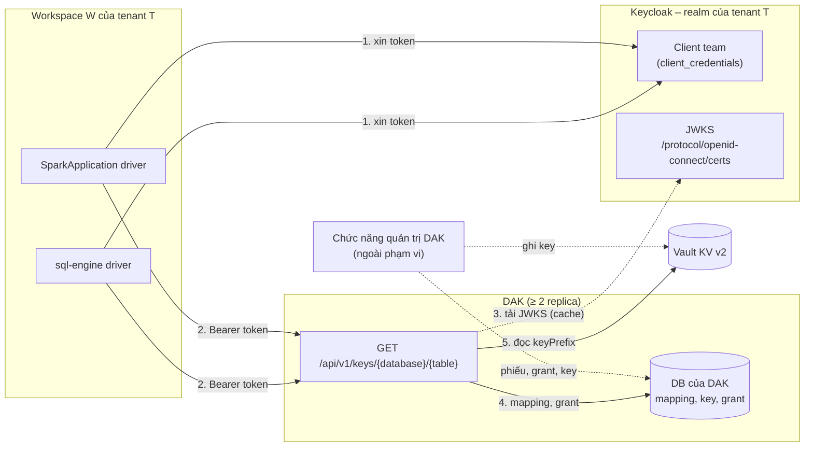
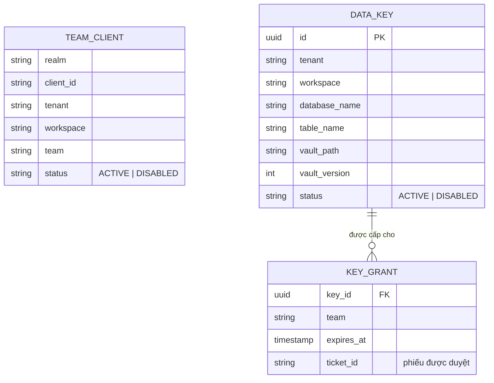
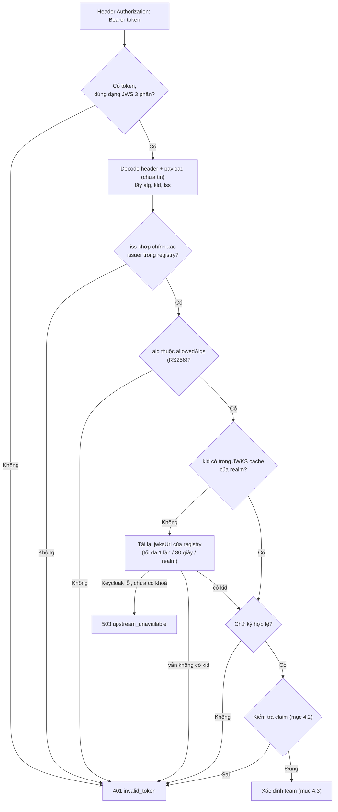
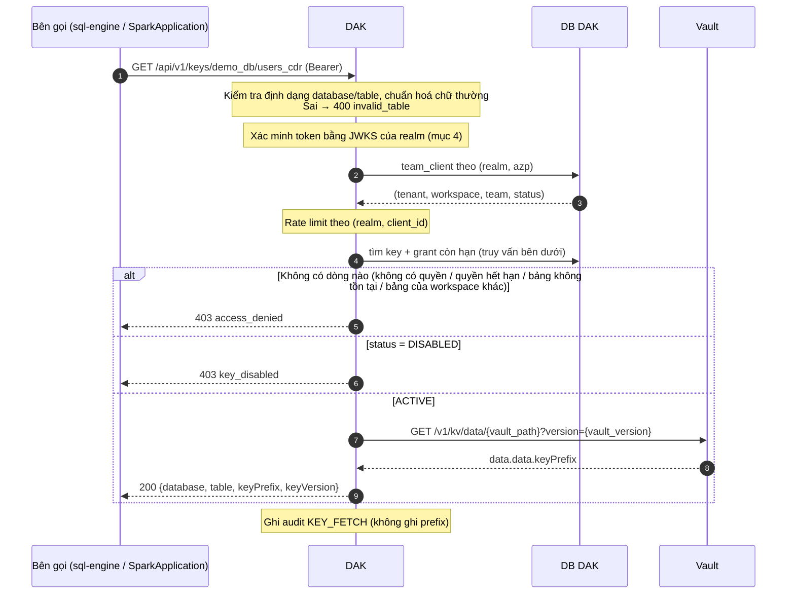

# Đặc tả DAK (Data Access Key): API lấy key cho sql-engine và SparkApplication

Tài liệu cho team DAK: API mà sql-engine và SparkApplication gọi để lấy `keyPrefix`, cùng toàn bộ logic DAK phải thực hiện
khi phục vụ API này (xác thực token, kiểm tra quyền, đọc key từ Vault).

Plan phía client, migration và rollout: [DAK_KEY_ACCESS_SQL_ENGINE_PLAN.md](DAK_KEY_ACCESS_SQL_ENGINE_PLAN.md).

Lịch sử: bản 2026-10-06 (lần 2) cập nhật theo phản hồi của DAK ([dak_response/PHAN-HOI-DAK.md](dak_response/PHAN-HOI-DAK.md))
và các điểm đã thống nhất ([dak_response/PHAN-HOI-SQL-ENGINE.md](dak_response/PHAN-HOI-SQL-ENGINE.md)): xác minh token bằng
JWKS thay cho introspection; quyền có thời hạn; chưa kiểm `aud`; client của team do vận hành tạo.

## 0. Phạm vi và quyết định nền

**Trong phạm vi**: API `GET /api/v1/keys/{database}/{table}` và logic phía sau nó.

**Ngoài phạm vi**: chức năng quản trị của DAK (admin đăng nhập bằng local user của DAK, phiếu yêu cầu/duyệt quyền, nạp key).
Tài liệu này chỉ nêu **dữ liệu và cấu hình** mà các chức năng đó phải tạo ra để API lấy key hoạt động đúng (mục 2.3, mục 3).

| Chủ đề              | Quyết định                                                                                                          |
| ------------------- | ------------------------------------------------------------------------------------------------------------------- |
| Bên gọi             | Driver của sql-engine và SparkApplication. Executor không gọi DAK                                                   |
| Danh tính bên gọi   | Mỗi team một (hoặc hai, khi rotate) client Keycloak confidential (`client_credentials`). 1 engine/job = 1 team      |
| Realm Keycloak      | Mỗi tenant một realm riêng. Giai đoạn đầu chỉ **1 tenant**, nhưng code và dữ liệu phải hỗ trợ nhiều realm          |
| Xác minh token      | **Chữ ký JWT với JWKS của realm** (verify tại chỗ). Không dùng introspection                                        |
| Token → team        | Mapping trong DB của DAK: `(realm, client_id)` → (tenant, workspace, team), tra ở **mỗi** request                   |
| Định danh key       | `(tenant, workspace, database, table)`. Tenant/workspace suy ra từ token; database/table lấy từ path                 |
| Phạm vi đọc         | Team chỉ lấy được key trong workspace của chính nó. Không có quyền liên workspace/tenant                            |
| Quyền               | Grant `(team, key)` sinh ra từ phiếu được duyệt, **có thời hạn**. Hết hạn thì 403 như không có quyền               |
| `aud`               | **Chưa kiểm** ở v1. Bật sau khi 100% client có audience mapper `dak-api`                                            |
| Lưu key             | `keyPrefix` ở Vault KV v2; metadata (mapping, key, grant) ở DB của DAK                                              |
| Tên bảng một phần   | Không hỗ trợ: bắt buộc đủ `database` và `table`                                                                     |

Phiên bản Keycloak đã đối chiếu: 26.8 (môi trường của DAK). URL theo bản Quarkus, không có tiền tố `/auth`.

## 1. Tổng quan luồng



## 2. Thiết lập Keycloak cần cho API lấy key

### 2.1. Mỗi realm tenant

Do **vận hành** làm một lần khi onboard tenant (DAK không giữ credential quản trị Keycloak nào):

| Việc                        | Ghi chú                                                                                                  |
| --------------------------- | -------------------------------------------------------------------------------------------------------- |
| Tạo client `dak-api`        | Bearer-only, không login, không secret. Chỉ làm đích cho audience mapper (dùng khi bật kiểm `aud`)       |
| Thêm realm vào registry DAK | Mục 2.2                                                                                                  |

### 2.2. Registry realm (cấu hình tĩnh của DAK)

DAK chỉ chấp nhận token của các realm có trong registry. Registry do vận hành khai, **không** lấy từ token.

```yaml
realms:
  - realm: tenant-a
    tenant: tenant-a
    issuer: https://keycloak.example/realms/tenant-a                                # so khớp CHÍNH XÁC với claim iss
    jwksUri: https://keycloak.example/realms/tenant-a/protocol/openid-connect/certs # nguồn khoá DUY NHẤT
    allowedAlgs: [RS256]
    requireAudience: false        # bật thành true khi mọi client đã có mapper dak-api
```

### 2.3. Yêu cầu với client của team

Client do **vận hành tạo tay** theo checklist này, rồi đăng ký `(realm, client_id)` → `(tenant, workspace, team)` vào DAK.

| Thuộc tính                         | Giá trị                          | Lý do                                                                                 |
| ---------------------------------- | -------------------------------- | ------------------------------------------------------------------------------------- |
| Realm                              | Realm của tenant chứa team       | Tenant được xác định qua realm                                                        |
| Client authentication              | ON (confidential)                | Có `client_secret`                                                                    |
| Service accounts                   | ON                               | Cho phép `client_credentials`                                                         |
| Standard flow / Implicit / Direct  | OFF                              | Client chỉ dùng cho máy                                                               |
| Full scope allowed                 | OFF                              | Token không mang role nào khác                                                        |
| Audience mapper                    | `dak-api` (access token)         | Chưa kiểm ở v1, nhưng **gắn ngay từ đầu** để bật kiểm `aud` sau này không làm hỏng engine |
| Access token lifespan              | 300 giây                         | Giới hạn thời gian dùng một token bị lộ (DAK không introspect)                        |
| Signature algorithm                | RS256 (mặc định của realm)       | Khớp `allowedAlgs`                                                                    |

Thông tin vận hành chuyển cho chủ engine/job (mục 6): `dakAddr`, `tokenUrl` (`{issuer}/protocol/openid-connect/token`),
`clientId`, `clientSecret`.

**Rotate secret** (Keycloak không giữ hai secret song song ở chế độ ổn định): vận hành tạo client thứ hai cho cùng team, đăng ký
vào DAK, chuyển engine/job sang client mới (cần restart engine/job), rồi khoá client cũ trên DAK và xoá trên Keycloak. Vì vậy
DAK phải cho phép **nhiều client ACTIVE cho cùng một team** (mục 3).

## 3. Dữ liệu API lấy key đọc

Các bảng do chức năng quản trị của DAK ghi; API lấy key chỉ **đọc**.



Bất biến mà chức năng quản trị phải bảo đảm (API lấy key dựa vào chúng):

| Bất biến                                                                                                        | Vì sao                                                                                   |
| --------------------------------------------------------------------------------------------------------------- | ---------------------------------------------------------------------------------------- |
| Unique `(realm, client_id)` trong `team_client`, và `team_client.tenant` đúng là tenant của realm               | `client_id` chỉ duy nhất trong một realm; hai tenant có thể trùng `client_id`            |
| Một team được có **nhiều** dòng `team_client` ACTIVE                                                            | Rotate secret bằng client thứ hai (mục 2.3)                                              |
| Unique `(tenant, workspace, database_name, table_name)` trong `data_key`                                       | Mỗi bảng một key; hai team cùng workspace được cấp cùng bảng thì nhận cùng prefix        |
| `database_name`, `table_name` lưu **chữ thường**, khớp `[a-z0-9_]{1,128}`                                       | API chuẩn hoá chữ thường trước khi tra                                                   |
| Grant chỉ nối team và key **cùng** `(tenant, workspace)`; mỗi grant có `expires_at`                              | Không có quyền liên workspace; quyền có thời hạn                                         |
| Giá trị `keyPrefix` đã ghi **không bao giờ bị ghi đè**; `vault_version` trỏ đúng version đã ghi                 | Đổi prefix là mất khả năng giải mã dữ liệu đã mã hoá                                     |

## 4. Xác minh token (JWKS)

### 4.1. Các bước



Quy tắc bắt buộc:

- **Không bao giờ** dựng URL từ token. `iss` chỉ dùng làm khoá tra registry; khoá công khai chỉ lấy từ `jwksUri` trong
  registry. **Bỏ qua hoàn toàn** các header `jku`, `x5u`, `jwk`, `x5c` của token.
- `alg` lấy từ danh sách cho phép, không tin header: từ chối `none`, mọi `HS*`, và mọi alg không khớp `alg` của khoá trong JWKS.
- Chỉ dùng khoá có `use = sig` (hoặc không khai `use`) và `kty = RSA`.
- JWKS cache theo realm: làm mới định kỳ 10 phút và khi gặp `kid` lạ (tối đa 1 lần mỗi 30 giây mỗi realm, để token rác
  không làm DAK dội Keycloak). Keycloak tự đổi khoá ký theo chu kỳ, nên bắt buộc có cơ chế tải lại theo `kid`.

### 4.2. Kiểm tra claim

Payload mẫu của token client team (Keycloak 26):

```json
{
  "exp": 1791273900,
  "iat": 1791273600,
  "jti": "5b1c6c1e-...",
  "iss": "https://keycloak.example/realms/tenant-a",
  "aud": "dak-api",
  "sub": "8f0d2f4a-...",
  "typ": "Bearer",
  "azp": "dak.w1.team-a",
  "client_id": "dak.w1.team-a"
}
```

| Kiểm tra                                                                         | Sai thì |
| -------------------------------------------------------------------------------- | ------- |
| `exp` > now − 60 giây (cho phép lệch đồng hồ tối đa 60 giây)                      | 401     |
| `iat` (và `nbf` nếu có) ≤ now + 60 giây                                          | 401     |
| `iss` == `issuer` của realm trong registry (so khớp chuỗi chính xác)              | 401     |
| `typ == "Bearer"` (loại refresh/ID token)                                        | 401     |
| `azp` có mặt; nếu có `client_id` thì phải bằng `azp`                              | 401     |
| `aud` chứa `dak-api` — **chỉ khi** `requireAudience: true` (v1: tắt)              | 401     |

Token bị thu hồi trên Keycloak vẫn được DAK chấp nhận tới `exp` (≤ 300 giây, mục 2.3). Khoá client **trên DAK** thì có hiệu
lực ngay (mục 4.3).

### 4.3. Xác định team

Tra `team_client` theo `(realm, azp)` ở **mỗi** request (không cache):

- Không có dòng, hoặc `status = DISABLED` → 401 `invalid_token`.
- `team_client.tenant` khác tenant của realm trong registry → 401 và bắn cảnh báo (dữ liệu mapping sai).
- Có → team = `(tenant, workspace, team)`.

## 5. API lấy key

### 5.1. Request

```http
GET /api/v1/keys/{database}/{table}
Host: dak.example
Authorization: Bearer <access_token của client team>
Accept: application/json
X-Request-Id: 7f3e...            (tuỳ chọn)
```

| Mục                  | Quy định                                                                                     |
| -------------------- | -------------------------------------------------------------------------------------------- |
| `database`, `table`  | `[A-Za-z0-9_]{1,128}`; DAK chuẩn hoá chữ thường trước khi tra                                 |
| Sai định dạng        | 400 `invalid_table`, kiểm tra **trước** khi xác minh token                                   |
| `X-Request-Id`       | Không gửi thì DAK sinh. **Luôn** trả lại trong response, kể cả khi lỗi                       |
| Body                 | Không có                                                                                     |
| Tenant/workspace     | **Không** nhận từ bên gọi dưới bất kỳ hình thức nào; luôn suy từ token                       |

Ví dụ:

```bash
curl -s https://dak.example/api/v1/keys/demo_db/users_cdr \
  -H "Authorization: Bearer $ACCESS_TOKEN"
```

### 5.2. Response 200

```http
HTTP/1.1 200 OK
Content-Type: application/json
Cache-Control: no-store
X-Request-Id: 7f3e...

{
  "database": "demo_db",
  "table": "users_cdr",
  "keyPrefix": "9f2c4b...e1",
  "keyVersion": 1
}
```

| Field               | Kiểu   | Quy định                                                                                 |
| ------------------- | ------ | ---------------------------------------------------------------------------------------- |
| `database`, `table` | string | Đã chuẩn hoá chữ thường, luôn có                                                         |
| `keyPrefix`         | string | Giá trị thô, **luôn khác rỗng**. Thiếu dữ liệu thì trả 500, không trả `null` hay `""`    |
| `keyVersion`        | number | Version KV trong Vault mà DAK **đã thực sự đọc** (`data_key.vault_version`)              |

Tương thích: DAK chỉ được **thêm** field mới, không đổi tên hay bỏ field cũ. Bên gọi bỏ qua field lạ.

### 5.3. Logic xử lý



Truy vấn kiểm tra quyền (**quyền trước, tồn tại sau**: không có grant còn hạn thì luôn 403 với cùng một body, nên bên gọi
không dò được bảng của workspace/tenant khác):

```sql
SELECT k.id, k.status, k.vault_path, k.vault_version
FROM data_key k
JOIN key_grant g ON g.key_id = k.id
WHERE k.tenant        = :team_tenant
  AND k.workspace     = :team_workspace     -- chỉ trong workspace của team
  AND k.database_name = :database
  AND k.table_name    = :table
  AND g.team          = :team
  AND g.expires_at    > now();              -- quyền hết hạn = không có quyền
```

Tenant và workspace **luôn** lấy từ team đã xác định ở mục 4.3, không từ request.

Request đọc Vault:

```http
GET https://vault.example/v1/kv/data/dak/keys/tenant-a/w1/demo_db/users_cdr?version=1
X-Vault-Token: <token Vault của DAK>
```

Đọc đúng `version` lưu trong DB: nếu ai đó ghi đè trực tiếp trong Vault thì DAK vẫn trả đúng prefix mà dữ liệu đã mã hoá đang
dùng. Field `keyPrefix` thiếu hoặc rỗng là lỗi dữ liệu: trả 500 và bắn cảnh báo. DAK **không** cache prefix; mỗi request đều
đọc Vault.

### 5.4. Mã lỗi

Body lỗi (mọi mã):

```json
{
  "error": "access_denied",
  "message": "Team has no access to key demo_db.users_cdr",
  "requestId": "7f3e..."
}
```

| HTTP | `error`                | Khi nào                                                                                                   | Bên gọi xử lý                     |
| ---- | ---------------------- | --------------------------------------------------------------------------------------------------------- | --------------------------------- |
| 400  | `invalid_table`        | `database`/`table` sai định dạng                                                                          | Báo lỗi, không retry              |
| 401  | `invalid_token`        | Thiếu token; sai định dạng; `alg` không cho phép; chữ ký sai; `exp` đã qua; `iss` không có trong registry; claim sai; `(realm, client_id)` không có hoặc bị khoá | Xin token mới, thử lại **1 lần**  |
| 403  | `access_denied`        | Không có grant còn hạn: gồm cả quyền **đã hết hạn**, bảng không tồn tại, bảng của workspace/tenant khác   | Báo lỗi, không retry              |
| 403  | `key_disabled`         | Có grant còn hạn nhưng key đang bị khoá                                                                  | Báo lỗi, không retry              |
| 429  | `rate_limited`         | Vượt rate limit. Có header `Retry-After` (giây)                                                          | Báo lỗi, không retry (v1)         |
| 500  | `internal_error`       | Lỗi DAK hoặc dữ liệu Vault không hợp lệ                                                                  | Báo lỗi                           |
| 503  | `upstream_unavailable` | Vault không phản hồi; hoặc cần tải JWKS mà Keycloak không phản hồi và chưa có khoá trong cache            | Báo lỗi                           |

- 401 và 403 tách bạch: 401 luôn là vấn đề danh tính (thử lại với token mới có ích), 403 luôn là vấn đề quyền (thử lại vô ích).
  DAK không bao giờ trả 403 cho vấn đề token và ngược lại.
- `message` không bao giờ chứa token, secret, `keyPrefix`, hay tên bảng của workspace khác.
- 403 `access_denied` có **cùng một body** cho mọi nguyên nhân.

### 5.5. Hành vi biên

| Tình huống                                     | DAK làm gì                                                                                     |
| ---------------------------------------------- | ---------------------------------------------------------------------------------------------- |
| Team bị khoá giữa chừng                        | Request kế tiếp 401 ngay                                                                       |
| Key bị khoá giữa chừng                         | Request kế tiếp 403 `key_disabled` ngay                                                        |
| Quyền bị thu hồi hoặc hết hạn giữa chừng       | Request kế tiếp 403 `access_denied` ngay (bên gọi còn cache prefix tới `cacheTtlSeconds`)      |
| Keycloak sập                                   | DAK vẫn xác minh được token bằng JWKS đã cache. Bên gọi không xin được token mới khi token cũ hết hạn |
| Vault sập                                      | 503 `upstream_unavailable`                                                                     |
| Hai team cùng workspace, cùng được cấp một bảng | Cả hai nhận cùng `keyPrefix`                                                                  |

## 6. Bên gọi: sql-engine và SparkApplication

Cả hai dùng chung `key-prefix-lib` (nguồn `source=dak`), chỉ khác nơi đặt cấu hình. Chỉ **driver** gọi DAK.

| Thông tin vận hành cấp | sql-engine (Spark conf, `<ns>` = `spark.columncrypto.` / `spark.cdrcrypto.`) | SparkApplication (biến môi trường)              |
| ---------------------- | ---------------------------------------------------------------------------- | ----------------------------------------------- |
| `dakAddr`              | `<ns>dak.addr`                                                               | `DAK_ADDR`                                      |
| `tokenUrl`             | `<ns>dak.tokenUrl`                                                           | `DAK_TOKEN_URL`                                 |
| `clientId`             | `<ns>dak.clientId`                                                           | `DAK_CLIENT_ID`                                 |
| `clientSecret`         | `<ns>dak.clientSecret`                                                       | `DAK_CLIENT_SECRET` (từ K8s Secret)             |
| –                      | `<ns>source=dak`                                                             | `CRYPTO_PREFIX_SOURCE=dak`                      |

Tên bảng truyền vào:

| Bên gọi          | Giá trị                                                                       |
| ---------------- | ----------------------------------------------------------------------------- |
| sql-engine       | Tham số đầu của hàm SQL, dạng `'database.table'`, vd `cdr_decrypt('demo_db.users_cdr', isdn, created_at)` |
| SparkApplication | `${DB_NAME}.${TABLE_NAME}` của job                                            |

Hành vi của bên gọi (cài trong `key-prefix-lib`):

1. Tách `database.table`, chuẩn hoá chữ thường; sai định dạng thì báo lỗi, không gọi DAK.
2. Xin token `client_credentials` tại `tokenUrl`, cache tới gần hết hạn, dùng lại cho mọi bảng.
3. Gọi `GET /api/v1/keys/{database}/{table}`. Nhận 401 thì xin token mới và thử lại đúng 1 lần.
4. Cache `keyPrefix` theo bảng trong `cacheTtlSeconds` (mặc định 300 giây). Tải lên DAK: tối đa khoảng 1 request mỗi bảng mỗi
   5 phút cho mỗi engine/job.

Bên gọi giữ sẵn cấu hình Vault cũ để **fallback thủ công** (đổi `source=vault` rồi restart) khi DAK sự cố. Điều này không đòi
hỏi gì từ DAK, ngoài việc DAK **không ghi** vào path Vault cũ (mục 7).

## 7. Vault

DAK xác thực với Vault bằng **Kubernetes auth** (ServiceAccount của pod DAK). Quyền cần cho API lấy key:

```hcl
path "kv/data/dak/keys/*" {
  capabilities = ["read"]
}
```

| Path                                                       | Field       | Nội dung        |
| ---------------------------------------------------------- | ----------- | --------------- |
| `kv/data/dak/keys/{tenant}/{workspace}/{database}/{table}`  | `keyPrefix` | Prefix của bảng |

- Quyền ghi key thuộc chức năng quản trị (ngoài phạm vi).
- Path cũ `kv/hla-datalake/datalake/spark-application/*` vẫn được giữ làm nguồn fallback thủ công của bên gọi. DAK **không đọc
  và không ghi** path này (ngoài việc đọc một lần lúc migration, do bên gọi thực hiện).

## 8. Audit

Mỗi request lấy key (thành công hay lỗi) ghi một bản ghi audit `KEY_FETCH`. **Không** ghi token, secret hay prefix.

| Field                           | Ví dụ                               |
| ------------------------------- | ----------------------------------- |
| `ts`                            | `2026-10-06T08:31:02.123Z`          |
| `requestId`                     | `7f3e...`                           |
| `result`, `httpStatus`, `error` | `DENIED`, `403`, `access_denied`    |
| `denyReason` (chỉ trong audit)  | `NO_GRANT`, `GRANT_EXPIRED`, `KEY_NOT_FOUND`, `OTHER_WORKSPACE` |
| `realm`, `tenant`, `workspace`  | `tenant-a`, `tenant-a`, `w1`        |
| `clientId`, `team`              | `dak.w1.team-a`, `team-a`           |
| `database`, `table`             | `demo_db`, `users_cdr`              |
| `keyVersion`                    | `1` (khi thành công)                |
| `sourceIp`                      | `10.0.3.17`                         |

`denyReason` chỉ nằm trong audit nội bộ (không trả cho bên gọi), để vận hành tra được nguyên nhân 403 qua `requestId`.

## 9. Yêu cầu phi chức năng

| Hạng mục             | Yêu cầu                                                                                                   |
| -------------------- | --------------------------------------------------------------------------------------------------------- |
| TLS                  | DAK phục vụ HTTPS. Gọi Keycloak (JWKS) và Vault qua HTTPS                                                 |
| HA                   | **Tối thiểu 2 replica, không giữ state trong bộ nhớ tiến trình** — điều kiện bắt buộc trước khi engine/job chuyển sang DAK |
| SLA                  | Theo thống nhất ở [dak_response/PHAN-HOI-SQL-ENGINE.md](dak_response/PHAN-HOI-SQL-ENGINE.md)              |
| Timeout gọi ra ngoài | Keycloak (JWKS), Vault: kết nối 2 giây, tổng 5 giây                                                       |
| Cache                | JWKS theo realm (mục 4.1). **Không** cache prefix và trạng thái `team_client`                             |
| Rate limit           | Theo `(realm, client_id)`, vd 20 req/s, burst 50                                                          |
| Log                  | Không log header `Authorization` và body response. `database`/`table` trong access log ingress: chấp nhận |
| Metric               | Số request theo `httpStatus`/`error`, số lần tải JWKS, độ trễ Vault, tỉ lệ 503                            |

## 10. Câu hỏi mở

Không còn câu hỏi mở về hợp đồng API. Các điểm vận hành còn lại theo dõi ở
[dak_response/PHAN-HOI-SQL-ENGINE.md](dak_response/PHAN-HOI-SQL-ENGINE.md).
