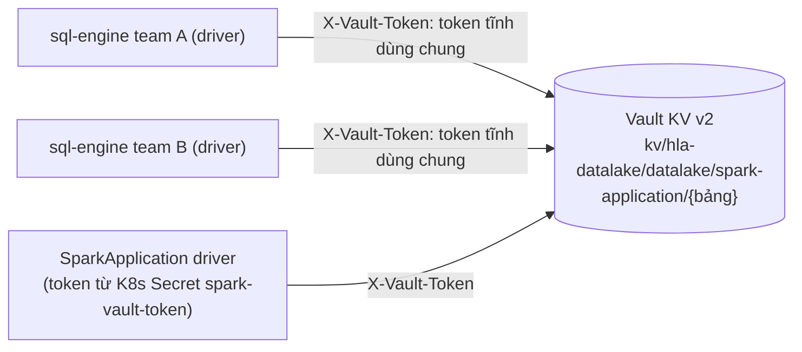
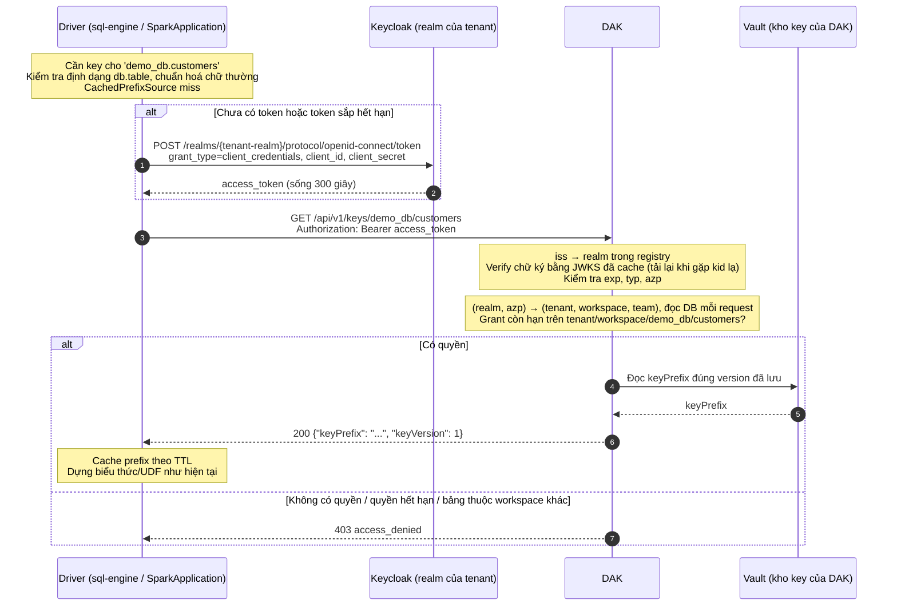
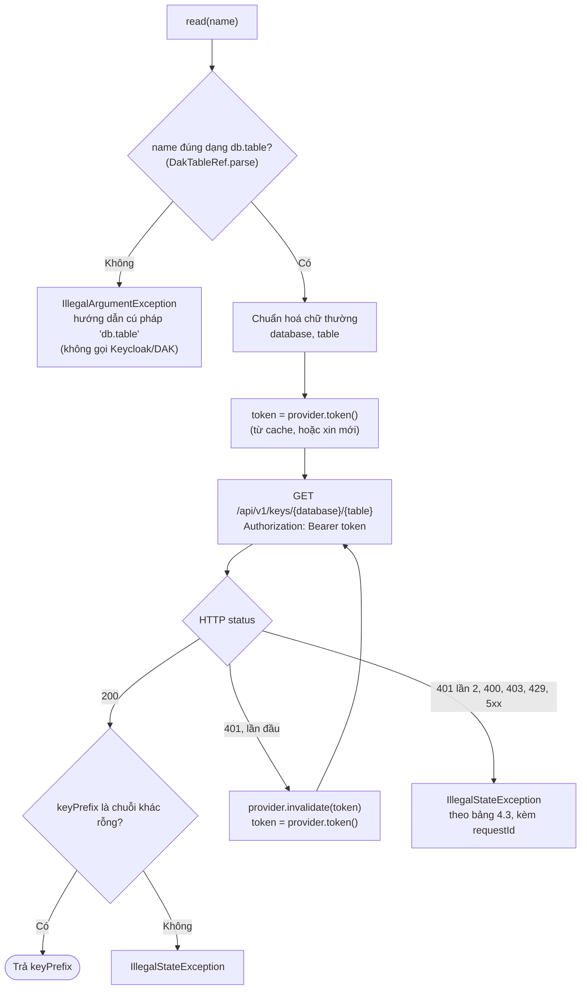
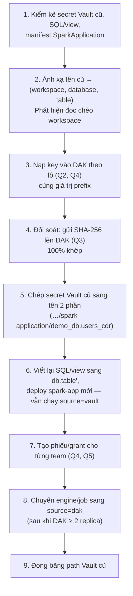

# Plan: sql-engine và SparkApplication lấy keyPrefix qua DAK

Kế hoạch chuyển nguồn `keyPrefix` của `column_*`/`cdr_*` trên **sql-engine** và **SparkApplication** từ "token Vault tĩnh dùng
chung" sang **Data Access Key (DAK)**: mỗi team có một client Keycloak riêng, DAK xác định team từ token và chỉ trả key của
các bảng mà team đó được cấp quyền.

Tài liệu này là plan **phía client** (`key-prefix-lib`, `spark-app`, cấu hình sql-engine/SparkApplication), migration và
rollout. Đặc tả API lấy key của DAK nằm ở [DAK_API_SPEC.md](DAK_API_SPEC.md). Trao đổi với team DAK:
[phản hồi của DAK](dak_response/PHAN-HOI-DAK.md), [phản hồi của mình](dak_response/PHAN-HOI-SQL-ENGINE.md).

Tài liệu liên quan: [COLUMN_CRYPTO_SQL_ENGINE_GUIDE.md](COLUMN_CRYPTO_SQL_ENGINE_GUIDE.md) (cấu hình hiện tại),
[COLUMN_CRYPTO_ARCHITECTURE.md](COLUMN_CRYPTO_ARCHITECTURE.md) (vì sao chỉ driver lấy prefix).

## 0. Các quyết định đã chốt

| Chủ đề                       | Quyết định                                                                                                                                         |
| ---------------------------- | -------------------------------------------------------------------------------------------------------------------------------------------------- |
| Phạm vi                      | sql-engine **và** SparkApplication chuyển sang DAK **cùng đợt**                                                                                    |
| Quan hệ engine/job ↔ team    | **1 sql-engine hoặc 1 job = 1 team**, dùng 1 bộ `client_id`/`client_secret` của team đó                                                            |
| Realm Keycloak               | Mỗi tenant một realm riêng. Giai đoạn đầu **1 tenant**                                                                                             |
| Grant Keycloak               | `client_credentials` (client confidential, bật Service Accounts)                                                                                   |
| DAK xác minh token           | **Chữ ký JWT với JWKS của realm** + tra `(realm, client_id)` trong DB ở mỗi request. Không dùng introspection                                      |
| Token → team                 | Mapping trong DAK: `(realm, client_id)` → (tenant, workspace, team)                                                                                |
| Tạo client cho team          | **Vận hành tạo tay** trên Keycloak theo checklist ([DAK_API_SPEC.md mục 2.3](DAK_API_SPEC.md#23-yêu-cầu-với-client-của-team)), rồi đăng ký vào DAK |
| Đưa credential vào           | sql-engine: **Spark conf trên UI**. SparkApplication: biến môi trường `DAK_*`, secret qua K8s Secret                                               |
| Quản trị DAK                 | Admin đăng nhập DAK bằng **local user của DAK**. Phiếu yêu cầu/duyệt quyền, nạp key do DAK tự thiết kế (mục 4.5)                                   |
| DAK trả về                   | **keyPrefix thô**, nên công thức `column_*`/`cdr_*` giữ nguyên và dữ liệu cũ vẫn giải mã được                                                      |
| Độ mịn quyền                 | **1 quyền "get key" / bảng**: có key là vừa mã hoá vừa giải mã được                                                                                |
| Thời hạn quyền               | Quyền sinh từ **phiếu được duyệt, có thời hạn** (1 năm), DAK cảnh báo trước 30 ngày. Hết hạn → **403 `access_denied`** như không có quyền          |
| Định danh key                | **`(tenant, workspace, database, table)`**. Tenant/workspace do DAK suy ra từ token; database/table từ tham số                                     |
| Tham số bảng                 | **`'database.table'`**, vẫn 3 tham số. sql-engine: tham số đầu của hàm SQL. SparkApplication: `${DB_NAME}.${TABLE_NAME}`                           |
| Tên một phần (`'users_cdr'`) | **Bị từ chối** khi `source=dak`                                                                                                                    |
| Phạm vi đọc                  | **Engine/job chỉ lấy được key của bảng trong workspace của chính nó**                                                                              |
| `aud`                        | **Chưa kiểm** ở v1; client mới vẫn gắn mapper `dak-api` để bật kiểm sau                                                                            |
| Fallback                     | **Thủ công**: cấu hình giữ sẵn cả `dak.*` và `vault.*`; khi DAK sự cố thì đổi `source=vault` rồi restart. **Không** fallback tự động               |
| Token Vault cũ               | **Giữ lâu dài** để phục vụ fallback (rủi ro chấp nhận, mục 11)                                                                                     |

## 1. Hiện trạng và vấn đề



- Mọi engine/job dùng **một token Vault chỉ đọc chung**, đọc được prefix của **mọi bảng** dưới `kvBasePath`. Không phân quyền
  theo team và không biết ai đã lấy key nào.
- Token nằm plaintext trong cấu hình engine hoặc K8s Secret của job, rotate thủ công.
- Tên key là **tên logic toàn cục, không có database**: hai tenant, hoặc hai database cùng có bảng `customers`, dùng chung
  một prefix.

## 2. Kiến trúc đích



Executor không đổi: không gọi Keycloak/DAK, không cần credential.

Ba lớp cô lập:

| Lớp       | Cơ chế                                                                                                                                |
| --------- | ------------------------------------------------------------------------------------------------------------------------------------- |
| Tenant    | Mỗi tenant một realm, token ký bằng khoá của realm; DAK chỉ tin JWKS của realm trong registry; mapping khoá theo `(realm, client_id)` |
| Workspace | DAK chỉ tra key trong namespace `(tenant, workspace)` của team; API không có tham số nào để chỉ định workspace khác                   |
| Bảng      | Trong workspace, team phải có grant còn hạn trên từng key `(database, table)`                                                         |

Phân quyền ở đây là quyền **lấy key**. Quyền đọc bảng vật lý trong `FROM` vẫn do Ranger quyết định như hiện nay.

Những gì **không đổi**: `CryptoExpressions`, `CdrCipherCore`, định dạng ciphertext; hàm vẫn 3 tham số; prefix chỉ tra ở driver.
`column-crypto-lib`, `cdr-crypto-udf` không sửa logic. `spark-app` đổi **giá trị** tên bảng truyền vào hàm (mục 5.6).

## 3. Phạm vi

**Trong phạm vi**

- `key-prefix-lib`: nguồn mới `source=dak` (lấy token Keycloak, tách `db.table`, gọi DAK, cache token).
- sql-engine: cấu hình `spark.columncrypto.dak.*` / `spark.cdrcrypto.dak.*`, giữ `vault.*` cho fallback.
- SparkApplication: sửa `spark-app` truyền `db.table`, sửa manifest (env `DAK_*`, K8s Secret), giữ `VAULT_*` cho fallback.
- Migration keyPrefix sang DAK **giữ nguyên giá trị**, viết lại SQL/view sang `'db.table'` (mục 7).
- Quy trình fallback thủ công và diễn tập.
- Test, tài liệu, rollout.
- Đặc tả API lấy key: [DAK_API_SPEC.md](DAK_API_SPEC.md). Yêu cầu với chức năng quản trị của DAK: mục 4.5.

**Ngoài phạm vi**

- Chuyển credential của sql-engine từ Spark conf sang K8s Secret.
- Phân quyền theo từng user SQL (cần token exchange). Mô hình hiện tại là phân quyền theo engine/job (team).
- Kiểm tra database có thực sự thuộc workspace hay không (tạm bỏ qua).
- Grant cấp database (`db.*`).
- Thiết kế chức năng quản trị của DAK.

**Không hỗ trợ (theo thiết kế)**

- Lấy key của bảng thuộc workspace/tenant khác. Muốn dùng dữ liệu của workspace khác thì đưa dữ liệu sang bằng pipeline được
  duyệt (giải mã ở workspace nguồn, mã hoá lại bằng key của workspace đích).
- Tên một phần (`'users_cdr'`) khi `source=dak`.
- Fallback tự động `dak,vault` (mục 5.3).

## 4. Hợp đồng API (phần client dùng)

Chi tiết đầy đủ: [DAK_API_SPEC.md](DAK_API_SPEC.md).

### 4.1. Lấy access token từ Keycloak (client → Keycloak)

```http
POST {tokenUrl}                       # vd https://keycloak.example/realms/<tenant-realm>/protocol/openid-connect/token
Content-Type: application/x-www-form-urlencoded

grant_type=client_credentials&client_id=<id>&client_secret=<secret>
```

- Client gửi credential trong body (`client_secret_post`).
- Response cần có `access_token` và `expires_in` (giây). Không dùng refresh token; khi token sắp hết hạn thì xin token mới.
- `tokenUrl` phải trỏ tới **realm của tenant sở hữu engine/job**.
- `dakAddr`, `tokenUrl`, `clientId`, `clientSecret` do **vận hành** cấp khi tạo client cho team (mục 4.5 Q1).

### 4.2. Lấy keyPrefix (client → DAK)

```http
GET {dakAddr}/api/v1/keys/{database}/{table}
Authorization: Bearer <access_token>
Accept: application/json
```

```json
{
  "database": "demo_db",
  "table": "users_cdr",
  "keyPrefix": "<giá trị thô>",
  "keyVersion": 1
}
```

- `{database}`, `{table}` đã chuẩn hoá chữ thường (mục 5.2).
- Client chỉ dùng `keyPrefix`; bỏ qua field lạ (DAK chỉ thêm field, không đổi/bỏ). `keyVersion` chỉ log ở mức DEBUG.

### 4.3. Mã lỗi và hành vi của client

Body lỗi: `{"error": "<mã>", "message": "...", "requestId": "..."}`. `X-Request-Id` luôn có trong response.

| HTTP từ DAK         | `error`         | Hành vi client                                                                        |
| ------------------- | --------------- | ------------------------------------------------------------------------------------- |
| 200                 | –               | Kiểm tra `keyPrefix` là chuỗi khác rỗng, rồi trả về                                   |
| 401                 | `invalid_token` | Bỏ token đang cache, xin token mới, **thử lại đúng 1 lần**. Lần 2 vẫn 401 thì báo lỗi |
| 403                 | `access_denied` | Báo lỗi ngay, không retry                                                             |
| 403                 | `key_disabled`  | Báo lỗi ngay, không retry                                                             |
| 400                 | `invalid_table` | Báo lỗi ngay (thường đã bị chặn ở client)                                             |
| 429 / 5xx / timeout | –               | Báo lỗi (v1 không retry)                                                              |

403 `access_denied` gộp nhiều nguyên nhân (không có quyền, **quyền hết hạn**, bảng không tồn tại, bảng của workspace khác) và
DAK cố ý không phân biệt. Message lỗi của lib phải nói rõ điều đó và in `requestId`, vd:

```
cdr_decrypt: DAK denied key for demo_db.users_cdr (403 access_denied, requestId=7f3e...).
Possible causes: no grant, grant expired, or table not registered in this workspace.
Ask the DAK admin to look up the requestId.
```

Vận hành DAK tra `requestId` trong audit để thấy `denyReason` (vd `GRANT_EXPIRED`).

### 4.4. Những gì client phụ thuộc vào API lấy key

| Yêu cầu                                                                       | Đặc tả                                                           |
| ----------------------------------------------------------------------------- | ---------------------------------------------------------------- |
| Registry realm; khoá chỉ lấy từ `jwksUri` của registry, bỏ qua `jku`/`x5u`    | [DAK_API_SPEC.md mục 2.2, 4.1](DAK_API_SPEC.md#41-các-bước)      |
| Chỉ RS256, kiểm `exp`/`iat` (lệch ≤ 60 giây), `iss`, `typ`, `azp`             | [DAK_API_SPEC.md mục 4.2](DAK_API_SPEC.md#42-kiểm-tra-claim)     |
| Tra `(realm, client_id)` ở mỗi request, khoá client có hiệu lực ngay          | [DAK_API_SPEC.md mục 4.3](DAK_API_SPEC.md#43-xác-định-team)      |
| Chỉ tra key trong workspace của team; grant còn hạn; đọc đúng `vault_version` | [DAK_API_SPEC.md mục 5.3](DAK_API_SPEC.md#53-logic-xử-lý)        |
| 401/403 tách bạch; body 403 giống nhau cho mọi nguyên nhân                    | [DAK_API_SPEC.md mục 5.4](DAK_API_SPEC.md#54-mã-lỗi)             |
| DAK ≥ 2 replica trước khi engine/job chuyển sang                              | [DAK_API_SPEC.md mục 9](DAK_API_SPEC.md#9-yêu-cầu-phi-chức-năng) |

### 4.5. Yêu cầu với chức năng quản trị của DAK và vận hành

Trạng thái theo [phản hồi của DAK](dak_response/PHAN-HOI-DAK.md) ngày 2026-10-06.

| #   | Chức năng                                                                                                                                                                                                            | Ai làm                               | Trạng thái                                         | Dùng ở bước nào          |
| --- | -------------------------------------------------------------------------------------------------------------------------------------------------------------------------------------------------------------------- | ------------------------------------ | -------------------------------------------------- | ------------------------ |
| Q1  | Tạo client Keycloak cho team theo [checklist](DAK_API_SPEC.md#23-yêu-cầu-với-client-của-team), đăng ký `(realm, client_id)` → team vào DAK, chuyển `dakAddr`/`tokenUrl`/`clientId`/`clientSecret` cho chủ engine/job | Vận hành (tạo client), DAK (đăng ký) | Đăng ký mapping: DAK sửa theo `(realm, client_id)` | Cấu hình (mục 6), P2.4   |
| Q2  | **Nạp key có sẵn** cho `(workspace, database, table)`, **không ghi đè**; nạp lại cùng giá trị thì thành công (idempotent), khác giá trị thì từ chối                                                                  | DAK                                  | Chưa có, sẽ làm                                    | Migration bước 3         |
| Q3  | **Đối soát**: bên mình gửi SHA-256 của prefix cũ, DAK trả khớp/không khớp. DAK không bao giờ phát hash ra                                                                                                            | DAK                                  | Chưa có, sẽ làm                                    | Migration bước 4         |
| Q4  | Nạp và đối soát **theo lô**; tạo phiếu/grant hàng loạt cho migration                                                                                                                                                 | DAK                                  | Chưa có, sẽ làm                                    | Migration bước 3, 4, 7   |
| Q5  | Cấp/thu hồi quyền qua phiếu được duyệt, thời hạn 1 năm, chỉ trong cùng workspace                                                                                                                                     | DAK                                  | Đã có                                              | Migration bước 7         |
| Q6  | Khoá/mở khoá client và key, có hiệu lực ngay                                                                                                                                                                         | DAK                                  | Đã có                                              | Checklist 9.6            |
| Q7  | Rotate: tạo client thứ hai cho cùng team; DAK cho phép nhiều client ACTIVE/team                                                                                                                                      | Vận hành + DAK                       | Chưa có, sẽ làm                                    | Vận hành sau cutover     |
| Q8  | Tạo key mới cho bảng mới (DAK sinh ngẫu nhiên)                                                                                                                                                                       | DAK                                  | Đã có                                              | Sau cutover              |
| Q9  | Cảnh báo quyền sắp hết hạn trước 30 ngày + màn hình danh sách quyền sắp hết hạn                                                                                                                                      | DAK                                  | DAK đề xuất; chờ chốt người nhận                   | Vận hành                 |
| Q10 | Chạy ≥ 2 replica, không giữ state trong bộ nhớ tiến trình                                                                                                                                                            | DAK                                  | Hiện 1 bản, sẽ sửa                                 | **Điều kiện trước P3.4** |

## 5. Thiết kế phía client

### 5.1. Thành phần mới trong `key-prefix-lib`

| File (trong `key-prefix-lib/src/main/scala/vai/lakehouse/keyprefix/`) | Nội dung                                                                                                                                                                             |
| --------------------------------------------------------------------- | ------------------------------------------------------------------------------------------------------------------------------------------------------------------------------------ |
| `DakPrefixSource.scala`                                               | `case class DakConfig(addr, tokenUrl, clientId, clientSecret)` (`toString` che secret), `DakTableRef` (tách và chuẩn hoá `db.table`) và `class DakPrefixSource extends PrefixSource` |
| `KeycloakTokenProvider.scala`                                         | Lấy và cache access token `client_credentials`, thread-safe, có `invalidate()`. Kèm registry dùng chung trong tiến trình                                                             |
| `JsonHttp.scala` (refactor)                                           | Tách hàm `send(...)` hiện có trong `VaultPrefixSource` ra dùng chung: timeout, chuyển lỗi IO thành `IllegalStateException` không lộ bí mật                                           |

Luồng của `DakPrefixSource.read(name)`:



Dùng JDK `HttpClient` và Jackson có sẵn của Spark, nên **không thêm dependency** và jar vẫn là jar thuần, không shade.

### 5.2. Định dạng tham số bảng khi `source=dak`

| Quy tắc                                       | Ví dụ                                                              |
| --------------------------------------------- | ------------------------------------------------------------------ |
| Đúng **2 phần** ngăn bởi một dấu `.`          | `'demo_db.users_cdr'` hợp lệ; `'users_cdr'`, `'a.b.c'` bị từ chối  |
| Mỗi phần khớp `[A-Za-z0-9_]{1,128}`           | `'.users'`, `'demo_db.'`, `'demo-db.x'` bị từ chối                 |
| **Chuẩn hoá về chữ thường** trước khi gọi DAK | `'Demo_DB.Users_CDR'` và `'demo_db.users_cdr'` ra **cùng** một key |

- Sai định dạng thì báo lỗi ngay, **không** gọi Keycloak/DAK. Message nêu cú pháp đúng, vd:
  `cdr_decrypt: with source=dak the first argument must be '<database>.<table>' (got 'users_cdr')`.
- `CachedPrefixSource` cache theo chuỗi gốc, nên `'Demo_DB.X'` và `'demo_db.x'` tạo hai entry (cùng giá trị). Không sai, chỉ
  tốn thêm một lần gọi DAK.
- Quy tắc này chỉ áp dụng cho nguồn `dak`. Nguồn `vault` **không** chuẩn hoá chữ thường, nên mọi nơi gọi phải truyền chữ thường
  để fallback về Vault tìm đúng path (mục 7 bước 5).

### 5.3. Cấu hình

Thêm vào `PrefixSourceFactory.Keys` và `EnvConfigSource`:

| Key logic          | Spark conf (sql-engine) | Env (SparkApplication)     | Bắt buộc khi `source=dak` | Ghi chú                                                      |
| ------------------ | ----------------------- | -------------------------- | ------------------------- | ------------------------------------------------------------ |
| `source`           | `<ns>source=dak`        | `CRYPTO_PREFIX_SOURCE`     | Có                        | Giá trị mới `dak`                                            |
| `dak.addr`         | `<ns>dak.addr`          | `DAK_ADDR`                 | Có                        | Base URL của DAK                                             |
| `dak.tokenUrl`     | `<ns>dak.tokenUrl`      | `DAK_TOKEN_URL`            | Có                        | Token endpoint của **realm của tenant**                      |
| `dak.clientId`     | `<ns>dak.clientId`      | `DAK_CLIENT_ID`            | Có                        |                                                              |
| `dak.clientSecret` | `<ns>dak.clientSecret`  | `DAK_CLIENT_SECRET`        | Có                        | Spark tự che trên UI (`spark.redaction.regex` khớp `secret`) |
| `cacheTtlSeconds`  | `<ns>cacheTtlSeconds`   | `CRYPTO_CACHE_TTL_SECONDS` | Không (300)               | Cache prefix                                                 |

Kiểm tra cấu hình trong `PrefixSourceFactory`:

- Thiếu key bắt buộc của nguồn **đang chọn** thì ném `IllegalArgumentException("Missing required setting: <tên vật lý>")`.
- **`dak.*` và `vault.*` được phép cùng có mặt**: chỉ nguồn trong `source` được đọc và kiểm tra, nguồn kia bị bỏ qua. Đây là
  điều kiện để fallback thủ công chỉ cần đổi một dòng `source`.
- `dak.addr` và `dak.tokenUrl` phải là `https://`. Cho phép `http://` chỉ khi đặt `<ns>dak.allowInsecureHttp=true` (dev/test).
- **Không cho ghép `dak` với nguồn khác** (`dak,vault`, `file,dak` bị từ chối). `ChainedPrefixSource` chuyển nguồn khi gặp
  **bất kỳ** lỗi nào, nên 403 của DAK sẽ rơi xuống Vault và trả key, tức là **bỏ qua phân quyền và thời hạn quyền**.

### 5.4. Quản lý token

- **Cache token**: giữ tới `issuedAt + expires_in - skew`, với `skew = min(30s, expires_in / 2)`.
- **Thread-safe**: việc xin token mới được đồng bộ (`synchronized`, double-check), để N query cùng cache miss chỉ tạo
  **1** request tới Keycloak.
- **Chia sẻ giữa hai namespace**: registry `KeycloakTokenProvider.shared(tokenUrl, clientId, secret)` trả cùng một provider khi
  cùng `(tokenUrl, clientId)`.
- **`invalidate(token)`**: chỉ xoá khi token trong cache đúng là token vừa bị 401.

### 5.5. Bảo mật phía client

- Thông báo lỗi và log **không** chứa client secret, access token hay keyPrefix. `DakConfig.toString` che `clientSecret`.
- Khi đọc body lỗi của DAK, chỉ đưa `error` và `requestId` vào message.
- Credential chỉ ở driver. Executor không nhận config DAK.
- TLS dùng truststore mặc định của JVM; CA nội bộ thì thêm qua `spark.driver.extraJavaOptions=-Djavax.net.ssl.trustStore=...`.

### 5.6. Thay đổi ở `spark-app` và manifest SparkApplication

**Code**: [SparkApp.scala:186](../spark-app/src/main/scala/org/example/SparkApp.scala#L186) và
[SparkApp.scala:255](../spark-app/src/main/scala/org/example/SparkApp.scala#L255) đang truyền `cfg.tableName` (một phần) vào
`CryptoStep.encrypt`/`decrypt`. Đổi thành `s"${cfg.dbName}.${cfg.tableName}".toLowerCase` (chữ thường để fallback Vault tìm
đúng path). Cập nhật scaladoc của `CryptoStep` (tham số đầu là `'database.table'`).

**Manifest** (`k8s/spark-application-cdr.yaml`, `k8s/spark-application-column.yaml`), env của **driver**:

```yaml
- name: CRYPTO_PREFIX_SOURCE
  value: "dak" # fallback thủ công: đổi thành "vault" rồi chạy lại job
- name: DAK_ADDR
  value: "https://dak.<domain>"
- name: DAK_TOKEN_URL
  value: "https://keycloak.<domain>/realms/<realm của tenant>/protocol/openid-connect/token"
- name: DAK_CLIENT_ID
  value: "<client_id của team>"
- name: DAK_CLIENT_SECRET
  valueFrom:
    secretKeyRef:
      name: spark-dak-client # tạo trước, cùng namespace với driver
      key: clientSecret
# --- Giữ nguyên cho fallback thủ công ---
- name: VAULT_ADDR
  value: "http://vault.cyberspace.vn"
- name: VAULT_AUTH_METHOD
  value: "token"
- name: VAULT_TOKEN
  valueFrom:
    secretKeyRef:
      name: spark-vault-token
      key: token
- name: VAULT_KV_MOUNT
  value: "kv"
- name: VAULT_KV_PATH
  value: "hla-datalake/datalake/spark-application"
```

Tạo Secret `spark-dak-client`:

```bash
read -rs -p "DAK client secret: " S; echo
kubectl create secret generic spark-dak-client -n <namespace> --from-literal=clientSecret="$S"; unset S
```

### 5.7. Ảnh hưởng tới code hiện có

| Module              | Thay đổi                                                                                                |
| ------------------- | ------------------------------------------------------------------------------------------------------- |
| `key-prefix-lib`    | Thêm 2 file mới, refactor `send` ra `JsonHttp`, mở rộng `PrefixSourceFactory` và `EnvConfigSource`      |
| `column-crypto-lib` | Không đổi logic. Cập nhật ví dụ trong message lỗi/scaladoc (`column_encrypt('demo_db.customers', ...)`) |
| `cdr-crypto-udf`    | Không đổi logic. Cập nhật ví dụ trong message lỗi/scaladoc                                              |
| `spark-app`         | Truyền `db.table` chữ thường vào hàm crypto (mục 5.6); test                                             |
| `k8s/`              | Manifest thêm `DAK_*`, Secret `spark-dak-client`; giữ `VAULT_*`                                         |

## 6. Cấu hình và cách dùng

sql-engine:

```properties
# --- Nạp lib và extension: giữ nguyên như COLUMN_CRYPTO_SQL_ENGINE_GUIDE.md mục 4.1 ---
spark.jars=hdfs:///libs/column-crypto-lib/key-prefix-lib-1.0-SNAPSHOT.jar,hdfs:///libs/column-crypto-lib/column-crypto-lib-1.0-SNAPSHOT.jar
spark.sql.extensions=<extension đang có>,vai.lakehouse.columncrypto.sql.ColumnCryptoExtension

# --- Nguồn đang dùng. Fallback thủ công: đổi thành vault rồi restart engine ---
spark.columncrypto.source=dak

# --- DAK (giá trị do vận hành cấp khi tạo client cho team) ---
spark.columncrypto.dak.addr=https://dak.<domain>
spark.columncrypto.dak.tokenUrl=https://keycloak.<domain>/realms/<realm của tenant>/protocol/openid-connect/token
spark.columncrypto.dak.clientId=<client_id của team>
spark.columncrypto.dak.clientSecret=<client_secret của team>
spark.columncrypto.cacheTtlSeconds=300

# --- Vault cũ: giữ nguyên cho fallback thủ công, không được đọc khi source=dak ---
spark.columncrypto.vault.addr=http://vault.cyberspace.vn
spark.columncrypto.vault.authMethod=token
spark.columncrypto.vault.token=<token Vault chỉ đọc>
spark.columncrypto.vault.kvBasePath=hla-datalake/datalake/spark-application

# Nếu dùng thêm cdr_*: lặp lại các khối trên với tiền tố spark.cdrcrypto.
```

SQL:

```sql
INSERT INTO demo_db.customers
SELECT id, column_encrypt('demo_db.customers', name, id), column_encrypt('demo_db.customers', city, id)
FROM staging_customers;

SELECT id, cdr_decrypt('demo_db.users_cdr', name, created_at) AS name
FROM demo_db.users_cdr;
```

SparkApplication: mục 5.6.

## 7. Migration: chuyển key và viết lại SQL

Hai ràng buộc cứng:

- **Giá trị keyPrefix phải giữ nguyên từng byte.**
- **Mọi SQL/view/job phải dùng `'db.table'` chữ thường trước khi engine/job của nó chuyển sang DAK.**



1. **Kiểm kê**:
   - Secret dưới `kv/hla-datalake/datalake/spark-application/*`.
   - Manifest SparkApplication: các cặp `DB_NAME`/`TABLE_NAME` có bật crypto.
   - Mọi nơi gọi `column_*`/`cdr_*`: script SQL, job, và **view lưu trong metastore**. Tìm view bằng truy vấn DB của Hive
     Metastore (MySQL; với PostgreSQL thì bọc tên bảng/cột trong dấu nháy kép):

     ```sql
     SELECT d.NAME AS db, t.TBL_NAME AS view_name
     FROM TBLS t JOIN DBS d ON t.DB_ID = d.DB_ID
     WHERE t.TBL_TYPE = 'VIRTUAL_VIEW'
       AND (t.VIEW_ORIGINAL_TEXT LIKE '%column_decrypt(%' OR t.VIEW_ORIGINAL_TEXT LIKE '%column_encrypt(%'
         OR t.VIEW_ORIGINAL_TEXT LIKE '%cdr_decrypt(%'    OR t.VIEW_ORIGINAL_TEXT LIKE '%cdr_encrypt(%');
     ```

2. **Ánh xạ tên cũ → `(workspace, database, table)`**: mỗi `(workspace, db, table)` thành một key trong DAK, cùng giá trị prefix
   với tên cũ. Ghi nhận các nhóm dùng chung prefix để rotate về sau. Liệt kê các trường hợp **đọc chéo workspace** (sẽ lỗi 403
   sau cutover) và báo trước cho chủ sở hữu.
3. **Nạp vào DAK**: dùng chức năng nạp theo lô của DAK (Q2, Q4). Prefix đọc từ Vault cũ được chuyển thẳng vào DAK, không in ra
   màn hình hay log. Nạp lại cùng giá trị là an toàn (idempotent), nên script chạy lại được khi đứt giữa chừng.
4. **Đối soát**: tính SHA-256 của prefix ở Vault cũ, gửi lên DAK theo lô (Q3), yêu cầu 100% "khớp".
5. **Chép secret Vault cũ sang tên hai phần**: với mỗi `db.table`, tạo secret
   `kv/hla-datalake/datalake/spark-application/demo_db.users_cdr` (chữ thường) với **cùng giá trị** của secret cũ. Đây là điều
   kiện để SQL/job mới chạy được trên `source=vault`, và để **fallback thủ công lâu dài** hoạt động.
6. **Viết lại SQL/view** sang `'db.table'` chữ thường (`CREATE OR REPLACE VIEW`), **deploy `spark-app` mới** (mục 5.6) nhưng vẫn
   `source=vault`. Chạy thử để xác nhận không vỡ.
7. **Tạo phiếu/grant** cho từng team trên các key engine/job của team đó dùng (Q4, Q5), thời hạn 1 năm.
8. **Chuyển engine/job** sang `source=dak` (Phase 3). Chỉ bắt đầu khi DAK đã chạy ≥ 2 replica (Q10).
9. **Đóng băng path Vault cũ**: sau cutover, **không tạo thêm** secret nào dưới path cũ. Bảng mới chỉ có key ở DAK, nên
   **không có fallback** cho bảng mới (mục 10).

## 8. Danh sách công việc

### Phase 0: Chốt và chuẩn bị

| #    | Việc                                                                                                                           | Người làm      | Kết quả nghiệm thu                                                          |
| ---- | ------------------------------------------------------------------------------------------------------------------------------ | -------------- | --------------------------------------------------------------------------- |
| P0.1 | Gửi [phản hồi](dak_response/PHAN-HOI-SQL-ENGINE.md) và chốt [DAK_API_SPEC.md](DAK_API_SPEC.md) với team DAK                    | Mình + DAK     | DAK xác nhận spec, SLA, người nhận cảnh báo hết hạn                         |
| P0.2 | Môi trường dev: DAK, **1 realm** (tenant T1) với W1 (team A, team B) và W2 (team C), mỗi team ít nhất một bảng có key và grant | DAK + vận hành | Có `dak.addr` dev, `tokenUrl`, 3 bộ credential                              |
| P0.3 | Kiểm kê secret, SQL/view, manifest SparkApplication; ánh xạ; danh sách đọc chéo (mục 7 bước 1–2)                               | Mình           | Bảng ánh xạ + danh sách view cần sửa + danh sách đọc chéo đã gửi chủ sở hữu |
| P0.4 | Xác nhận HTTPS và CA của Keycloak/DAK, có cần truststore riêng không                                                           | Mình + hạ tầng | Biết cấu hình TLS cần cho driver                                            |

### Phase D: Phía DAK và vận hành

| #   | Việc                                                                                                                            | Người làm | Phase phía mình cần nó   |
| --- | ------------------------------------------------------------------------------------------------------------------------------- | --------- | ------------------------ |
| D1  | Mô hình dữ liệu: key gắn `(database, table)` + `vault_version`; mapping `(realm, client_id)`; nhiều client/team; registry realm | DAK       | P2.4                     |
| D2  | Xác minh token bằng JWKS theo spec mục 4                                                                                        | DAK       | P2.4                     |
| D3  | API `GET /api/v1/keys/{database}/{table}` theo spec mục 5                                                                       | DAK       | P2.4                     |
| D4  | Nạp key, đối soát hash, nạp/grant theo lô (Q2–Q4)                                                                               | DAK       | P3.1                     |
| D5  | Rotate bằng client thứ hai (Q7), cảnh báo hết hạn (Q9)                                                                          | DAK       | Trước cutover            |
| D6  | ≥ 2 replica, metric, rate limit (Q10)                                                                                           | DAK       | **Điều kiện trước P3.4** |
| V1  | Tạo `dak-api` trong realm, tạo client cho từng team theo checklist, giao credential                                             | Vận hành  | P2.4, P3.4               |

### Phase 1: `key-prefix-lib` (TDD: viết test trước)

| #    | Việc                                                                                        | File                                            | Nghiệm thu                                          |
| ---- | ------------------------------------------------------------------------------------------- | ----------------------------------------------- | --------------------------------------------------- |
| P1.1 | Refactor: tách `send` của `VaultPrefixSource` ra `JsonHttp`                                 | `JsonHttp.scala`, `VaultPrefixSource.scala`     | `VaultPrefixSourceSpec` vẫn xanh, không đổi hành vi |
| P1.2 | `KeycloakTokenProvider`: xin token, cache, skew, `invalidate`, đồng bộ, registry dùng chung | `KeycloakTokenProvider.scala` + `...Spec`       | Test mục 9.1 xanh                                   |
| P1.3 | `DakTableRef`: tách `db.table`, kiểm tra, chuẩn hoá chữ thường                              | `DakPrefixSource.scala` + `DakTableRefSpec`     | Test mục 9.2 xanh                                   |
| P1.4 | `DakConfig` + `DakPrefixSource`: gọi DAK, retry 401 một lần, map lỗi theo bảng 4.3          | `DakPrefixSource.scala` + `DakPrefixSourceSpec` | Test mục 9.3 xanh                                   |
| P1.5 | `PrefixSourceFactory`: `source=dak`, `dak.*` và `vault.*` cùng tồn tại, https, cấm ghép     | `PrefixSourceFactory.scala` + `...FactorySpec`  | Test mục 9.4 xanh                                   |
| P1.6 | `EnvConfigSource`: mapping `DAK_*`                                                          | `EnvConfigSource.scala` + `...Spec`             | Test đọc `DAK_*` xanh                               |
| P1.7 | Coverage `key-prefix-lib` ≥ 80%                                                             | –                                               | Báo cáo coverage                                    |

### Phase 2: Tích hợp sql-engine và SparkApplication

| #    | Việc                                                                                                                                                                        | Nghiệm thu                                                                           |
| ---- | --------------------------------------------------------------------------------------------------------------------------------------------------------------------------- | ------------------------------------------------------------------------------------ |
| P2.1 | Test tích hợp: `SparkSession` local + 2 extension + stub Keycloak/DAK, cấu hình qua `spark.<ns>.dak.*`                                                                      | `column_encrypt('demo_db.t', ...)`/`cdr_decrypt` chạy; tên một phần và 403 ra lỗi rõ |
| P2.2 | `spark-app`: truyền `db.table` chữ thường (mục 5.6) + test                                                                                                                  | Test mục 9.5 xanh                                                                    |
| P2.3 | Manifest SparkApplication: `DAK_*`, Secret `spark-dak-client`, giữ `VAULT_*` (mục 5.6)                                                                                      | Manifest review xong                                                                 |
| P2.4 | Engine thử và job thử trên dev, chạy checklist mục 9.6                                                                                                                      | Checklist pass                                                                       |
| P2.5 | Cập nhật [COLUMN_CRYPTO_SQL_ENGINE_GUIDE.md](COLUMN_CRYPTO_SQL_ENGINE_GUIDE.md) và README: cấu hình `dak`, cú pháp `'db.table'`, xử lý sự cố, **runbook fallback thủ công** | Tài liệu được review                                                                 |
| P2.6 | Build và đưa jar `key-prefix-lib` mới lên HDFS (thư mục phiên bản mới), build image `spark-app` mới                                                                         | Jar và image mới có sẵn, bản cũ còn nguyên                                           |

### Phase 3: Migration và cutover

| #    | Việc                                                                                                            | Nghiệm thu                                                    |
| ---- | --------------------------------------------------------------------------------------------------------------- | ------------------------------------------------------------- |
| P3.1 | Nạp key vào DAK và đối soát (mục 7 bước 3–4)                                                                    | 100% khớp                                                     |
| P3.2 | Chép secret Vault cũ sang tên hai phần; viết lại SQL/view; deploy `spark-app` mới với `source=vault` (bước 5–6) | Mọi view/job chạy được trên `source=vault`                    |
| P3.3 | Tạo phiếu/grant (bước 7)                                                                                        | Mỗi team có grant còn hạn trên key nó dùng                    |
| P3.4 | **Sau khi D6 xong**: chuyển từng engine/job sang `source=dak`, smoke test. Engine/job đọc chéo chuyển sau cùng  | Đọc/ghi được dữ liệu cũ; audit DAK có bản ghi                 |
| P3.5 | Đóng băng path Vault cũ; bật giám sát đọc Vault bằng token fallback; diễn tập fallback một lần (kịch bản 20)    | Có cảnh báo khi token fallback được dùng; diễn tập thành công |

## 9. Kế hoạch test

### 9.1. `KeycloakTokenProvider`

- Gửi đúng `grant_type=client_credentials`, `client_id`, `client_secret` dạng form-urlencoded (secret có `&`, `=`, `+` vẫn đúng).
- Dùng lại token khi còn hạn; xin mới khi qua `expires_in - skew` (thời gian được tiêm vào, không sleep).
- `invalidate(t)` chỉ xoá khi token cache bằng `t`.
- 20 thread gọi `token()` đồng thời khi cache trống chỉ tạo **1** request token.
- 401/400 từ Keycloak: message chứa tên config cần kiểm tra, **không** chứa secret.
- Response thiếu `access_token` hoặc `expires_in` thì báo lỗi rõ.
- `shared(...)` trả cùng instance cho cùng `(tokenUrl, clientId)`, khác instance khi khác `tokenUrl`.

### 9.2. `DakTableRef`

- `'demo_db.users_cdr'` → `(demo_db, users_cdr)`; `'Demo_DB.Users_CDR'` → `(demo_db, users_cdr)`.
- Bị từ chối, message nêu cú pháp `'<database>.<table>'`: `'users_cdr'`, `'a.b.c'`, `'.users'`, `'demo_db.'`, `''`,
  `'demo-db.x'`, `'demo_db.x y'`, `'../x'`, `'a/b.c'`, phần dài hơn 128 ký tự.

### 9.3. `DakPrefixSource`

- Happy path: header `Authorization: Bearer <token>`, path `/api/v1/keys/demo_db/users_cdr`, trả `keyPrefix`; bỏ qua field lạ.
- Tên sai định dạng: **0** request tới Keycloak/DAK.
- 401 lần đầu, 200 lần hai: xin token mới đúng 1 lần. 401 cả hai lần: lỗi, tổng 2 request DAK.
- 403 (`access_denied`, `key_disabled`), 400, 429, 500, 503: lỗi **không retry**, message có `db.table`, mã, `requestId`; với
  `access_denied` có gợi ý các nguyên nhân (mục 4.3); không có token/secret/body.
- `keyPrefix` thiếu, không phải chuỗi, hoặc rỗng: lỗi.
- Không kết nối được: message có địa chỉ, không có secret.
- `DakConfig.toString` che secret.

### 9.4. `PrefixSourceFactory`

- `source=dak` đủ key thì trả `CachedPrefixSource(DakPrefixSource)`.
- `source=dak` **có kèm** `vault.*` đầy đủ: không lỗi, không đọc Vault. `source=vault` có kèm `dak.*`: dùng Vault như cũ.
- Thiếu từng key bắt buộc của nguồn đang chọn: `Missing required setting: <tên vật lý>`.
- `http://` bị từ chối nếu không có `allowInsecureHttp=true`.
- `dak,vault`, `file,dak`: bị từ chối, message nêu lý do bỏ qua phân quyền.
- Cấu hình `vault`/`file` cũ: hành vi không đổi, kể cả với tên hai phần `'demo_db.users_cdr'`.

### 9.5. `spark-app`

- `CryptoStep.encrypt`/`decrypt` được gọi với `'demo_db.users_cdr'` khi `DB_NAME=demo_db`, `TABLE_NAME=users_cdr`.
- `DB_NAME=Demo_DB` → `'demo_db.users_cdr'` (chữ thường).
- Roundtrip ghi bằng job, đọc bằng sql-engine với cùng `'db.table'` (test hiện có, đổi tham số).

### 9.6. Checklist trên môi trường dev

Dùng môi trường của P0.2: T1/W1 (team A, B), T1/W2 (team C).

| #   | Kịch bản                                                                               | Kỳ vọng                                                                                                                         |
| --- | -------------------------------------------------------------------------------------- | ------------------------------------------------------------------------------------------------------------------------------- |
| 1   | Team A query `column_decrypt('<db>.<bảng W1 được cấp>', ...)`                          | Giải mã đúng dữ liệu do job cũ ghi (prefix giữ nguyên)                                                                          |
| 2   | Team A gọi tên một phần `column_decrypt('users_cdr', ...)`                             | Lỗi ngay, hướng dẫn cú pháp `'db.table'`; DAK không nhận request nào                                                            |
| 3   | Team A gọi `'DEMO_DB.Users_CDR'`                                                       | Ra cùng prefix với `'demo_db.users_cdr'`                                                                                        |
| 4   | `db1.customers` và `db2.customers` trong W1, mỗi bảng một key                          | Hai prefix khác nhau                                                                                                            |
| 5   | Team A query key của W1 chỉ cấp cho team B                                             | 403 `access_denied` ngay ở analyze                                                                                              |
| 6   | Team A query `db.table` chỉ tồn tại ở W2                                               | 403, body giống hệt kịch bản 5                                                                                                  |
| 7   | Token tự ký (HS256 hoặc `alg: none`), token bị sửa chữ ký, token có `jku` trỏ ra ngoài | 401; DAK không gọi ra địa chỉ nào ngoài `jwksUri` của registry                                                                  |
| 8   | Token của realm chưa đăng ký                                                           | 401                                                                                                                             |
| 9   | Thu hồi grant của team A                                                               | Sau tối đa `cacheTtlSeconds` thì 403                                                                                            |
| 10  | Grant hết hạn (đặt thời hạn ngắn trên dev)                                             | Sau tối đa `cacheTtlSeconds` thì 403 `access_denied`; audit DAK có `denyReason=GRANT_EXPIRED` cho `requestId` trong message lỗi |
| 11  | Khoá key trên DAK                                                                      | Sau tối đa `cacheTtlSeconds` thì 403 `key_disabled`                                                                             |
| 12  | Khoá client của team A trên DAK                                                        | Request DAK tiếp theo 401 ngay                                                                                                  |
| 13  | Sai `clientSecret`                                                                     | Lỗi Keycloak `invalid_client`, message trỏ đúng key config                                                                      |
| 14  | Bật cả `column_*` và `cdr_*` cùng credential                                           | Keycloak chỉ thấy 1 lần xin token mỗi kỳ hết hạn                                                                                |
| 15  | `EXPLAIN` / Spark UI / event log / log driver                                          | Không thấy prefix, client secret hay access token                                                                               |
| 16  | Job SparkApplication ghi bảng qua DAK, sql-engine đọc lại qua DAK                      | Đọc đúng                                                                                                                        |
| 17  | Keycloak sập                                                                           | Bảng đã cache chạy tới hết TTL; bảng mới lỗi khi token hết hạn, message nói rõ không xin được token                             |
| 18  | Tắt 1 replica DAK                                                                      | Không lỗi                                                                                                                       |
| 19  | Rotate bằng client thứ hai                                                             | Chuyển engine sang client mới (restart), khoá client cũ, engine chạy bình thường                                                |
| 20  | **Diễn tập fallback**: đổi `source=vault`, restart engine và chạy lại job              | Đọc/ghi được bảng cũ với SQL/job `'db.table'`; cảnh báo giám sát Vault bật lên                                                  |
| 21  | Kịch bản trùng `client_id` giữa hai realm                                              | **Hoãn** tới trước khi onboard tenant thứ hai                                                                                   |

## 10. Rollout và fallback

- **Rollout từng engine/job**: đổi `source=dak` và restart. Jar/image mới vẫn hỗ trợ `vault`, nên engine/job chưa chuyển không
  bị ảnh hưởng.
- **Fallback thủ công** (giữ lâu dài): khi DAK sự cố, vận hành đổi `source=vault` rồi restart engine/chạy lại job. Cấu hình
  `vault.*`/`VAULT_*` luôn có sẵn. Runbook ở P2.5.
- **Giới hạn của fallback**:
  - Chỉ phủ các bảng đã có trước cutover (có secret tên hai phần ở path cũ). Bảng tạo sau cutover chỉ có key ở DAK.
  - Khi fallback, **phân quyền và thời hạn quyền của DAK không còn hiệu lực**: engine đọc được mọi prefix ở path cũ. Vì vậy
    fallback chỉ dùng khi DAK sự cố, cần được phê duyệt và ghi nhận, và quay lại `source=dak` ngay khi DAK phục hồi.
  - Không dùng fallback để "chữa" lỗi 403 (quyền hết hạn, chưa được cấp); 403 phải xử lý ở DAK.
- **Không** dùng fallback tự động `dak,vault` (bị chặn ở factory, mục 5.3).

## 11. Rủi ro và hạn chế

| Rủi ro / hạn chế                                                                                                                                                          | Giảm thiểu                                                                                                                                                                                   |
| ------------------------------------------------------------------------------------------------------------------------------------------------------------------------- | -------------------------------------------------------------------------------------------------------------------------------------------------------------------------------------------- |
| **Token Vault đọc-mọi-prefix được giữ lâu dài** (quyết định đã chấp nhận): ai đọc được cấu hình engine/Secret của job đều vượt được phân quyền DAK bằng cách đổi `source` | Token chỉ đọc path cũ; đóng băng path cũ (không có bảng mới); giám sát và cảnh báo mỗi lần token fallback được dùng; fallback cần phê duyệt; xem lại quyết định sau khi DAK vận hành ổn định |
| **Quyền hết hạn làm engine/job dừng**: 403 `access_denied` không nói lý do                                                                                                | DAK cảnh báo trước 30 ngày + màn hình quyền sắp hết hạn (Q9); message lỗi của lib gợi ý nguyên nhân và in `requestId`; DAK tra `denyReason`                                                  |
| **Hết hạn hàng loạt**: grant tạo bằng migration cùng ngày sẽ hết hạn cùng ngày năm sau, mọi engine/job có thể dừng cùng lúc                                               | Đề nghị DAK gia hạn theo lô hoặc rải ngày hết hạn ([phản hồi mục 3.3](dak_response/PHAN-HOI-SQL-ENGINE.md#33-hết-hạn-hàng-loạt-sau-migration))                                               |
| **DAK hiện chạy 1 bản**                                                                                                                                                   | Không cutover trước khi D6 xong (≥ 2 replica)                                                                                                                                                |
| **Keycloak sập**: engine/job không xin được token mới                                                                                                                     | Cache prefix 300 giây che sự cố ngắn; sự cố dài thì fallback thủ công                                                                                                                        |
| **Token bị thu hồi trên Keycloak vẫn dùng được tới khi hết hạn** (JWKS không biết thu hồi)                                                                                | Token sống 300 giây; khoá client trên DAK có hiệu lực ngay                                                                                                                                   |
| **Phân quyền theo engine/job, không theo user SQL**                                                                                                                       | Kết hợp Ranger như hiện tại                                                                                                                                                                  |
| **Quyền là quyền lấy key, không gắn với bảng vật lý**                                                                                                                     | Quyền đọc bảng vật lý vẫn do Ranger; quy ước `'db.table'` trùng bảng vật lý                                                                                                                  |
| **Viết lại SQL/view và deploy lại job là công việc lớn**                                                                                                                  | Kiểm kê từ metastore và manifest; viết lại trước cutover nhờ bản sao secret tên hai phần                                                                                                     |
| **Client secret plaintext trong Spark conf** của sql-engine                                                                                                               | Giới hạn quyền xem cấu hình engine; rotate bằng client thứ hai (Q7)                                                                                                                          |
| **Thu hồi quyền không tức thì**: engine còn cache prefix tới `cacheTtlSeconds`                                                                                            | Đặt `cacheTtlSeconds` theo yêu cầu (vd 60–300)                                                                                                                                               |
| **Migration sai giá trị prefix**                                                                                                                                          | Đối soát 100% trước cutover (mục 7 bước 4)                                                                                                                                                   |
| **Nhiều key dùng chung một prefix sau migration**                                                                                                                         | Ghi nhận nhóm dùng chung để rotate khi có cơ chế rotate key                                                                                                                                  |
| **Không đọc chéo workspace (theo thiết kế)**                                                                                                                              | Kiểm kê và báo trước; pipeline chia sẻ được duyệt                                                                                                                                            |
| **Giả mạo token qua header `jku`/`x5u` hoặc `alg`**                                                                                                                       | DAK chỉ dùng `jwksUri` trong registry và RS256 ([DAK_API_SPEC.md mục 4.1](DAK_API_SPEC.md#41-các-bước)); kịch bản 7                                                                          |
| **`client_id` trùng giữa các realm** (khi có tenant thứ hai)                                                                                                              | Mapping theo `(realm, client_id)`; kịch bản 21 trước khi onboard tenant thứ hai                                                                                                              |
| **`cdr_*` với `keyField` ≥ 16 ký tự**: prefix không còn tác dụng                                                                                                          | Không đổi so với hiện tại                                                                                                                                                                    |

## 12. Câu hỏi mở

Đã chốt (2026-10-06, sau phản hồi của DAK): quyền có thời hạn theo phương án B của DAK; xác minh token bằng JWKS; client của
team do vận hành tạo tay; SparkApplication chuyển cùng đợt; fallback thủ công, giữ token Vault lâu dài; 1 tenant giai đoạn đầu;
đối soát bằng cách gửi hash lên; chấp nhận `database`/`table` trong access log; hoãn kiểm `aud`; rotate bằng client thứ hai.

Còn lại:

1. **SLA của DAK**: đề xuất trong [phản hồi](dak_response/PHAN-HOI-SQL-ENGINE.md), chờ DAK xác nhận.
2. **Người nhận cảnh báo quyền sắp hết hạn** (Q9): chờ DAK xác nhận kênh và danh sách người nhận.
3. **Ai viết lại view**: chủ sở hữu từng view tự sửa, hay mình chạy script `CREATE OR REPLACE VIEW` hàng loạt?
4. **Quy trình phê duyệt fallback**: ai được quyết định chuyển `source=vault`, và ghi nhận ở đâu?
