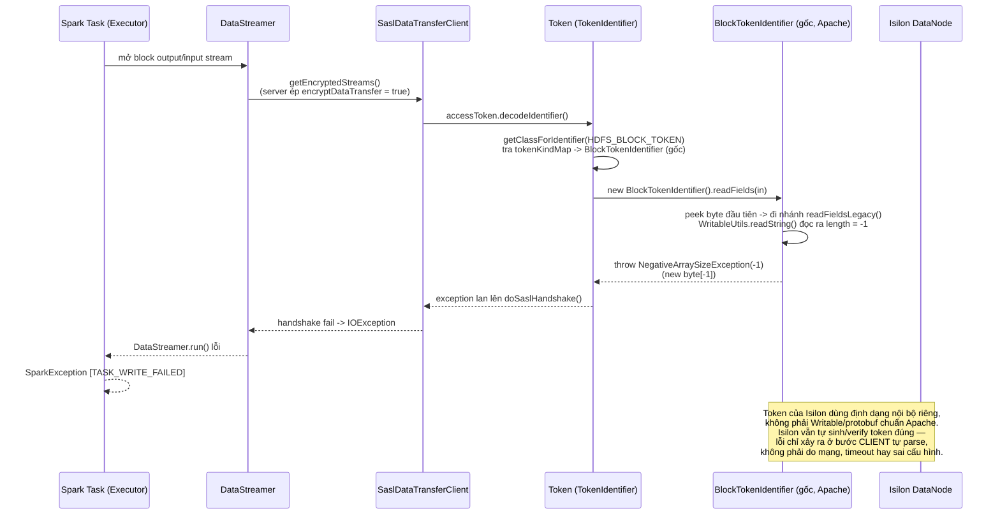
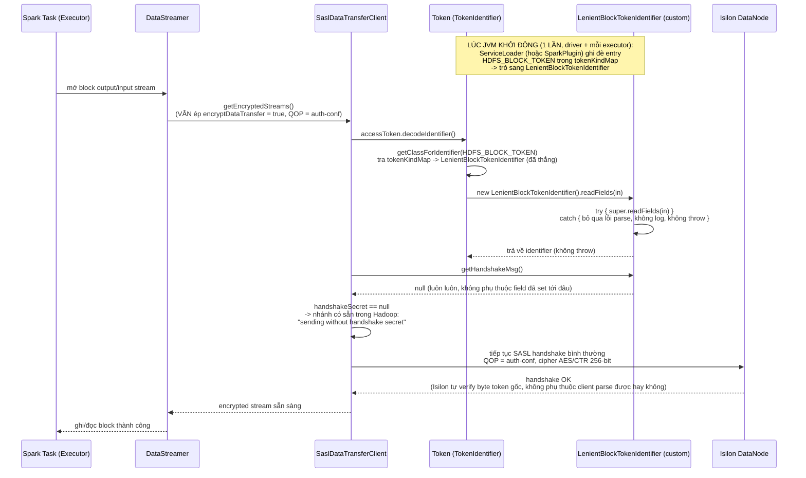
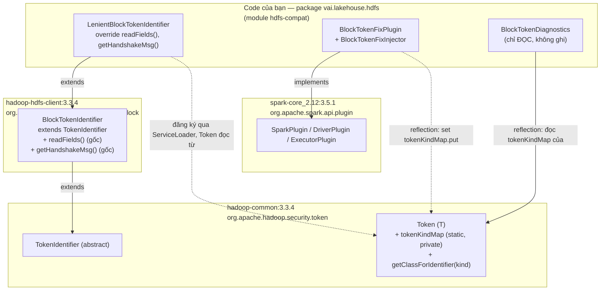

# Diagram: vấn đề block token Isilon & flow sau khi áp dụng patch

> Nền tảng kỹ thuật đầy đủ (root cause, JIRA, cấu hình): xem
> [`SPARK_HDFS_WIRE_ENCRYPTION_TASK.md`](./SPARK_HDFS_WIRE_ENCRYPTION_TASK.md).
> File này chỉ trực quan hoá 2 luồng (lỗi / đã vá) + phân tích phạm vi ảnh
> hưởng và chi phí hiệu năng của patch.

> **Đính chính version**: câu hỏi gốc ghi "Hadoop client >= 3.1.2" — theo tài
> liệu điều tra (mục 3 của `SPARK_HDFS_WIRE_ENCRYPTION_TASK.md`, JIRA
> [HDFS-13617](https://issues.apache.org/jira/browse/HDFS-13617) /
> [HDFS-13699](https://issues.apache.org/jira/browse/HDFS-13699)), ngưỡng
> chính xác là **Hadoop client ≥ 3.2.1** (client tự parse block token để lấy
> `handshakeSecret` kể từ bản này). 3.2.0 trở về trước coi token là chuỗi
> byte đục (opaque), không parse — không lỗi. Diagram dưới dùng đúng số 3.2.1.

---

## 1. Diagram 1 — Vấn đề khi Hadoop client ≥ 3.2.1

### Mô tả

Đọc từ trên xuống theo đúng thứ tự nhân quả thật của lỗi (mục 2 của
`SPARK_HDFS_WIRE_ENCRYPTION_TASK.md`):

1. Spark task mở stream ghi/đọc 1 block tới Isilon DataNode.
2. Vì Isilon **ép** `encryptDataTransfer = true`
   (`dfs.data.transfer.protection = privacy`), client bắt buộc đi nhánh
   `SaslDataTransferClient.getEncryptedStreams()` — không có config nào ở
   phía client bỏ qua được nhánh này (`shouldEncryptData()` đọc thẳng từ
   server defaults).
3. Trong `doSaslHandshake()`, kể từ Hadoop 3.2.1, client **tự parse** block
   token để lấy `handshakeSecret` phục vụ tối ưu selective-QOP
   (HDFS-13617/13699). Trước 3.2.1, bước này không tồn tại — token chỉ được
   chuyển tiếp nguyên xi xuống DataNode.
4. `BlockTokenIdentifier.readFields()` (cơ chế tương thích ngược từ
   HDFS-11026) peek byte đầu tiên để đoán định dạng cũ (Writable) hay mới
   (protobuf), rồi gọi `readFieldsLegacy()`.
5. Token của Isilon không khớp cấu trúc Writable chuẩn Apache —
   `WritableUtils.readString()` đọc ra độ dài chuỗi là `-1`, thực thi
   `new byte[-1]` → `NegativeArraySizeException`.
6. Exception này không được bắt ở đâu trong code Hadoop gốc (lời gọi
   `decodeIdentifier()` là vô điều kiện, không try/catch) → lan thẳng lên
   Spark task, biểu hiện thành `[TASK_WRITE_FAILED]`.

Điểm mấu chốt: **đây không phải lỗi mạng hay lỗi cấu hình** — token do
Isilon phát hành hợp lệ với chính Isilon, chỉ không hợp lệ với parser
Writable/protobuf mà client Apache Hadoop ≥ 3.2.1 áp đặt thêm vào.

---

## 2. Diagram 2 — Flow sau khi áp dụng custom lib

### Mô tả

1. **Chỉ 1 lần lúc khởi động JVM** (không phải mỗi block): patch tự đăng ký
   vào `tokenKindMap` — hoặc qua `ServiceLoader`
   (`META-INF/services/org.apache.hadoop.security.token.TokenIdentifier`),
   hoặc qua `BlockTokenFixPlugin` (`spark.plugins`, dùng reflection, không
   phụ thuộc thứ tự classpath — xem `HDFS_PATCH_AT_SCALE.md` mục 2).
2. Từ thời điểm đó, **mọi** lần `Token.decodeIdentifier()` với kind
   `HDFS_BLOCK_TOKEN` trong JVM đó đều tạo ra `LenientBlockTokenIdentifier`
   thay vì `BlockTokenIdentifier` gốc.
3. `readFields()` vẫn **thử** parse bình thường (`super.readFields(in)`) —
   patch không tắt hẳn khả năng đọc token, chỉ nuốt lỗi khi parse thất bại.
   Với token chuẩn Apache (HDFS thật, không phải Isilon), patch này **vô
   hại** — parse thành công như bình thường, không đổi hành vi.
4. `getHandshakeMsg()` luôn trả `null` → ép `doSaslHandshake` đi đúng nhánh
   "không có handshake secret" **đã có sẵn** trong code Hadoop gốc — patch
   không thêm logic bảo mật mới, chỉ chọn lại 1 nhánh có sẵn.
5. SASL handshake tiếp tục với **đúng QOP `auth-conf`** (mã hoá đầy đủ,
   AES/CTR 256-bit) — hoàn toàn không đổi so với trước patch. Byte token
   thật (`accessToken.getIdentifier()`) vẫn được gửi nguyên vẹn xuống
   DataNode, Isilon vẫn tự verify như cũ.
6. Về bản chất: patch khôi phục đúng hành vi của Hadoop client ≤ 3.2.0 —
   coi block token là "đục" (opaque) với client, chỉ chuyển tiếp, không tự
   ý diễn giải nội dung.

---

## 3. Phần custom thuộc lib nào

**Không sửa source/binary của Hadoop hay Spark ở bất kỳ đâu.** Toàn bộ patch
chỉ là:

| Class custom                                    | Quan hệ với thư viện gốc                                                                                                                                                                                                        |
| ----------------------------------------------- | ------------------------------------------------------------------------------------------------------------------------------------------------------------------------------------------------------------------------------- |
| `LenientBlockTokenIdentifier`                   | **Subclass** của `BlockTokenIdentifier` (thư viện `hadoop-hdfs-client:3.3.4`) — override 2 method public, không copy source Hadoop                                                                                              |
| `BlockTokenFixPlugin` / `BlockTokenFixInjector` | **Implement** interface `SparkPlugin`/`DriverPlugin`/`ExecutorPlugin` (thư viện `spark-core_2.12:3.5.1`); dùng **reflection** để ghi vào field `private static tokenKindMap` của class `Token` (thư viện `hadoop-common:3.3.4`) |
| `BlockTokenDiagnostics`                         | Chỉ dùng reflection để **đọc** (không ghi) field tĩnh tương tự, phục vụ log chẩn đoán                                                                                                                                           |

Cơ chế ghi đè (`ServiceLoader` last-write-wins, hoặc reflection qua Plugin)
đều là API/hành vi **được tài liệu hoá của chính Hadoop** (`ServiceLoader`
là cơ chế Java chuẩn; `tokenKindMap` được Hadoop tự populate bằng
`ServiceLoader.load(TokenIdentifier.class)` — patch chỉ tận dụng đúng cơ chế
đó, không can thiệp bytecode, không dùng `sun.misc.Unsafe`, không patch jar.

---

## 4. Ảnh hưởng của patch

- **Phạm vi là toàn JVM, theo `kind`, không theo cluster.** Override áp dụng
  cho **mọi** token có `kind = HDFS_BLOCK_TOKEN` trong JVM đó (driver hoặc 1
  executor) — không giới hạn riêng cho Isilon. Nếu cùng 1 job (hiếm nhưng
  có thể) còn đọc/ghi thêm 1 cluster Apache HDFS chuẩn khác, token của
  cluster đó **cũng** đi qua `LenientBlockTokenIdentifier`. Không ảnh hưởng
  bảo mật (bước 3 diagram 2: parse vẫn thử bình thường, chỉ nuốt lỗi khi
  thất bại) — HDFS chuẩn vẫn parse thành công như cũ. Ảnh hưởng thực tế duy
  nhất: cluster đó cũng bỏ qua tối ưu selective-QOP (HDFS-13617), tự động
  fallback về mã hoá đầy đủ — không phải lỗi, chỉ là không tận dụng được 1
  tối ưu không bắt buộc.
- **Không có token nào khác bị ảnh hưởng.** Chỉ đúng 1 `kind` cụ thể
  (`HDFS_BLOCK_TOKEN`) bị override — `DELEGATION_TOKEN`, các token loại
  khác của YARN/HBase/Hive... không đụng tới.
- **Không đổi hành vi mã hoá đường truyền.** QOP, cipher suite, Kerberos —
  tất cả giữ nguyên (xem bảng "Mã hoá KHÔNG bị ảnh hưởng" ở mục 4 của
  `SPARK_HDFS_WIRE_ENCRYPTION_TASK.md`).
- **Mất khả năng tối ưu selective-QOP** (`handshakeSecret`) — tính năng này
  vốn cho phép hạ QOP có chọn lọc cho 1 số kết nối; patch luôn bỏ qua nó.
  Với Isilon, tính năng này chưa từng hoạt động được (Isilon không phát
  hành `handshakeSecret` theo đúng định dạng) nên **thực tế không mất gì**
  so với hiện trạng.
- **Là workaround, không phải fix gốc** (mục 17 của
  `SPARK_HDFS_WIRE_ENCRYPTION_TASK.md`) — cần Dell fix OneFS sinh token đúng
  chuẩn Apache về lâu dài; khi đó gỡ patch, không đụng gì tới app code.

---

## 5. Ảnh hưởng khi chạy dữ liệu lớn (nhiều block, throughput cao)

Đây là câu hỏi hiệu năng thật, không chỉ lý thuyết — đáng phân tích kỹ vì
`readFields()` nằm trên **hot path**: chạy 1 lần cho **mỗi block** khi mở
kết nối DataStreamer, tức với job ghi/đọc hàng chục nghìn tới hàng triệu
block sẽ gọi hàm này hàng chục nghìn tới hàng triệu lần.

| Khía cạnh                                                                                                              | Ảnh hưởng                                        | Vì sao                                                                                                                                                           |
| ---------------------------------------------------------------------------------------------------------------------- | ------------------------------------------------ | ---------------------------------------------------------------------------------------------------------------------------------------------------------------- |
| **Băng thông / throughput mã hoá thực tế**                                                                             | **Không đổi**                                    | Patch không đụng gì tới luồng byte đã mã hoá (AES/CTR) — chỉ đụng bước parse metadata token, xảy ra 1 lần lúc mở kết nối, không lặp lại trong lúc truyền dữ liệu |
| **Chi phí đăng ký patch (ServiceLoader/Plugin)**                                                                       | **Không đổi theo scale**                         | Chỉ chạy 1 lần khi JVM khởi động (driver, mỗi executor) — không phụ thuộc số lượng block/record xử lý sau đó                                                     |
| **Tra `tokenKindMap.get(kind)`**                                                                                       | Không đáng kể                                    | `HashMap.get` O(1), đã tồn tại sẵn trong Hadoop gốc (không phải overhead do patch thêm vào)                                                                      |
| **Chi phí `try/catch` khi parse thành công** (token Isilon parse lỗi ngay từ đầu, nhưng nếu 1 lúc nào đó token hợp lệ) | Không đáng kể                                    | JVM không phạt performance cho code nằm trong `try` khi không có exception xảy ra                                                                                |
| **Chi phí throw `NegativeArraySizeException` mỗi block (trường hợp thực tế với Isilon — LUÔN throw)**                  | **Có, nhưng được JIT tự triệt tiêu sau warm-up** | Xem phân tích dưới                                                                                                                                               |

### Chi tiết chi phí exception trên hot path

Với Isilon, `readFields()` **luôn** ném `NegativeArraySizeException` (token
không parse được), nghĩa là patch **luôn** rơi vào nhánh catch — với job xử
lý hàng triệu block, đây là hàng triệu exception được throw/catch.

Chi phí thật của throw/catch trong JVM không nằm ở `catch` mà ở
`Throwable.fillInStackTrace()` — bước capture stack trace lúc tạo exception,
tốn CPU tỉ lệ với độ sâu call stack. Tin tốt: HotSpot JVM có tối ưu
**`OmitStackTraceInFastThrow`** (bật mặc định từ lâu) — khi cùng 1 exception
được throw lặp lại nhiều lần tại đúng 1 bytecode location (chính là trường
hợp này: luôn throw tại `WritableUtils.readString()` bên trong
`readFieldsLegacy()`), sau một số lần nhất định (thường ~vài nghìn lần, do
JIT compiler quyết định) HotSpot chuyển sang dùng **1 instance exception đã
preallocate, không có stack trace**, gần như miễn phí về CPU.

**Kết luận thực tế cho job dữ liệu lớn:**

- Vài nghìn block đầu tiên (giai đoạn JIT warm-up của executor): có overhead
  nhỏ do exception có đầy đủ stack trace — không đáng kể so với thời gian
  I/O mạng của block transfer (mili-giây so với micro-giây).
- Sau warm-up (phần lớn thời gian chạy với job lớn): overhead gần như 0 nhờ
  `OmitStackTraceInFastThrow`.
- **Điều kiện cần lưu ý**: nếu ai đó chạy Spark job với JVM flag
  `-XX:-OmitStackTraceInFastThrow` (tắt tối ưu này — hiếm khi làm, thường chỉ
  bật khi debug production issues khác), chi phí capture stack trace sẽ áp
  dụng cho **mọi** block trong suốt job, không chỉ lúc warm-up. Nên tránh
  set flag này khi chạy job dùng patch này ở quy mô lớn, hoặc nếu bắt buộc
  phải debug, chỉ bật tạm thời trên 1 job nhỏ.
- **Không có rủi ro memory/leak**: không giữ tham chiếu tới token, không có
  cache tăng dần theo số block — mỗi `readFields()` độc lập, không tích luỹ
  state qua các lần gọi.

**Tóm lại**: với khối lượng dữ liệu lớn, patch không ảnh hưởng tới thông
lượng ghi/đọc thực tế (không đụng đường truyền mã hoá), chi phí CPU phụ trội
từ việc throw exception mỗi block là có thật nhưng nhỏ và tự triệt tiêu dần
nhờ JIT — không cần thay đổi gì thêm để "tối ưu" cho job lớn, trừ việc tránh
tắt `OmitStackTraceInFastThrow`.
