# Hướng dẫn phân quyền Ranger, chạy Spark qua Airflow và giám sát

> Tài liệu hướng dẫn thao tác: cấp quyền trên Ranger (Hadoop SQL + Ranger KMS),
> submit một Spark application qua Airflow, và giám sát job qua Spark History
> Server (SHS). Ảnh minh hoạ nằm ở [`docs/images/`](./images/).
>
> **Ví dụ xuyên suốt:** Spark application `sample-spark-application-privacy` chạy
> trên Kubernetes (qua Spark Operator), dùng Kerberos principal
> `k8s@VAILAKEHOUSE.VIETTEL.COM`. Manifest khai báo job (kiểu tài nguyên
> `SparkApplication`) đã set sẵn `spark.kerberos.principal` và
> `spark.kerberos.keytab` trỏ tới keytab của user này; principal `k8s` đã được
> tạo sẵn trên KDC từ trước.

---

## 0. Tổng quan: xác thực Kerberos và các lớp phân quyền

Cần phân biệt rõ 2 khái niệm hay bị nhầm với nhau:

- **Xác thực (authentication)** — do Kerberos đảm nhiệm: xác minh Spark job đang
  chạy đúng là "ai" (principal nào), thông qua keytab. Bước này **không liên quan
  đến việc job được phép làm gì**.
- **Phân quyền (authorization)** — do Ranger đảm nhiệm: sau khi đã biết job là
  principal nào, Ranger quyết định principal đó được đọc/ghi/truy vấn dữ liệu nào.

Một Spark job có thể chạy bằng **bất kỳ principal nào** đã được cấp keytab (không
chỉ riêng `k8s` — tài liệu chỉ dùng `k8s` làm ví dụ minh hoạ). Với principal đó,
job cần đi qua đúng thứ tự sau:

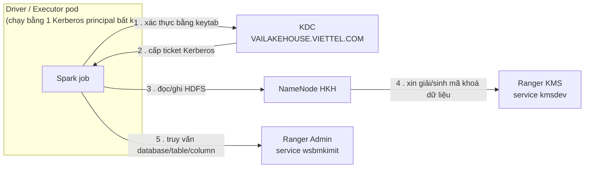

Bước 1–2 là **xác thực** (Kerberos): job dùng keytab để "chứng minh danh tính" với
KDC và nhận vé. Bước 3–5 là nơi **phân quyền** (Ranger) phát huy tác dụng — mỗi mũi
tên tương ứng với một lớp quyền phải được cấp riêng:

| Lớp phân quyền        | Cấu hình ở đâu                     | Kiểm soát việc gì                             |
| --------------------- | ---------------------------------- | --------------------------------------------- |
| Quyền đường dẫn HDFS  | Ranger HDFS service                | Được đọc/ghi thư mục/file nào trên HDFS       |
| Quyền Hadoop SQL      | Ranger Admin → service `wsbmkimit` | Được truy vấn database/table/column nào       |
| Quyền dùng key mã hoá | Ranger KMS → service `kmsdev`      | Được sinh/giải mã dữ liệu (EDEK) bằng key nào |

Principal xác thực Kerberos thành công **không đồng nghĩa** với việc được cấp đủ
3 quyền trên — thiếu bất kỳ lớp nào, job vẫn chạy được (vì đã qua bước xác thực)
nhưng sẽ bị Ranger từ chối (`AccessControlException`) ngay khi chạm tới hành động
tương ứng. Mục 1–2 dưới đây hướng dẫn cấp 2 lớp quyền quan trọng nhất
(Hadoop SQL và KMS key); mục 3–4 hướng dẫn chạy job qua Airflow và cách nhận biết
job có đang bị thiếu quyền hay không thông qua Spark History Server.

---

## 1. Cấp quyền Hadoop SQL cho một user

1. Vào Ranger Admin → **Access Manager** → **Service Manager**, chọn service
   HADOOP SQL đúng tenant đang dùng (ví dụ service `wsbmkimit` ứng với namespace
   `vlp-tenantw1xjixm-wsytjjtr0-ingestion`).

   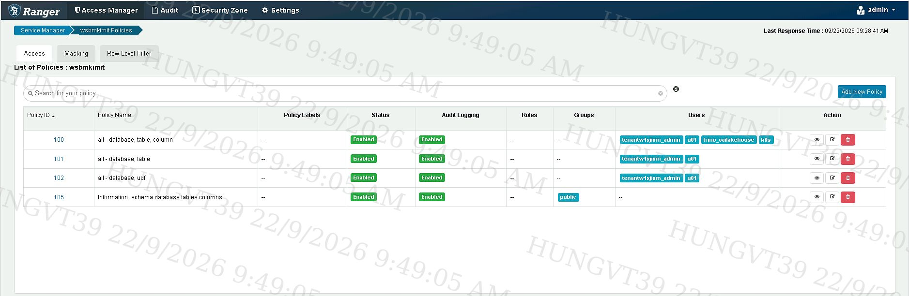

2. Mở service đó để vào **List of Policies**, chọn policy có phạm vi phù hợp (áp
   dụng cho toàn bộ database, hay chỉ 1 database cụ thể). Nếu chưa có policy phù
   hợp, bấm **Add New Policy** để tạo mới.

   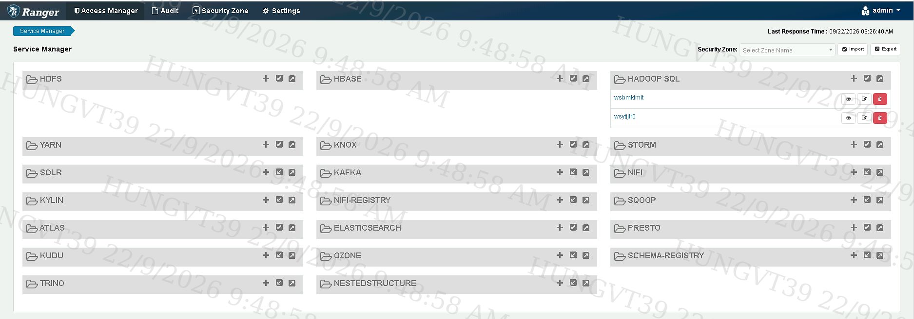

3. Trong phần **Policy Details**, giữ nguyên `Enabled` và bật `Audit Logging: Yes`
   — nhờ vậy sau này có thể tra lịch sử ai đã truy cập gì trong tab Audit.

   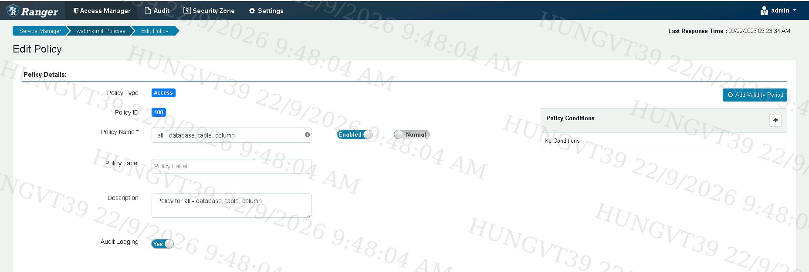

4. Ở phần **Resources**, khai báo `database` / `table` / `column` mà policy áp
   dụng (dùng `*` nếu muốn áp dụng cho tất cả).

   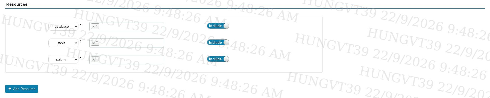

5. Ở phần **Allow Conditions**, gõ tên user cần cấp quyền vào ô **Select User**,
   sau đó bấm biểu tượng bút chì ở cột **Permissions** để chọn quyền. Chỉ nên cấp
   quyền tối thiểu job cần dùng — thường là `select` (thêm `update`/`write` nếu
   job có ghi dữ liệu vào bảng), tránh cấp `All` hoặc `Service Admin` cho một
   service account. Không cần bật **Delegate Admin**.

   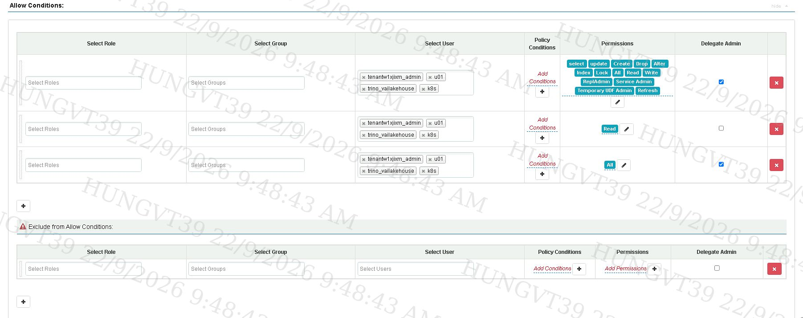

6. Kiểm tra phần **Deny Conditions** bên dưới không có rule nào chặn user vừa
   thêm — vì Deny luôn được ưu tiên hơn Allow. Sau đó bấm **Save**.

   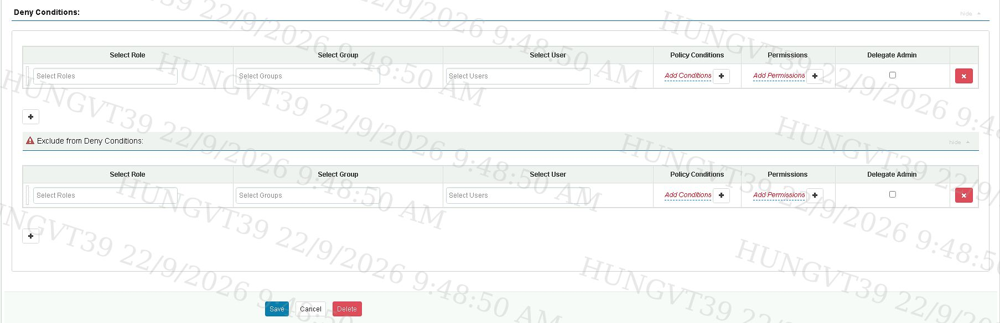

7. Plugin Hive/Trino sẽ tự động đồng bộ policy mới sau vài chục giây, không cần
   restart service nào. Để kiểm tra lại, chạy thử job rồi mở tab **Audit → Access**
   trên Ranger Admin — nếu thấy request của user vừa cấp hiện `Allowed` là đã
   thành công.

---

## 2. Cấp quyền dùng key trên Ranger KMS

Cụm HDFS đang dùng bật mã hoá đường truyền bắt buộc và dùng Ranger KMS làm nơi
quản lý key mã hoá dữ liệu. Khi một job đọc hoặc ghi file nằm trong vùng mã hoá,
HDFS sẽ tự động gọi sang Ranger KMS để xin giải mã hoặc sinh khoá mới — và Ranger
KMS kiểm tra quyền **theo từng key riêng biệt**, hoàn toàn tách biệt với quyền
Hadoop SQL ở mục 1. Vì vậy dù job đã được cấp đủ quyền query ở mục 1, vẫn có thể
bị chặn ở bước đọc/ghi file nếu thiếu quyền key ở mục này.

1. Đăng nhập Ranger KMS UI bằng tài khoản quản trị key (ví dụ `keyadmin`).

   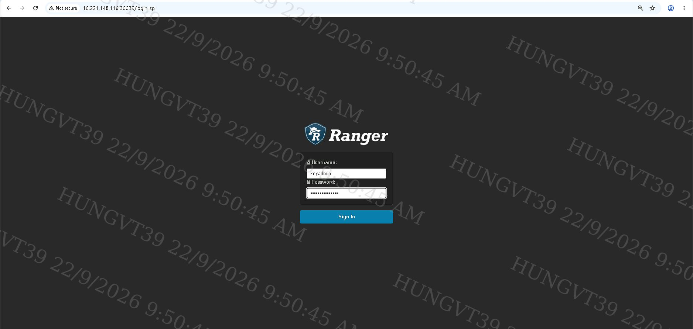

2. Phần cấu hình kết nối tới KMS server (service `kmsdev`) thường đã được hạ tầng
   thiết lập sẵn, chỉ cần biết vị trí để tra cứu khi cần: vào **Access Manager →
   Encryption → KMS → Edit Service** sẽ thấy `KMS URL` và thông tin xác thực
   Kerberos riêng của Ranger KMS server (`rangerprincipal`, `rangerkeytab`,
   `authtype: kerberos`).

   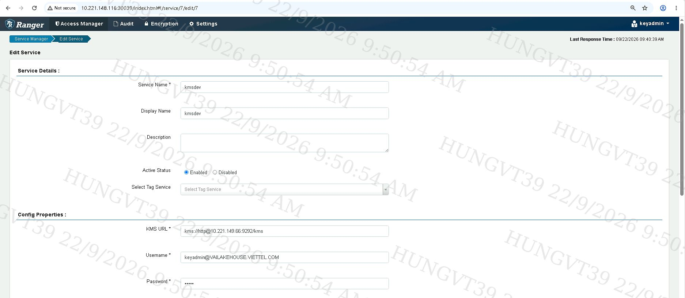
   

3. Xem danh sách các key hiện có tại **Encryption → Key Management**. Cột
   **Attributes** hiển thị `key.acl.name` — đây chính là tên resource dùng để
   khớp với policy ở bước tiếp theo.

   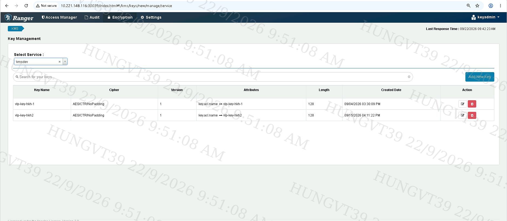

4. Để cấp quyền theo key, vào **Access Manager → kmsdev → List of Policies**. Ở
   ví dụ này, policy `49 — all - keyname` đang áp dụng cho mọi key (`*`) và đã có
   sẵn user `k8s` trong danh sách.

   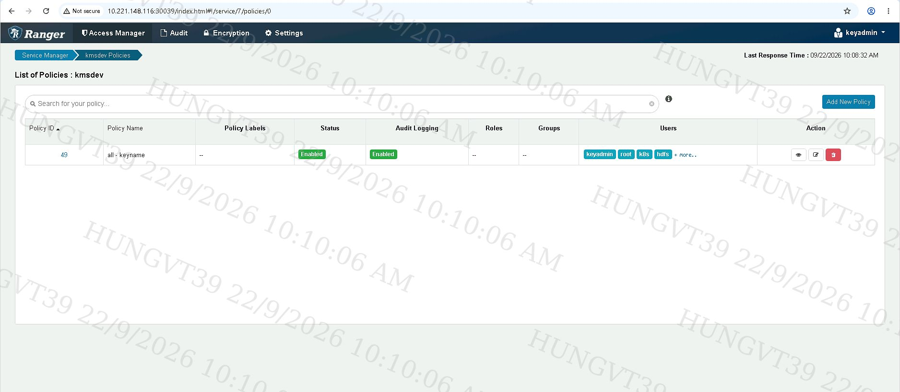

5. Mở policy đó: **Policy Details** giữ `Enabled` và `Audit Logging: Yes`; ở
   **Resources**, khai báo `Key Name` (`*` cho mọi key, hoặc gõ đúng tên key nếu
   muốn giới hạn phạm vi).

   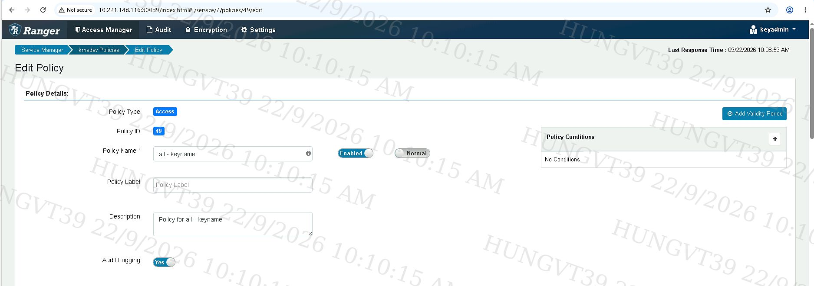

6. Ở **Allow Conditions**, thêm user vào **Select User** rồi chọn quyền. Trong
   policy 49, user `k8s` hiện đang được cấp **toàn bộ quyền** (`Create`, `Delete`,
   `Rollover`, `Set Key Material`, `Get`, `Get Keys`, `Get Metadata`,
   `Generate EEK`, `Decrypt EEK`) cùng `Delegate Admin` — ngang với tài khoản quản
   trị `keyadmin`/`root`.

   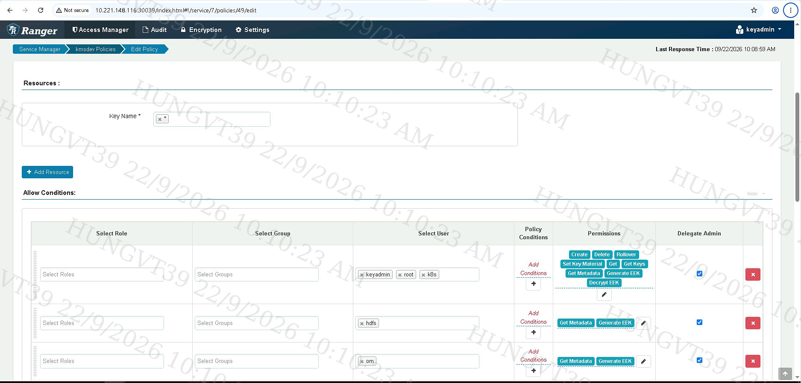

   > **Khuyến nghị** cho một service account chỉ chạy job (không cần quản trị
   > key): chỉ nên cấp `Get Metadata` + `Decrypt EEK` (thêm `Generate EEK` nếu job
   > có ghi file mới), giống 2 dòng còn lại của policy 49 đang cấp cho user
   > `hdfs`/`om`. Không nên cấp `Rollover`, `Set Key Material` hay bật
   > `Delegate Admin` cho service account, trừ khi thực sự cần quyền quản trị key.

7. Bấm **Save**, sau đó có thể kiểm tra lại qua tab **Audit** của Ranger KMS.

---

## 3. Submit Spark application qua Airflow (`SparkKubernetesOperator`)

DAG `test_spark_job_vailakehouse` (task `vlp_test_job`) dùng toán tử
`SparkKubernetesOperator` để apply manifest `SparkApplication` lên cluster —
manifest này chính là nơi khai báo principal/keytab của job như mô tả ở đầu tài
liệu.

1. Trigger DAG, theo dõi tiến trình ở tab **Grid** — task `vlp_test_job` chuyển
   xanh là chạy thành công. Tab **Logs** hiển thị log gộp của pod (bao gồm cả log
   ứng dụng lẫn log Spark khi job kết thúc); tìm dòng `Marking task as SUCCESS`
   để xác nhận.

   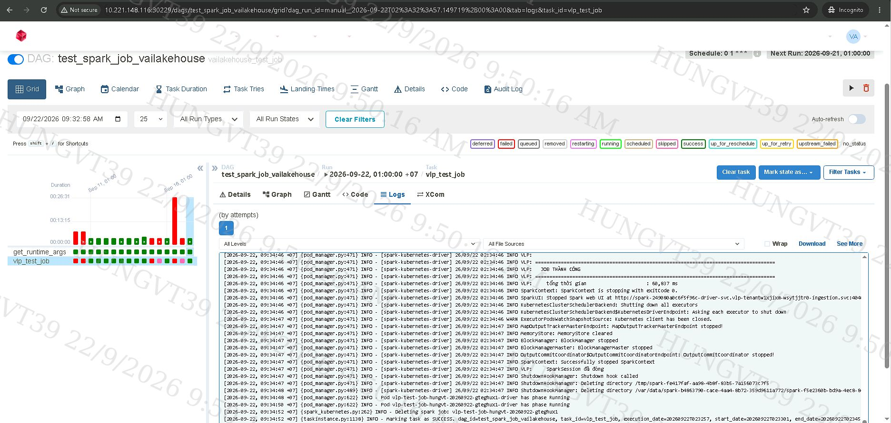

2. Để xem đầy đủ log của một lần chạy task, bấm vào task đó trên tab **Grid**
   rồi chọn tab **Logs** — toàn bộ log từ lúc Airflow bắt đầu submit
   `SparkApplication` cho tới khi task kết thúc đều hiển thị ở đây.

   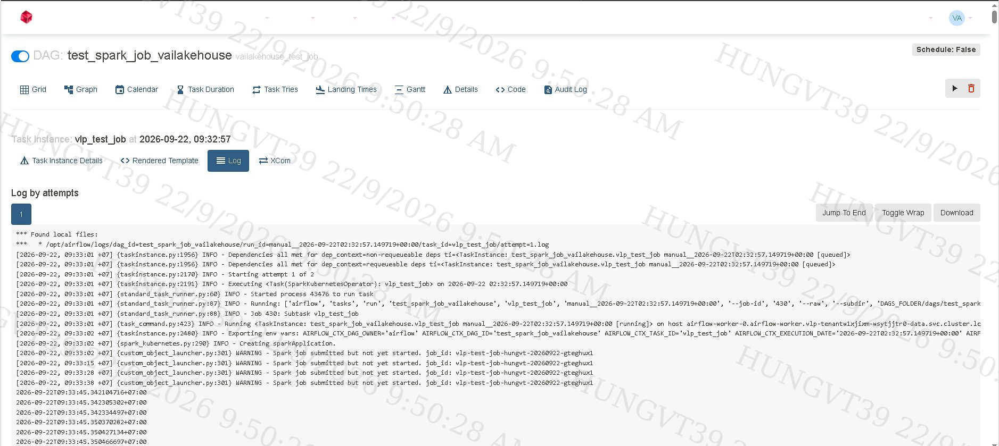

3. Trước khi trigger, cần đảm bảo hạ tầng đã chuẩn bị sẵn: Secret chứa keytab của
   user đã mount đúng đường dẫn trong pod, cấu hình Kerberos client (`krb5.conf`)
   đã mount đúng, và cấu hình Hadoop (core-site/hdfs-site) đã trỏ đúng tới Ranger
   KMS. Đây thường là việc hạ tầng đã làm sẵn cho tenant, không phải việc lặp lại
   mỗi lần chạy job — chỉ cần biết để tra cứu khi debug. Ngoài ra, principal của
   job phải đã được cấp quyền ở mục 1 và mục 2: nếu chưa, job vẫn submit và khởi
   động bình thường (vì đây là bước xác thực, không phải phân quyền) nhưng sẽ fail
   ngay khi chạm tới thao tác đọc/ghi HDFS hoặc truy vấn dữ liệu đầu tiên.

---

## 4. Giám sát trên Spark History Server (SHS)

1. Mở SHS, tìm đúng application theo tên hoặc thời gian chạy, đối chiếu cột
   **Spark User** để biết job đang chạy bằng principal nào. Lưu ý: job chỉ xuất
   hiện ở đây nếu manifest đã bật ghi log sự kiện
   (`spark.eventLog.enabled: "true"`) và trỏ đúng thư mục lưu log trên HDFS
   (`spark.eventLog.dir`) — đây là cấu hình ghi log để phục vụ giám sát, **không
   liên quan tới phân quyền** ở mục 1–2.

   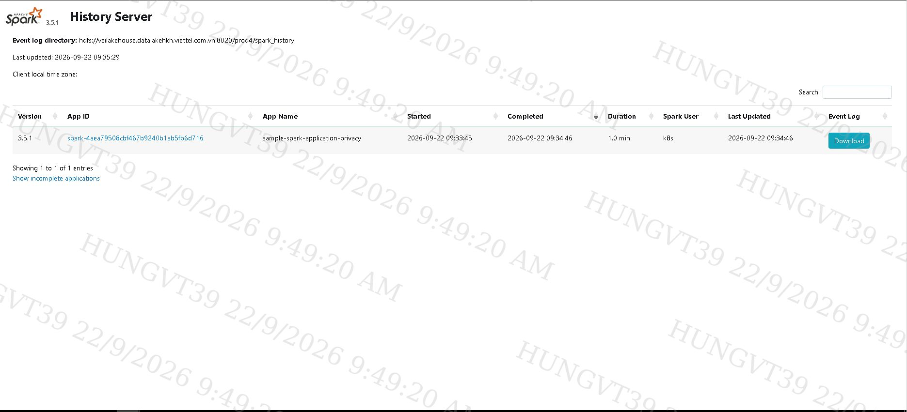

2. Bấm vào **App ID** để mở giao diện chi tiết. Tab **Jobs** cho cái nhìn tổng
   quan về tiến độ chạy job, kèm Event Timeline; mỗi dòng mô tả job còn trỏ ngược
   được về đúng vị trí trong code (ví dụ `SparkApp.scala:225`).

   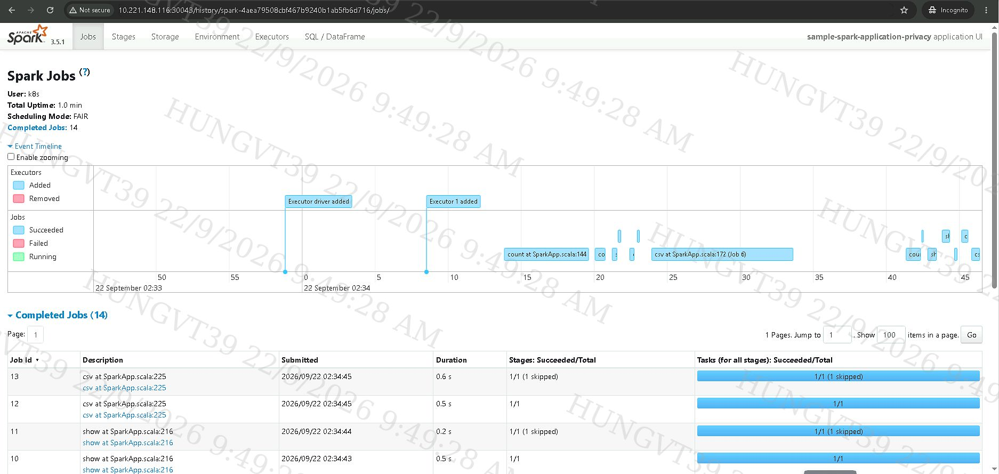

3. Tab **Stages** cho biết chi tiết hơn: `Input`/`Output`/`Shuffle Read/Write`
   của từng stage. Nếu một stage lẽ ra phải đọc/ghi dữ liệu mà cột `Input`/
   `Output` lại hiện 0 byte, đây là dấu hiệu job đang **thiếu quyền Ranger** (đôi
   khi exception bị nuốt ở tầng khác nên không hiện lỗi rõ ràng).

   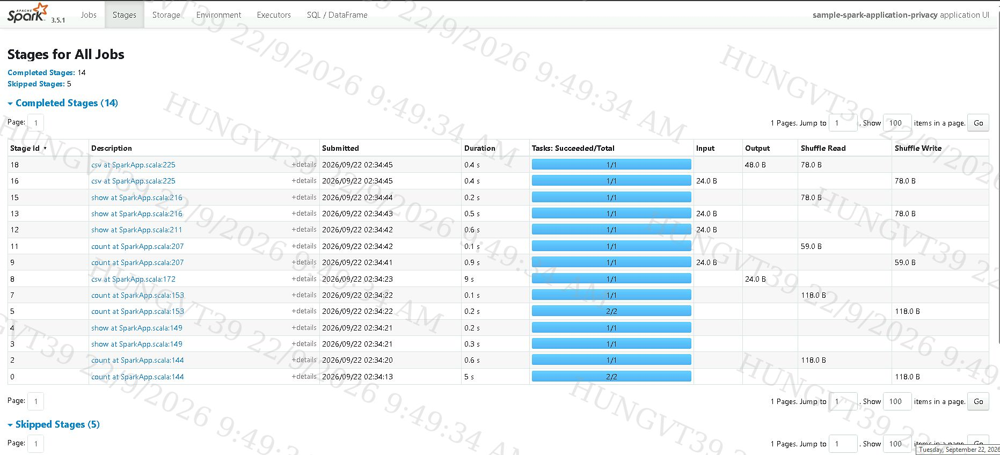

4. Tab **Environment** giúp xác minh nhanh cấu hình Kerberos đã được áp dụng đúng
   cho lần chạy đó (ví dụ `spark.driver.extraJavaOptions` có bật debug
   `krb5.debug`/`spnego.debug`, hay `spark.driver.host` đúng namespace mong
   muốn) mà không cần đăng nhập vào pod để kiểm tra.

   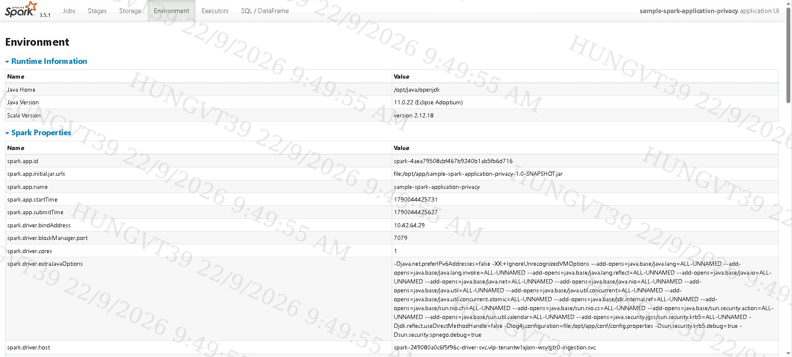

5. Tab **Executors** cho biết số `Failed Tasks` của từng executor. Nếu Ranger từ
   chối quyền ngay khi job đang chạy, executor tương ứng thường có
   `Failed Tasks > 0` — bấm vào executor đó để mở log `stderr` và tìm dòng lỗi
   `AccessControlException`.

   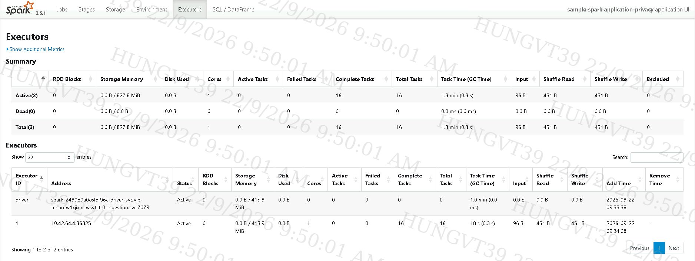

---

## 5. Checklist thêm mới 1 Spark application / user

1. Principal đã tồn tại trên KDC và đã có keytab.
2. Cấp quyền Hadoop SQL (mục 1): thêm user vào Allow Conditions của policy phù
   hợp, trên đúng service của tenant.
3. Cấp quyền key trên Ranger KMS (mục 2): thêm user vào policy của service
   `kmsdev` cho các key mà job sẽ đọc/ghi.
4. Manifest `SparkApplication`: khai báo đúng namespace, đúng
   `spark.kerberos.principal`/`spark.kerberos.keytab`, đúng cấu hình Hadoop
   (core-site/hdfs-site trỏ tới Ranger KMS), và bật `spark.eventLog.enabled` +
   `spark.eventLog.dir` nếu muốn theo dõi qua SHS.
5. Tạo/trỏ DAG Airflow dùng `SparkKubernetesOperator` tới manifest ở bước 4, chạy
   thử và theo dõi log tới khi thấy `Marking task as SUCCESS` (mục 3).
6. Xác minh lại qua SHS (mục 4): đúng `Spark User`, không có Input/Output = 0 bất
   thường, không có `Failed Tasks`.
7. Nếu job fail vì lỗi quyền, mở tab **Audit** của Ranger Admin và Ranger KMS để
   xem request bị `Denied` ở lớp nào, sửa đúng policy tương ứng rồi lặp lại từ
   bước 5.
