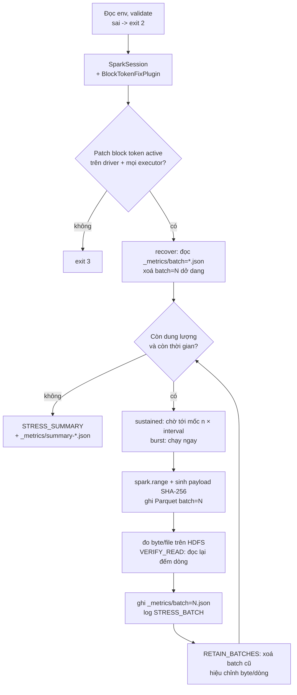

# Plan: stress test nạp dữ liệu vào HDFS HKH (100 GiB/ngày)

Code app, `Dockerfile` và manifest SparkApplication nằm ở module [`hdfs-load-stress-test/`](../../hdfs-load-stress-test/) ở gốc
repo. Hướng dẫn build và chạy: [hdfs-load-stress-test/README.md](../../hdfs-load-stress-test/README.md). Các đường dẫn file trong
plan này (`StressConfig.scala`, `k8s/...`) tính từ thư mục module đó.

## 1. Mục tiêu và phạm vi

**Mục tiêu**

1. Chứng minh cụm HDFS Isilon HKH (`vailakehouse.datalakehkh.viettel.com.vn`) nhận được **100 GiB/ngày** ghi liên tục từ Spark
   trên K8s, với đúng cấu hình bảo mật đang dùng: Kerberos, wire encryption (`dfs.data.transfer.protection=privacy`) và patch
   lenient block token.
2. Đo **năng lực ghi tối đa**, để biết hệ thống còn dư bao nhiêu lần so với tải danh định.
3. Bắt các lỗi chỉ lộ ra khi chạy dài: delegation token hết hạn hoặc không được gia hạn, lỗi block token rải rác
   (`NegativeArraySizeException`, `InvalidToken`), quota, file nhỏ.

**Trong phạm vi**: luồng ghi (và đọc lại để kiểm) từ Spark 3.5.1 trên namespace `vlp-tenantw1xjixm-wsbmkimit-teamk6gy0b5` vào
HDFS HKH.

**Ngoài phạm vi**
- Mã hoá cột: app không chứa lib crypto nào.
- Delta Lake và Hive metastore: app ghi Parquet theo path, để phép đo phản ánh I/O của HDFS chứ không bị ảnh hưởng bởi
  commit log của Delta hay metastore. Có thể bổ sung sau nếu cần đo cả tầng đó.
- Nguồn dữ liệu như Kafka: dữ liệu được sinh ngay trên executor.

## 2. Môi trường

Lấy theo `crawler-streaming-app` đang chạy cùng namespace.

| Mục | Giá trị |
|---|---|
| Namespace | `vlp-tenantw1xjixm-wsbmkimit-teamk6gy0b5` |
| ServiceAccount | `spark-application-sa` |
| `hadoopConfigMap` | `teamk6gy0b5-hadoop-conf` (core-site + hdfs-site của cụm HKH) |
| Namenode | `hdfs://vailakehouse.datalakehkh.viettel.com.vn:8020` |
| Kerberos | principal `k8s@VAILAKEHOUSE.VIETTEL.COM`, keytab `/etc/security/keytabs/k8s.keytab` (trên pod Spark Operator) |
| Wire encryption | `privacy` (AES/CTR), không hạ xuống |
| Patch block token | `LenientBlockTokenIdentifier` (ServiceLoader) + `BlockTokenFixPlugin` (app tự bật) |
| Event log | `hdfs://…datalakehkh…:8020/prod6/spark_history` |
| Thư mục ghi test | `hdfs://…datalakehkh…:8020/prod6/stress_test/hdfs_load/<RUN_ID>` (**giả định**, cần xác nhận, mục 11) |
| Image | `hub.vtcc.vn:8989/hungvt0110/hdfs-load-stress-test:v0.1` (**giả định**) |

## 3. Con số tải

Đơn vị là GiB (1024³ byte), cùng đơn vị với `hdfs dfs -du -h`.

| Đại lượng | Giá trị |
|---|---|
| Tải danh định | 100 GiB/ngày ≈ **1.19 MiB/s** trung bình |
| Chu kỳ batch (sustained) | 300 s → **288 batch/ngày** |
| Dung lượng 1 batch | 100 GiB × 300 / 86 400 ≈ **355.6 MiB** |
| File mỗi batch | ⌈355.6 / 128⌉ = **3 file** (~118.5 MiB) → ~864 file/ngày |
| Kích thước 1 dòng | ~1 072 byte (payload 1 024 byte không nén được + ~48 byte các cột khác) |
| Số dòng | ~348 nghìn dòng/batch, ~100 triệu dòng/ngày |
| Burst 100 GiB, 5 GiB/batch | 20 batch × 40 file = 800 file |
| Đỉnh 3× (kịch bản S3) | 300 GiB/ngày ≈ 3.56 MiB/s, ~1.07 GiB/batch, 9 file/batch |

Tải trung bình 1.19 MiB/s là nhỏ. Rủi ro thật nằm ở độ **ổn định khi chạy dài** (token, lỗi rải rác) và ở **đỉnh** khi các luồng
nạp dồn vào cùng một khung giờ. Vì vậy plan gồm cả bài chạy dài lẫn bài đo đỉnh.

## 4. Kịch bản test

| ID | Tên | Manifest và cấu hình | Mục đích | Tiêu chí đạt |
|---|---|---|---|---|
| S0 | Smoke | `hdfs-stress-burst.yaml`, `TOTAL_GIB=1`, `BATCH_GIB=0.25`, `VERIFY_READ=true` | Kiểm tra quyền ghi, Kerberos, patch, đọc lại | Exit 0; `BLOCK_TOKEN_PATCH` báo active trên driver và mọi executor; `STRESS_SUMMARY.status=PASS` |
| S1 | Burst | `hdfs-stress-burst.yaml`, `TOTAL_GIB=100`, `BATCH_GIB=5` | Năng lực ghi tối đa (headroom) | Không batch nào lỗi; ghi 100 GiB trong **≤ 2.4 h** (≥ 12 MiB/s, tức ≥ 10× tải danh định; **đề xuất**, cần chốt) |
| S2 | Sustained 24h | `hdfs-stress-sustained.yaml` (mặc định) | Ổn định ở tải danh định | 288 batch, 0 lỗi; `keptUp=true` (không batch nào trễ ≥ 300 s); p95 thời gian ghi < 60 s; không có `NegativeArraySizeException`/`InvalidToken`; thấy log gia hạn delegation token |
| S3 | Đỉnh 3× (tuỳ chọn) | sustained, `STRESS_GIB_PER_DAY=300`, `DURATION_HOURS=6` | Mô phỏng các luồng nạp dồn giờ | Như S2, áp cho 72 batch |
| S4 | Đọc song song (tuỳ chọn) | S1 với `VERIFY_READ=true` | Chiều đọc qua block token + wire encryption khi tải cao | Số dòng đọc lại khớp ở mọi batch |

Thứ tự chạy: S0 → S1 → S2 → (S3, S4). Chỉ sang bước tiếp theo khi bước trước đạt.

## 5. Thiết kế app

| Thành phần | File | Ghi chú |
|---|---|---|
| Cấu hình | `StressConfig.scala` | Mọi tham số qua env; gom tất cả lỗi một lượt; `RUN_ID` chỉ cho `[A-Za-z0-9_-]` |
| Sinh dữ liệu | `DataGenerator.scala` | `spark.range` + cột `payload` hex SHA-256 → gần như không nén được, nên byte trên HDFS bám sát cấu hình. Dữ liệu tất định theo (`id`, `RUN_ID`) |
| Kích thước batch | `BatchPlanner.scala` | Số dòng = byte mục tiêu ÷ byte/dòng, ước lượng được hiệu chỉnh sau mỗi batch theo số đo thật. Số partition = ⌈byte ÷ `TARGET_FILE_MIB`⌉ = số file |
| Nhịp (sustained) | `StressRunner.scala` | Batch thứ n bắt đầu ở `start + n × interval`. Nếu batch trước kéo dài quá mốc thì batch sau chạy ngay và ghi nhận `lagSeconds` (cảnh báo `STRESS_BEHIND`) |
| Resume | `RunStore.scala` | Tiến độ = các file `_metrics/batch=N.json` (mỗi file ghi một lần, sau khi batch commit). Lần chạy sau xoá `batch=N` chưa có metric rồi ghi lại. Dải id riêng mỗi batch nên không trùng dữ liệu |
| Patch block token | `HdfsLoadStressApp.scala` | Shade jar `block-token-patch` của `spark-app`; tự thêm `BlockTokenFixPlugin` vào `spark.plugins`; kiểm tra `BlockTokenDiagnostics` trên driver và từng executor **trước** khi ghi |
| Kết quả | `Metrics.scala` | `STRESS_BATCH` (mỗi batch) và `STRESS_SUMMARY` (cuối): MiB/s ghi, p50/p95/max thời gian ghi, độ trễ lớn nhất, `PASS`/`WARN` |

Các quyết định chính:

- **Batch lặp thay vì Structured Streaming**: điều khiển nhịp và đo từng batch rõ ràng, không cần checkpoint. Resume dựa trên file
  metric.
- **Payload không nén được**: nếu dùng chuỗi lặp, Snappy nén còn vài phần trăm và con số "100 GiB" sẽ không phản ánh I/O thật.
- **Đo byte trên HDFS** (`getContentSummary`) thay vì tính từ số dòng: kết quả là dung lượng thực sự nằm trên Isilon.
- **Tiêu chí PASS** cho phép tổng thiếu tới 2%, vì dung lượng mỗi batch dựa trên ước lượng byte/dòng.

## 6. Cấu hình

Bảng biến môi trường đầy đủ ở [README.md mục 5](../../hdfs-load-stress-test/README.md#5-biến-môi-trường). Giá trị mặc định đã khớp kịch bản S2.

## 7. Tài nguyên

| Kịch bản | Driver | Executor | Lý do |
|---|---|---|---|
| S2/S3 sustained | 1 core, 2 GiB + 512 MiB | 2 × (2 core, 3 GiB + 1 GiB) | 355.6 MiB/5 phút chỉ cần 3 task song song; dư để đọc lại (`VERIFY_READ`) |
| S0/S1 burst | 1 core, 2 GiB + 512 MiB | 4 × (4 core, 4 GiB + 1.5 GiB) | 16 task song song để đẩy tới giới hạn của Isilon/mạng. **Phải vừa ResourceQuota của namespace** |

Mỗi task giữ một row group Parquet 128 MiB trong bộ nhớ trước khi ghi, nên khoảng 1 GiB heap cho mỗi 4 core là đủ. Sinh SHA-256
và mã hoá AES/CTR tốn CPU: nếu S1 cho thấy CPU executor bão hoà trong khi I/O còn thấp, hãy tăng core trước khi kết luận về
năng lực của Isilon.

## 8. Theo dõi và thu kết quả

| Nguồn | Cách xem | Dùng để |
|---|---|---|
| Log driver | `kubectl logs -f <app>-driver -n <ns> \| grep -E 'STRESS_\|BLOCK_TOKEN'` | Theo dõi trực tiếp từng batch, kết quả cuối |
| `_metrics/*.json` trên HDFS | `<OUTPUT_PATH>/<RUN_ID>/_metrics/` | Số liệu bền vững, giữ lại sau khi pod bị xoá; tổng hợp báo cáo |
| Spark History Server | event log `/prod6/spark_history` | Thời gian từng task, phát hiện task chậm hoặc retry |
| `kubectl top pod` | namespace | CPU/RAM của executor: phân biệt nghẽn do CPU hay do I/O |
| Phía Isilon | team storage | Throughput, latency, tải CPU của node Isilon trong khung giờ test |
| Log executor | `kubectl logs <executor-pod>` | Lỗi block token và SASL nếu có |

Báo cáo sau mỗi kịch bản nên có: thời gian chạy, GiB đã ghi, MiB/s ghi (`writeMiBps`) và hiệu dụng (`effectiveMiBps`), p50/p95/max
thời gian ghi, độ trễ lớn nhất, số lỗi hoặc retry, và chỉ số từ phía Isilon trong cùng khung giờ.

## 9. Rủi ro và giảm thiểu

| Rủi ro | Ảnh hưởng | Giảm thiểu |
|---|---|---|
| Test ghi lên cụm đang phục vụ production (`/prod6`) | Ảnh hưởng tới job thật, đặc biệt ở S1 | Chốt khung giờ thấp điểm với team storage; chạy S0 trước; dừng ngay bằng `kubectl delete sparkapplication` |
| Hết quota hoặc dung lượng | Job lỗi, ảnh hưởng thư mục khác | S2 tạo 100 GiB, S1 100 GiB mỗi lần (chưa tính overhead bảo vệ của Isilon). Xác nhận quota trước; dùng `RETAIN_BATCHES`; dọn sau khi test (`hdfs-load-stress-test/README.md` mục 7) |
| Delegation token hết hạn khi chạy 24h | Ghi lỗi giữa chừng | Manifest dùng keytab nên Spark tự lấy token mới; log `org.apache.spark.deploy.security` bật ở INFO để kiểm chứng |
| Patch block token không được nạp | Mọi thao tác ghi lỗi | App kiểm tra trên driver và executor rồi `exit 3` trước khi ghi; plugin là lớp dự phòng cho ServiceLoader |
| Pod bị evict hoặc restart | Mất tiến độ | `OnFailure` + resume theo `_metrics`; batch dở được xoá và ghi lại |
| Kết quả bị méo do CPU sinh dữ liệu | Kết luận sai về Isilon | Đối chiếu `kubectl top` với chỉ số phía Isilon; tăng core nếu CPU bão hoà |
| Principal `k8s` dùng chung | Không tách được tải test khỏi tải thật trong audit | Ghi rõ `RUN_ID` và khung giờ trong báo cáo; cân nhắc principal riêng cho test |

## 10. Các bước triển khai

- [ ] **P0 – Chuẩn bị**: chốt các câu hỏi ở mục 11; xác nhận ConfigMap `teamk6gy0b5-hadoop-conf` và ServiceAccount đã có trong
      namespace; build và push image (`hdfs-load-stress-test/README.md` mục 2).
- [ ] **P1 – S0 smoke**: 1 GiB; kiểm tra quyền ghi, `BLOCK_TOKEN_PATCH`, `VERIFY_READ`, file `_metrics`.
- [ ] **P2 – S1 burst**: 100 GiB; ghi lại MiB/s và chỉ số phía Isilon; quyết định có cần tăng hoặc giảm executor không.
- [ ] **P3 – S2 sustained 24h**: theo dõi định kỳ (`STRESS_BEHIND`, lỗi block token, gia hạn token).
- [ ] **P4 – (tuỳ chọn) S3/S4**.
- [ ] **P5 – Báo cáo và dọn dẹp**: tổng hợp `_metrics/*.json`, so với tiêu chí ở mục 4, xoá dữ liệu test.

## 11. Câu hỏi cần chốt trước khi chạy

1. Thư mục ghi test: `/prod6/stress_test/hdfs_load` có được phép không, principal `k8s` có quyền ghi không, quota bao nhiêu?
2. Khung giờ được phép chạy S1 (burst) và S2 (24h) trên cụm HKH.
3. Ngưỡng đạt của S1: đề xuất ≥ 10× tải danh định (100 GiB trong ≤ 2.4 h), cần thống nhất với team storage.
4. ResourceQuota của namespace có đủ cho cấu hình burst (4 executor × 4 core) không.
5. Có cần đo thêm qua Delta Lake hoặc Hive metastore (luồng giống crawler) không, hay chỉ cần tầng HDFS.
6. Dữ liệu test giữ bao lâu sau khi xong, ai dọn.
